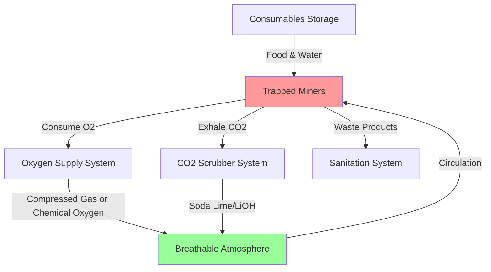
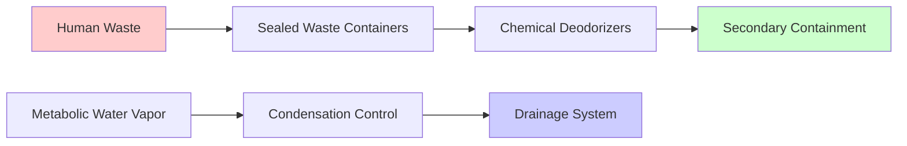

## MINER Act 96-Hour Mandate

The Mine Improvement and New Emergency Response (MINER) Act of 2006 established the 96-hour survival duration requirement for underground coal mine refuge chambers following the Sago Mine disaster. This federal mandate under 30 CFR 7.503 requires refuge chambers to sustain trapped miners for a minimum of 96 hours (4 days) with adequate oxygen, CO2 removal, food, water, and sanitation facilities.

The 96-hour period represents the statistical window during which rescue operations can reasonably be expected to reach trapped miners based on historical mine emergency data. This duration provides a critical safety margin beyond typical rescue response times of 24-48 hours.

## Metabolic Gas Exchange Calculations

### Oxygen Consumption Rate

Human oxygen consumption under sedentary refuge chamber conditions follows predictable metabolic patterns. The basal metabolic rate for a resting adult in a confined space environment is:

$$\dot{V}_{O_2} = 0.25 \text{ L/min} = 15 \text{ L/hr} = 360 \text{ L/day per person}$$

For the full 96-hour period per person:

$$V_{O_2,total} = 360 \frac{\text{L}}{\text{day}} \times 4 \text{ days} = 1,440 \text{ L} = 1.44 \text{ m}^3$$

Converting to mass at standard conditions (STP: 0°C, 1 atm):

$$m_{O_2} = \frac{V \times M}{V_m} = \frac{1,440 \text{ L} \times 32 \text{ g/mol}}{22.4 \text{ L/mol}} = 2,057 \text{ g} = 2.06 \text{ kg per person}$$

At typical refuge chamber conditions (25°C, 1 atm), the required oxygen volume increases:

$$V_{25°C} = V_{STP} \times \frac{T_{25°C}}{T_{STP}} = 1,440 \text{ L} \times \frac{298 \text{ K}}{273 \text{ K}} = 1,572 \text{ L per person}$$

### Carbon Dioxide Generation Rate

The respiratory quotient (RQ) for typical mixed metabolism is approximately 0.85, meaning CO2 production is 85% of O2 consumption by volume:

$$\dot{V}_{CO_2} = 0.85 \times \dot{V}_{O_2} = 0.85 \times 15 \text{ L/hr} = 12.75 \text{ L/hr per person}$$

Total CO2 generation over 96 hours:

$$V_{CO_2,total} = 12.75 \frac{\text{L}}{\text{hr}} \times 96 \text{ hr} = 1,224 \text{ L} = 1.22 \text{ m}^3 \text{ per person}$$

Converting to mass:

$$m_{CO_2} = \frac{1,224 \text{ L} \times 44 \text{ g/mol}}{22.4 \text{ L/mol}} = 2,404 \text{ g} = 2.40 \text{ kg per person}$$

This CO2 must be continuously removed to maintain atmospheric CO2 concentration below 0.5% (5,000 ppm) per MSHA standards.

## Life Support System Sizing

### Oxygen Supply Requirements

For a 15-person refuge chamber (typical capacity), total oxygen requirements:

$$V_{O_2,chamber} = 1,572 \text{ L/person} \times 15 \text{ persons} = 23,580 \text{ L} = 23.6 \text{ m}^3$$

When stored as compressed gas at 2,200 psi (150 bar):

$$V_{compressed} = \frac{V_{atm} \times P_{atm}}{P_{storage}} = \frac{23,580 \text{ L} \times 1 \text{ bar}}{150 \text{ bar}} = 157 \text{ L}$$

Chemical oxygen generation systems (sodium chlorate candles or potassium superoxide) provide alternative oxygen sources with typical capacities of 600-800 L per kilogram of reactant.

### CO2 Scrubbing Capacity

Soda lime (Ca(OH)2 and NaOH mixture) scrubbers remove CO2 through exothermic reaction:

$$\text{CO}_2 + 2\text{NaOH} \rightarrow \text{Na}_2\text{CO}_3 + \text{H}_2\text{O} + 41.4 \text{ kJ/mol}$$

Theoretical scrubbing capacity: 1 kg soda lime absorbs approximately 0.30 kg CO2.

For 15 persons over 96 hours:

$$m_{CO_2,total} = 2.40 \text{ kg/person} \times 15 \text{ persons} = 36 \text{ kg}$$

Required soda lime mass:

$$m_{scrubber} = \frac{36 \text{ kg}}{0.30} = 120 \text{ kg}$$

With 25% safety factor: 150 kg minimum.

## Consumables Storage Requirements

| Resource | Per Person (96 hr) | 15-Person Chamber | Storage Considerations |
|----------|-------------------|-------------------|------------------------|
| **Water** | 8 L (2 gal/day × 4 days) | 120 L (32 gal) | Sealed containers, potable quality |
| **Food** | 8,000 kcal (2,000 kcal/day × 4 days) | 120,000 kcal | High-density bars, 3-year shelf life |
| **Oxygen** | 1,572 L (at 25°C, 1 atm) | 23,580 L | Compressed or chemical generation |
| **CO2 Scrubber** | 10 kg soda lime | 150 kg | Sealed containers, desiccant protection |

### Water Requirements

Minimum water consumption accounts for:
- Metabolic water needs: 1.5 L/day
- Respiratory water loss: 0.4 L/day
- Insensible perspiration: 0.5 L/day

Total: 2 L/day minimum, with 2 gal/day (7.6 L/day) providing comfortable hydration levels.

### Food Energy Requirements

Basal metabolic rate for sedentary adults in confined conditions:

$$BMR = 1,500-1,800 \text{ kcal/day}$$

With stress factors (psychological stress, cold exposure), daily requirement increases to 2,000 kcal/day minimum. High-density emergency rations (400-500 kcal per bar) provide compact storage solutions.

## Waste Management Systems

Waste generation rates per person over 96 hours:
- Solid waste: 600-800 g/day × 4 days = 2.4-3.2 kg
- Liquid waste: 1.2-1.5 L/day × 4 days = 4.8-6.0 L

For 15 persons: 36-48 kg solid waste, 72-90 L liquid waste.

Portable chemical toilet systems with sealed containers and enzymatic or chemical deodorizers (calcium hypochlorite, formaldehyde-free agents) maintain sanitary conditions. Secondary containment prevents contamination of the refuge chamber atmosphere.

## Atmospheric Monitoring Requirements

Continuous monitoring maintains survival conditions:

| Parameter | MSHA Limit | Monitoring Frequency |
|-----------|------------|----------------------|
| Oxygen (O2) | >19.5% | Continuous |
| Carbon Dioxide (CO2) | <0.5% (5,000 ppm) | Continuous |
| Carbon Monoxide (CO) | <50 ppm | Continuous |
| Temperature | 50-95°F (10-35°C) | Every 15 min |
| Humidity | 30-70% RH | Every 30 min |

Exceeding CO2 thresholds rapidly degrades cognitive function and respiratory efficiency. The relationship between CO2 concentration and physiological effects:

- 0.5% (5,000 ppm): MSHA maximum, increased respiration
- 1.0% (10,000 ppm): Drowsiness, impaired decision-making
- 3.0% (30,000 ppm): Rapid breathing, headache, confusion
- 5.0% (50,000 ppm): Rapid unconsciousness

## Safety Margin Considerations

MSHA regulations require refuge chambers to maintain capacity with a 25% safety margin above rated occupancy. For a 15-person chamber, supplies must support 19 persons for 96 hours, or 15 persons for 120 hours.

This margin accounts for:
- Individual metabolic variations (±15%)
- Environmental stressors increasing consumption
- Potential supply degradation during storage
- Extended rescue operations beyond 96 hours

## Verification Testing

Refuge chambers undergo certification testing per 30 CFR Part 7, Subpart L, including:
1. 96-hour duration testing with simulated occupancy
2. Oxygen concentration maintenance >19.5%
3. CO2 concentration maintenance <0.5%
4. Temperature and humidity control verification
5. Consumables inventory validation

Testing occurs at MSHA-approved facilities with continuous atmospheric monitoring and documented compliance with all life support parameters throughout the full 96-hour duration.
