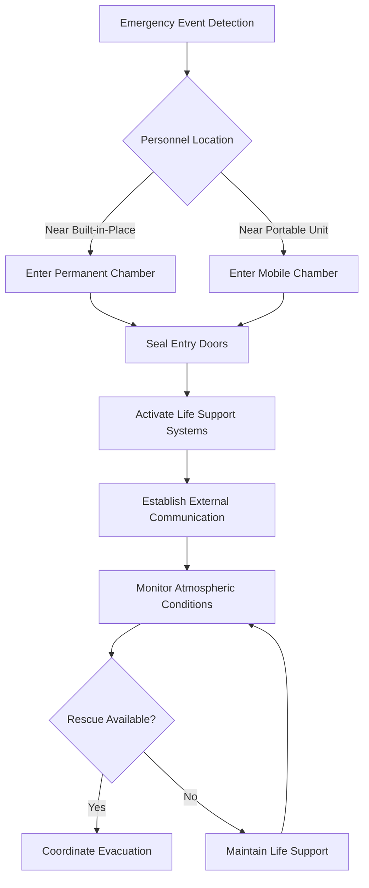

## Purpose and Regulatory Framework

Emergency shelters and refuge chambers serve as critical life-safety systems in underground mining operations, providing temporary protection during mine emergencies including fires, explosions, or atmospheric contamination. These sealed environments maintain habitable conditions through controlled atmospheric systems until rescue operations can safely extract personnel.

MSHA regulations under 30 CFR Part 7 establish comprehensive performance standards for refuge alternatives, mandating specific requirements for atmospheric control, structural integrity, and survivability duration. The regulatory framework emerged following several major mine disasters, particularly the 2006 Sago Mine tragedy, which revealed critical gaps in emergency preparedness.

## Built-in-Place vs Portable Chambers

### Comparison of Chamber Types

| Characteristic | Built-in-Place Chambers | Portable Chambers |
|----------------|------------------------|-------------------|
| Construction Method | Permanent concrete/steel structure | Pre-fabricated modular units |
| Installation Time | 2-4 weeks | 4-8 hours |
| Capacity Range | 15-100+ persons | 8-30 persons |
| Relocation Capability | None | Full mobility |
| Structural Integrity | Superior blast resistance | MSHA-certified protection |
| Capital Cost | $150,000-$500,000 | $40,000-$150,000 |
| Maintenance Access | In-situ inspection | Removal for servicing |

**Built-in-Place Chambers** provide maximum structural protection through reinforced concrete walls (typically 8-12 inches thick) with steel reinforcement. These permanent installations integrate with mine infrastructure, offering superior blast resistance and larger capacity. The thermal mass of concrete construction provides inherent temperature buffering, reducing cooling loads during extended occupancy.

**Portable Chambers** utilize steel construction (3/16 to 1/4 inch plate) with modular assembly, allowing repositioning as mining operations advance. Modern designs incorporate composite materials for the outer shell, providing blast resistance while minimizing weight for transport through mine passages.

## Capacity Requirements and Calculations

MSHA regulations require sufficient refuge capacity to accommodate all personnel in the affected area of the mine. Capacity calculations must account for both the number of occupants and the minimum habitable volume per person.

### Volumetric Requirements

The minimum internal volume requirement is:

$$V_{min} = N \times V_{person} \times SF$$

Where:
- $V_{min}$ = Minimum chamber volume (ft³)
- $N$ = Number of occupants
- $V_{person}$ = 15 ft³ per person (MSHA minimum)
- $SF$ = Safety factor (typically 1.2-1.5)

For a 20-person chamber:

$$V_{min} = 20 \times 15 \times 1.3 = 390 \text{ ft}^3$$

### Oxygen Supply Duration

The oxygen supply system must provide 96 hours of breathable air. The total oxygen requirement is:

$$O_2_{total} = N \times R_{O_2} \times t \times 1.25$$

Where:
- $O_2_{total}$ = Total oxygen required (liters)
- $N$ = Number of occupants
- $R_{O_2}$ = 15 L/hour per person (metabolic consumption at rest)
- $t$ = 96 hours (regulatory minimum)
- 1.25 = Reserve factor

For 20 occupants:

$$O_2_{total} = 20 \times 15 \times 96 \times 1.25 = 36,000 \text{ L}$$

At standard conditions (1 atm, 20°C), this requires approximately 1,550 standard cubic feet of compressed oxygen storage.

## Construction Standards

### Structural Requirements

Chambers must withstand:
- **Overpressure**: Minimum 15 psi blast wave resistance
- **Impact**: Protection from falling rock and debris
- **Temperature**: Maintain internal conditions between 50-95°F
- **Sealing**: Gas-tight construction preventing contaminated air infiltration

### Atmospheric Control Systems

The life support system maintains habitability through four primary functions:

**Carbon Dioxide Removal**: Scrubber systems using lithium hydroxide (LiOH) or calcium hydroxide (Ca(OH)₂) chemically absorb CO₂:

$$\text{LiOH} + \text{CO}_2 \rightarrow \text{LiHCO}_3$$

The scrubber capacity must remove CO₂ at the metabolic production rate of approximately 0.013 ft³/person·hour.

**Oxygen Supplementation**: Compressed gas cylinders or chemical oxygen generators maintain O₂ concentration between 18-23% by volume. The injection rate must balance metabolic consumption while preventing hyperoxic conditions.

## Location Criteria

Effective refuge chamber placement requires analysis of multiple factors:

1. **Distance from Working Face**: Maximum 2,000 feet travel distance (MSHA recommendation)
2. **Elevation Considerations**: Position above expected water accumulation zones
3. **Ventilation Circuit Position**: Locate in intake airways when possible
4. **Structural Stability**: Install in competent rock away from active mining zones
5. **Accessibility**: Clear access routes with signage every 100 feet

### Strategic Placement Analysis

The optimal number of chambers follows from the total workforce distribution:

$$N_{chambers} = \left\lceil \frac{W_{total}}{C_{chamber}} \right\rceil \times SF_{redundancy}$$

Where:
- $N_{chambers}$ = Number of required chambers
- $W_{total}$ = Total workers in zone
- $C_{chamber}$ = Chamber capacity
- $SF_{redundancy}$ = 1.5 (redundancy factor)

## Communication Systems

MSHA requires two-way communication capability with surface command centers. Systems include:

- **Hardwired Systems**: Leaky feeder or conventional telephone lines
- **Through-the-Earth (TTE)**: Low-frequency electromagnetic systems penetrating rock strata
- **Wireless Networks**: Mine-wide mesh networks with chamber integration
- **Backup Communication**: Independent battery-powered systems (72-hour minimum)

Each system must provide clear voice communication and allow distress signaling. Redundant communication pathways ensure connectivity even with primary system failure.

## Inspection and Maintenance

Quarterly inspections verify:
- Atmospheric control system functionality
- Oxygen cylinder pressure and expiration dates
- Scrubber material condition and capacity
- Structural integrity of seals and doors
- Communication system operation
- Emergency supplies inventory (water, first aid, sanitation)

Documentation of all inspections must be maintained for MSHA review, with immediate corrective action for any deficiencies affecting life-safety systems.
