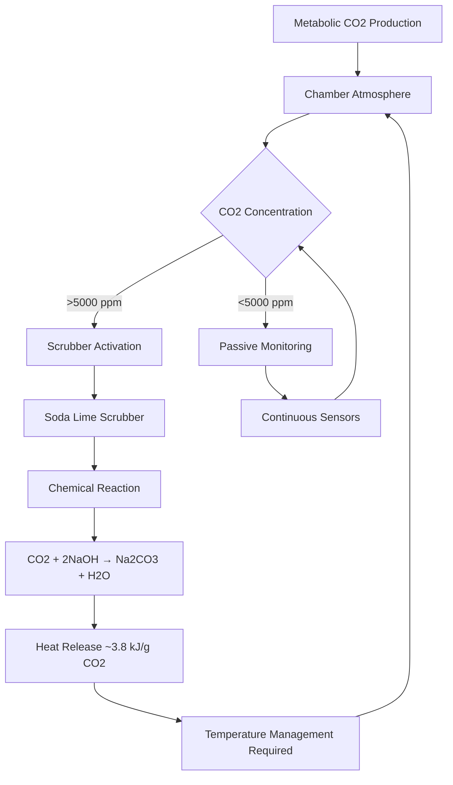
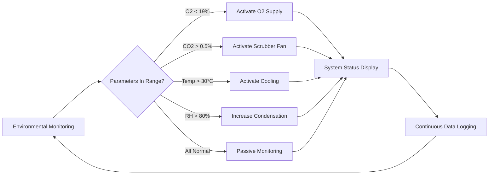

Mine refuge chambers provide critical life support during underground emergencies when miners cannot evacuate. The environmental control system must sustain life for extended periods, typically 96 hours per MSHA regulations, by managing atmospheric composition, temperature, and humidity in a sealed enclosure.

## Atmospheric Composition Control

The primary challenge in refuge chamber environmental control is maintaining breathable air quality in a sealed space with continuous metabolic oxygen consumption and carbon dioxide production.

### Oxygen Supply Requirements

Human oxygen consumption averages 0.3 to 0.4 L/min at rest, with metabolic heat generation creating additional thermal load. For a refuge chamber designed for $N$ occupants over duration $t$ (hours), the minimum oxygen requirement is:

$$V_{O_2} = N \times 0.35 \frac{\text{L}}{\text{min}} \times 60 \frac{\text{min}}{\text{hr}} \times t \text{ (hr)}$$

MSHA 30 CFR 7.504 requires maintaining oxygen concentration between 18.5% and 23% by volume. For a chamber volume $V_c$ (cubic meters), the oxygen partial pressure must remain within safe limits:

$$P_{O_2} = 0.185 \times P_{atm} \leq P_{O_2,actual} \leq 0.23 \times P_{atm}$$

Oxygen delivery systems include:

**Compressed Gas Cylinders**
- High-pressure storage (2000-2400 psi)
- Pressure regulators maintain 50-100 psi delivery
- Flow metering ensures controlled release
- Typical capacity: 200-300 ft³ per cylinder

**Chemical Oxygen Generators**
- Potassium superoxide (KO₂) or sodium chlorate candles
- Exothermic reaction produces O₂
- Self-contained activation mechanism
- Heat generation requires thermal management

### Carbon Dioxide Removal

Metabolic CO₂ production averages 0.25-0.3 L/min per person. Without removal, CO₂ concentration rises rapidly in sealed spaces. MSHA limits CO₂ to 1.0% (10,000 ppm) over 96 hours, with absolute maximum of 2.5%.

The CO₂ generation rate creates concentration increase:

$$\frac{dC_{CO_2}}{dt} = \frac{N \times R_{CO_2}}{V_c} \times 10^6 \text{ (ppm/hr)}$$

where $R_{CO_2}$ = 0.27 L/min per person and $V_c$ is chamber volume in liters.

#### Soda Lime Scrubbing

The predominant CO₂ removal method uses soda lime (mixture of calcium hydroxide and sodium hydroxide) in packed bed scrubbers:

$$\text{CO}_2 + 2\text{NaOH} \rightarrow \text{Na}_2\text{CO}_3 + \text{H}_2\text{O} + 127 \text{ kJ/mol}$$

$$\text{Na}_2\text{CO}_3 + \text{Ca(OH)}_2 \rightarrow \text{CaCO}_3 + 2\text{NaOH}$$

Required scrubber capacity for complete CO₂ removal over time $t$:

$$m_{scrubber} = \frac{N \times R_{CO_2} \times t \times 60 \times \rho_{CO_2}}{E_{scrubber}}$$

where:
- $\rho_{CO_2}$ = 1.98 g/L (at STP)
- $E_{scrubber}$ = scrubber efficiency (0.85-0.95)
- Typical consumption: 120 g soda lime per person per day

| Scrubber Type | Capacity (kg CO₂/kg media) | Pressure Drop (Pa) | Heat Release (kJ/kg CO₂) | Service Life |
|---------------|---------------------------|-------------------|------------------------|--------------|
| Soda Lime Packed Bed | 0.18-0.22 | 125-250 | 3800 | 500-700 hrs |
| Lithium Hydroxide | 0.35-0.45 | 75-150 | 4200 | 300-500 hrs |
| Molecular Sieve | 0.12-0.16 | 200-350 | N/A (regenerative) | Regenerable |

## Temperature and Humidity Control

The sealed refuge chamber experiences thermal loads from multiple sources:

**Heat Generation Sources:**
1. Metabolic heat: 100-120 W per person at rest
2. CO₂ scrubber reaction heat: 3.8 kJ per gram CO₂ removed
3. Oxygen generator heat (if chemical): 200-500 W during operation
4. Electronic equipment: 50-150 W continuous
5. Heat ingress through walls: $Q = UA\Delta T$

### Cooling System Design

MSHA requires maintaining temperature below 95°F (35°C) dry bulb. The total heat load balance:

$$Q_{total} = Q_{metabolic} + Q_{scrubber} + Q_{equipment} + Q_{walls} - Q_{cooling}$$

For steady-state conditions, $Q_{cooling}$ must equal all heat gains:

$$Q_{cooling} = N \times 120 \text{ W} + \dot{m}_{CO_2} \times 3800 \frac{\text{kJ}}{\text{kg}} + Q_{equip} + UA\Delta T$$

Cooling methods comparison:

| Cooling Method | Capacity (W) | Duration | Advantages | Limitations |
|----------------|--------------|----------|------------|-------------|
| Ice Storage | 2000-5000 | 48-96 hrs | Passive, reliable | Large space, limited duration |
| Phase Change Material | 1500-4000 | 72-120 hrs | Compact, steady temp | Higher cost, slower response |
| Compressed Air Expansion | 3000-8000 | 24-48 hrs | Rapid cooling | Air supply limited |
| Peltier Coolers | 500-2000 | Unlimited | Active control | High power consumption |

The most common approach combines ice storage for base load with compressed air expansion for peak loads. Ice storage mass required:

$$m_{ice} = \frac{Q_{total} \times t \times 3600}{h_{fg,ice}}$$

where $h_{fg,ice}$ = 334 kJ/kg (latent heat of fusion).

### Humidity Management

Metabolic water vapor production averages 40-50 g/hr per person. CO₂ scrubbing also releases water vapor from the chemical reaction. Without control, relative humidity exceeds 90% within hours, causing discomfort and condensation.

MSHA guidelines recommend maintaining RH below 85%. The moisture balance:

$$\frac{dm_{vapor}}{dt} = N \times \dot{m}_{metabolic} + \dot{m}_{scrubber} - \dot{m}_{condensate}$$

Condensing surfaces (cold walls or dedicated dehumidification) remove excess moisture. For ice-based cooling, the cold surface temperature $T_s$ must remain below dew point:

$$T_s < T_{dewpoint} = T_{db} - \frac{100 - RH}{5}$$

where $T_{db}$ is dry bulb temperature (°C) and this approximation is valid for typical conditions.

## Life Support Duration Calculations

MSHA 30 CFR 7.503 requires 96-hour minimum life support capacity. The limiting factor determines actual survivability:

**Oxygen Supply Duration:**

$$t_{O_2} = \frac{V_{O_2,stored}}{N \times 0.35 \times 60} \text{ (hours)}$$

**CO₂ Scrubber Duration:**

$$t_{CO_2} = \frac{m_{scrubber} \times E_{scrubber}}{N \times R_{CO_2} \times 60 \times \rho_{CO_2}} \text{ (hours)}$$

**Cooling Capacity Duration:**

$$t_{cooling} = \frac{m_{ice} \times h_{fg,ice}}{Q_{total} \times 3600} \text{ (hours)}$$

The actual life support duration is:

$$t_{actual} = \min(t_{O_2}, t_{CO_2}, t_{cooling})$$

Safety margins of 20-30% are standard practice to account for variations in occupancy, metabolic rate, and ambient conditions.

## Monitoring and Control Systems

Continuous monitoring ensures environmental parameters remain within safe limits. Required sensors per MSHA:

- **Oxygen:** Electrochemical or paramagnetic sensors, ±0.5% accuracy
- **Carbon Dioxide:** NDIR sensors, ±0.1% accuracy
- **Carbon Monoxide:** Electrochemical sensors, ±5 ppm accuracy
- **Temperature:** RTD or thermistor, ±0.5°C accuracy
- **Humidity:** Capacitive or resistive, ±3% RH accuracy

Automated control sequences activate life support systems based on sensor readings, with manual override capability and redundant backup systems for critical functions.

The integration of oxygen supply, CO₂ removal, thermal management, and humidity control creates a complete life support system capable of sustaining occupants through extended mine emergencies while maintaining conditions within physiological tolerance limits established by MSHA regulations.
