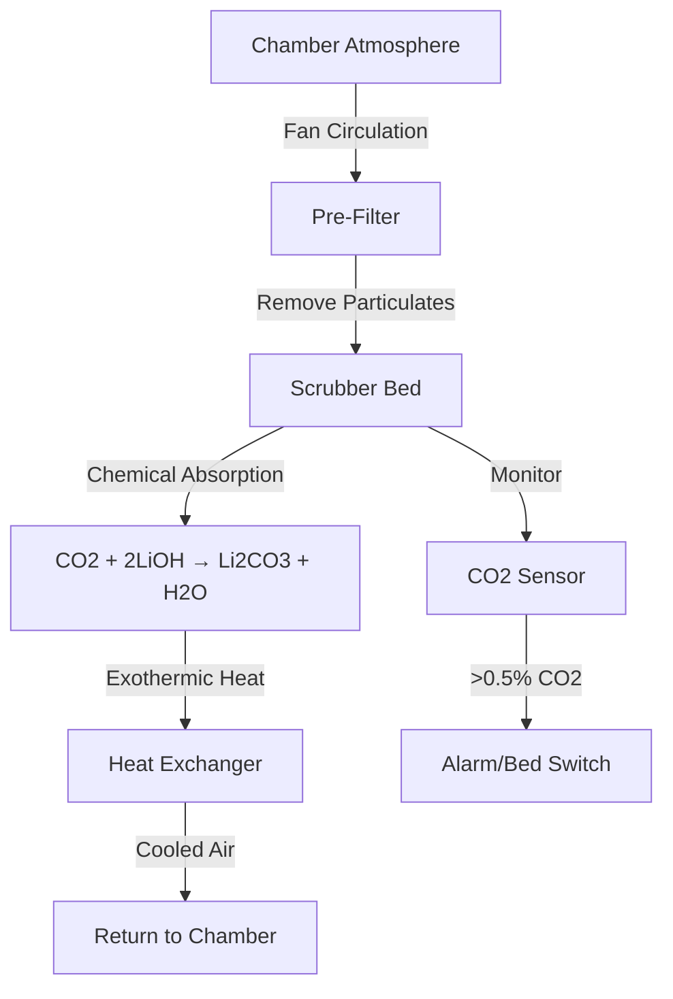
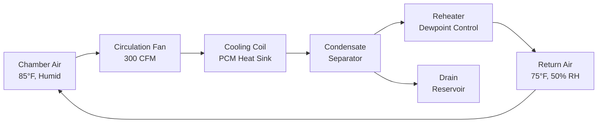

## Overview

Life support systems in mine refuge chambers maintain survivable atmospheric conditions for trapped miners during emergency situations. The engineering challenge involves balancing oxygen supply, carbon dioxide removal, thermal control, and humidity management within severely constrained volume and power limitations.

MSHA regulations (30 CFR 7.504) mandate refuge chambers sustain occupants for 96 hours minimum, requiring precise calculations of consumable capacity and environmental control system performance.

## Oxygen Supply Calculations

### Metabolic Oxygen Demand

Human oxygen consumption varies with activity level and body mass. At rest in emergency conditions, typical consumption rates are:

$$\dot{V}_{O_2} = 0.25 \text{ L/min per person (STPD)}$$

For a 96-hour refuge period with N occupants:

$$V_{O_2,total} = \dot{V}_{O_2} \times N \times t \times 60$$

$$V_{O_2,total} = 0.25 \times N \times 96 \times 60 = 1,440N \text{ liters (STPD)}$$

**Example:** A 15-person chamber requires 21,600 L (763 ft³) of oxygen at standard conditions.

### Supply Methods Comparison

| Method | Storage Density | Advantages | Limitations |
|--------|----------------|------------|-------------|
| Compressed Gas (2000 psi) | 150 L/L cylinder | Simple, reliable | Heavy cylinders, volume intensive |
| Chemical Generators (Chlorate Candles) | 600 L/kg | High density, no pressure | Heat generation (6.5 kJ/L O₂), limited control |
| Liquid Oxygen | 860 L/L | Highest density | Boil-off, cryogenic handling |

### Partial Pressure Requirements

Breathable atmosphere requires maintaining oxygen partial pressure:

$$P_{O_2} = 0.19 \text{ to } 0.23 \text{ atm}$$

In a sealed chamber, oxygen depletion and CO₂ accumulation affect total pressure. The mass balance equation:

$$P_{total} = P_{O_2} + P_{N_2} + P_{CO_2} + P_{H_2O}$$

As metabolic processes convert O₂ to CO₂, the respiratory quotient (RQ ≈ 0.8) means total moles decrease slightly, creating minor pressure drop.

## Carbon Dioxide Scrubbing

### Chemical Absorption Mechanisms

**Soda Lime (Ca(OH)₂ + NaOH)**

The predominant reaction sequence:

$$\text{CO}_2 + 2\text{NaOH} \rightarrow \text{Na}_2\text{CO}_3 + \text{H}_2\text{O} + 48.1 \text{ kJ/mol}$$

$$\text{Na}_2\text{CO}_3 + \text{Ca(OH)}_2 \rightarrow 2\text{NaOH} + \text{CaCO}_3$$

**Lithium Hydroxide (LiOH)**

$$\text{CO}_2 + 2\text{LiOH} \rightarrow \text{Li}_2\text{CO}_3 + \text{H}_2\text{O} + 62.8 \text{ kJ/mol}$$

### Scrubber Sizing Calculations

Human CO₂ production rate at rest:

$$\dot{V}_{CO_2} = RQ \times \dot{V}_{O_2} = 0.8 \times 0.25 = 0.20 \text{ L/min per person}$$

Total CO₂ mass for 96-hour occupancy:

$$m_{CO_2} = \dot{V}_{CO_2} \times N \times t \times 60 \times \frac{\rho_{CO_2}}{1000}$$

$$m_{CO_2} = 0.20 \times N \times 96 \times 60 \times 1.977 = 2,276N \text{ grams}$$

Where ρ_CO₂ = 1.977 g/L at STPD.

### Absorbent Capacity

**Soda Lime:** Theoretical capacity = 0.23 kg CO₂/kg absorbent (achievable: 0.15-0.18)

**Lithium Hydroxide:** Theoretical capacity = 0.92 kg CO₂/kg absorbent (achievable: 0.70-0.75)

For 15 occupants over 96 hours (34.14 kg CO₂):

- Soda lime required: 190-228 kg
- Lithium hydroxide required: 45-49 kg

## Temperature and Humidity Control

### Heat Load Components

Total sensible heat in a refuge chamber:

$$Q_{total} = Q_{metabolic} + Q_{scrubber} + Q_{equipment} + Q_{infiltration}$$

**Metabolic Heat Generation:**

$$Q_{metabolic} = N \times 100 \text{ W/person (at rest)}$$

**Scrubbing Reaction Heat:**

For soda lime: 48.1 kJ/mol CO₂ × 0.20 L/min × N × 0.0446 mol/L = 430N W

**Combined Heat Load (15 occupants):** 1,500 + 6,450 + equipment ≈ 8,500 W

### Cooling Methods

| Method | Cooling Capacity | Chamber Application |
|--------|-----------------|---------------------|
| Ice Storage | 334 kJ/kg | Limited duration, simple |
| Phase Change Materials | 150-250 kJ/kg | Extended duration, stable temp |
| Thermoelectric Coolers | 50-150 W/module | Electric dependent, compact |
| Chilled Water Loop | Variable | External heat sink required |

### Humidity Management

Metabolic water vapor production:

$$\dot{m}_{H_2O} = 50 \text{ g/h per person}$$

Relative humidity must remain below 60% for thermal comfort and above 30% for respiratory health. Condensation removal capacity required:

$$m_{H_2O,96h} = N \times 50 \times 96 = 4,800N \text{ grams}$$

Chemical scrubbers produce additional water from CO₂ reactions, increasing dehumidification requirements by approximately 40%.

## Air Monitoring Systems

### Critical Parameters

MSHA-compliant chambers require continuous monitoring:

| Parameter | Safe Range | Alarm Threshold | Sensor Type |
|-----------|------------|----------------|-------------|
| O₂ Concentration | 19-23% | <19.5% or >23% | Electrochemical |
| CO₂ Concentration | <0.5% | >1.0% | NDIR |
| CO Concentration | <25 ppm | >50 ppm | Electrochemical |
| Temperature | 50-95°F | >95°F | Thermocouple |
| Relative Humidity | 30-60% | >70% | Capacitive |

### Gas Concentration Dynamics

First-order accumulation model for CO₂ in sealed chamber:

$$\frac{dC}{dt} = \frac{\dot{V}_{CO_2} \times N}{V_{chamber}} - k \times C$$

Where k is the scrubber removal rate coefficient (min⁻¹). At steady state:

$$C_{ss} = \frac{\dot{V}_{CO_2} \times N}{k \times V_{chamber}}$$

## Metabolic Heat Removal

### Convective Heat Transfer

Chamber cooling relies on forced convection to occupants. Required air velocity for thermal comfort at 85°F:

$$v_{air} = 50-100 \text{ fpm}$$

Convective heat transfer coefficient:

$$h_c = 2.9 + 2.56v^{0.5}$$

Where v is in m/s, h_c in W/(m²·K).

### Cooling System Process Flow

## Occupant Capacity Calculations

Chamber capacity determination integrates multiple constraints:

$$N_{max} = \min\left(\frac{V_{chamber}}{42 \text{ ft}^3}, \frac{O_{2,stored}}{1440}, \frac{m_{scrubber}}{2.28 \text{ kg}}, \frac{Q_{cooling}}{530 \text{ W}}\right)$$

The limiting factor varies by chamber design. Well-engineered systems balance all parameters to achieve rated capacity without significant overdesign.

**MSHA Requirement:** Minimum 15 ft³ per person for non-air-conditioned chambers, 30 ft³ for air-conditioned chambers (30 CFR 7.503).

### Design Verification Example

For a 600 ft³ chamber rated for 15 occupants:

- Volume check: 600/15 = 40 ft³/person ✓
- O₂ supply: 22,000 L ÷ 1,440 = 15.3 persons ✓
- Scrubber capacity: 50 kg LiOH × 0.72 ÷ 2.28 = 15.8 persons ✓
- Cooling capacity: 9,000 W ÷ 530 = 17.0 persons ✓

All constraints satisfied for 96-hour occupancy at rated capacity.

## Operational Considerations

Periodic inspection protocols must verify:

1. Compressed gas cylinder pressure (monthly)
2. Scrubber absorbent condition (annual replacement or after use)
3. Sensor calibration (semi-annual)
4. Cooling system charge (quarterly)
5. Sealing gaskets and integrity (annual)

Life support consumables have finite shelf life—lithium hydroxide degrades with moisture exposure, oxygen generators have 10-15 year service life, and compressed gas cylinders require hydrostatic testing every 5 years per DOT regulations.

The integration of oxygen supply, CO₂ removal, thermal control, and monitoring creates a robust life support system capable of sustaining miners through extended emergency scenarios, provided engineering calculations accurately reflect metabolic loads and system capabilities align with MSHA performance standards.
