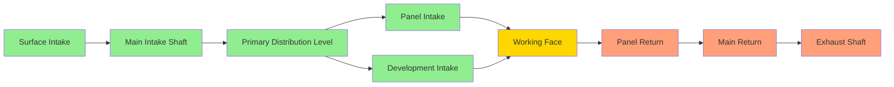
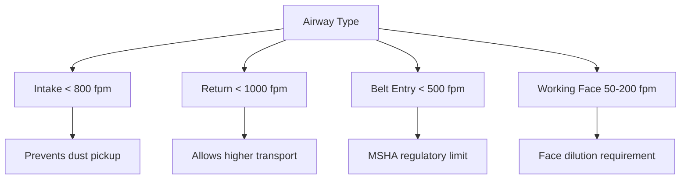

Mine airways form the arterial network through which ventilation air travels to dilute contaminants, control temperature, and provide breathable atmosphere throughout underground operations. The design, maintenance, and operation of these airways directly determine the efficiency and safety of the entire ventilation system.

## Intake and Return Airway Systems

Underground mine ventilation employs dedicated intake and return airways to establish controlled airflow patterns. **Intake airways** deliver fresh air from surface fans or natural draft openings to working areas, while **return airways** convey contaminated air back to exhaust points.

The separation of intake and return systems prevents short-circuiting and maintains air quality throughout the mine. MSHA regulations under 30 CFR 75.323 mandate that intake air remain isolated from return air except at designated mixing points. Physical barriers, stoppings, or sufficient rock pillars provide this separation.

### Airway Configuration Strategies

Parallel airway systems increase total airflow capacity while reducing overall resistance. When two identical airways operate in parallel, the combined resistance drops to 50% of a single airway, following the parallel resistance relationship:

$$\frac{1}{R_{total}} = \frac{1}{R_1} + \frac{1}{R_2} + ... + \frac{1}{R_n}$$

## Airway Dimensions and Cross-Sectional Area

Cross-sectional area directly governs both airflow capacity and frictional resistance. The fundamental relationship between air quantity, velocity, and area follows:

$$Q = A \times V$$

Where:
- $Q$ = air quantity (cfm or m³/s)
- $A$ = cross-sectional area (ft² or m²)
- $V$ = average air velocity (fpm or m/s)

### Standard Mine Entry Dimensions

| Entry Type | Width (ft) | Height (ft) | Area (ft²) | Typical Use |
|------------|-----------|------------|-----------|-------------|
| Main intake | 20 | 8 | 160 | Primary air distribution |
| Main return | 20 | 8 | 160 | Primary exhaust |
| Panel entry | 16 | 6 | 96 | Section ventilation |
| Development | 16 | 6 | 96 | Active mining |
| Escape route | 6 | 6 | 36 | Emergency egress |

The effective area often differs from the physical excavated area due to equipment, rail tracks, conveyor structures, and roof convergence. A **k-factor** (obstruction factor) of 0.70-0.85 accounts for these reductions:

$$A_{effective} = k \times A_{excavated}$$

## Airway Resistance and Friction Factors

Airway resistance represents the opposition to airflow caused by surface friction and turbulence. The Atkinson equation quantifies this resistance:

$$R = \frac{K \times L \times P}{A^3}$$

Where:
- $R$ = airway resistance (in units of N·s²/m⁸ or lb·min²/ft⁶)
- $K$ = friction factor (dimensionless)
- $L$ = airway length (m or ft)
- $P$ = perimeter (m or ft)
- $A$ = cross-sectional area (m² or ft²)

The friction factor $K$ encapsulates surface roughness effects and varies significantly with airway type:

| Surface Condition | Friction Factor (K) | Typical Application |
|-------------------|---------------------|---------------------|
| Smooth concrete liner | 0.004 - 0.006 | Shafts, main entries |
| Shotcrete surface | 0.008 - 0.012 | Rehabilitated entries |
| Rock bolt pattern | 0.012 - 0.018 | Modern roof support |
| Rough blasted rock | 0.020 - 0.035 | Unlined development |
| Ribbed with supports | 0.025 - 0.045 | Traditional coal mines |
| Severe deterioration | 0.050+ | Requires maintenance |

## Surface Roughness Effects on Airflow

Surface roughness generates turbulence in the boundary layer, increasing energy losses. The relationship between roughness height and friction factor follows the Colebrook-White equation adapted for mine airways.

Protruding rock bolts, scaling, rib deterioration, and equipment create roughness elements that project into the airstream. A roughness element of just 6 inches can increase resistance by 30-50% compared to smooth surfaces.

### Roughness Mitigation Strategies

**Shotcrete application**: Sprayed concrete smooths irregular surfaces, reducing $K$ from 0.025 to 0.010, cutting resistance by 60%.

**Airway rehabilitation**: Removing loose material, trimming protrusions, and resurfacing deteriorated sections restore design flow characteristics.

**Strategic liner placement**: High-velocity airways benefit most from smoothing; doubling velocity quadruples frictional losses due to the square-law relationship in pressure drop.

## Air Velocity Limits and Dust Control

Air velocity in mine airways must balance adequate ventilation against dust entrainment and coal dust explosion hazards. MSHA regulations establish specific velocity limits:

**30 CFR 75.326**: Air velocity in intake airways shall not be less than 40 fpm where miners work or travel.

**30 CFR 75.326(b)**: Air velocity in belt entry shall not exceed 500 fpm unless rock dust is applied or the belt is nonflammable.

### Velocity-Dust Relationship

The critical velocity for dust pickup follows empirical relationships based on particle size and density:

$$V_{critical} = K_{dust} \sqrt{\frac{d_p (\rho_p - \rho_a)}{\rho_a}}$$

Where:
- $V_{critical}$ = velocity causing dust entrainment (m/s)
- $K_{dust}$ = empirical constant (3-7)
- $d_p$ = particle diameter (m)
- $\rho_p$ = particle density (kg/m³)
- $\rho_a$ = air density (kg/m³)

For coal dust (10-100 μm particles), velocities exceeding 800-1000 fpm cause significant re-entrainment of settled dust, creating respirable dust exposure risks and explosion hazards.

### Recommended Velocity Ranges

## Airway Maintenance Requirements

Continuous maintenance preserves airway flow capacity and prevents progressive resistance increases. Ground pressure causes roof sag, floor heave, and rib convergence that reduce cross-sectional area over time.

The area reduction directly impacts resistance through the cubic relationship in the Atkinson equation. A 20% area loss increases resistance by 95% ($R \propto A^{-3}$).

### Maintenance Program Elements

**Regular inspection cycles**: Monthly surveys measure cross-sections, identify damage, and document changing conditions.

**Dilation scheduling**: Removing accumulated material from floor heave and roof sag restores design dimensions.

**Roof support upgrades**: Additional bolting or standing support prevents progressive closure in high-stress areas.

**Ventilation surveys**: Quarterly airflow measurements detect resistance increases before they compromise system performance.

## Emergency Escape Routes

MSHA regulations under 30 CFR 75.380 require two separate and distinct escapeways from each working section. These routes must remain passable and properly marked at all times.

Escapeway airways serve dual functions as ventilation routes and emergency egress paths. Minimum dimensions of 5 ft height by 4 ft width provide adequate passage for evacuating miners, though larger dimensions improve evacuation speed.

### Escapeway Air Quality Standards

**30 CFR 75.325**: Escapeway air must contain at least 19.5% oxygen and not more than 0.5% carbon dioxide.

During emergencies, escapeway air quality may degrade from smoke, gases, or ventilation system disruption. Refuge alternatives and self-contained self-rescuers (SCSRs) provide life support when escapeway air becomes irrespirable.

The physics of smoke migration in sloped airways follows buoyancy-driven flow patterns. Hot combustion gases rise in updip airways but can travel either direction in level entries depending on ventilation pressure differentials. Escape route planning must account for these smoke behavior patterns based on mine geometry and ventilation configuration.

## Conclusion

Mine airway design integrates fluid mechanics, rock mechanics, and regulatory compliance to create safe and efficient ventilation systems. Proper dimensioning, surface treatment, velocity control, and ongoing maintenance ensure airways fulfill their critical role in protecting underground miners while supporting productive mining operations.
