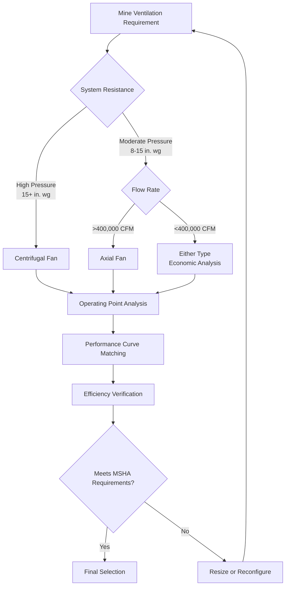

## Overview

Main mine ventilation fans represent the primary means of maintaining breathable atmosphere throughout underground mining operations. These large-capacity machines move hundreds of thousands of cubic feet per minute (CFM) against substantial static pressures, typically ranging from 8 to 25 inches water gauge (in. wg). The fundamental physics governing main fan operation differs significantly from commercial HVAC applications due to extreme airflow volumes, extended ductwork distances, and stringent regulatory requirements under MSHA (Mine Safety and Health Administration) jurisdiction.

The primary function of a main fan is to overcome the total resistance of the mine ventilation network while delivering the required volumetric airflow. This resistance stems from friction losses along airways, shock losses at junctions and obstructions, and elevation-related pressure changes. The fan must generate sufficient total pressure to maintain minimum velocity requirements—typically 60 fpm minimum in entries with personnel—while ensuring adequate air changes in working sections.

## Surface Fan Installations

Surface installations dominate main fan applications due to accessibility for maintenance, reduced explosion risk, and simplified regulatory compliance. The surface fan location relative to the mine shaft determines the fundamental operating mode.

### Installation Configurations

Surface fans connect to mine airways through either vertical shafts or inclined drift portals. The critical distinction lies in whether the fan pushes air into the mine (forcing) or pulls air from the mine (exhausting).

**Forcing Configuration:**
- Fan located at intake shaft
- Positive pressure throughout mine
- Airflow equation: $Q = A \cdot V = \rho A V / \rho_{std}$

**Exhausting Configuration:**
- Fan located at exhaust shaft
- Negative pressure throughout mine
- Dominant configuration for gassy mines

The exhausting configuration provides superior safety characteristics. Any air leakage through strata fractures or abandoned workings flows inward, preventing methane or other hazardous gases from migrating to adjacent properties. Additionally, exhaust fans prevent pressurization of sealed areas, reducing the risk of spontaneous combustion in coal mines.

## Forcing vs Exhausting Systems

The thermodynamic and safety implications of forcing versus exhausting configurations substantially influence system design.

### Pressure and Density Effects

In forcing systems, the entire mine operates under positive pressure. The fan receives surface air at standard density $\rho_0$ and compresses it slightly. The air density throughout the mine is:

$$\rho_{mine} = \rho_0 + \frac{\Delta P_{fan}}{RT}$$

where $\Delta P_{fan}$ is fan static pressure rise, $R$ is the specific gas constant (53.35 ft·lbf/lbm·°R for air), and $T$ is absolute temperature.

Exhausting systems maintain negative pressure throughout the mine. The fan inlet receives air at density:

$$\rho_{inlet} = \rho_0 - \frac{\Delta P_{system}}{RT}$$

This reduced inlet density decreases fan power requirements by approximately 2-5% compared to forcing systems.

### Comparison Table

| Parameter | Forcing System | Exhausting System |
|-----------|---------------|-------------------|
| Mine pressure | Positive throughout | Negative throughout |
| Leakage direction | Outward from mine | Inward to mine |
| Gas control | Fair | Excellent |
| Sealed area risk | Higher pressurization | Lower pressurization |
| Fan inlet conditions | Standard density | Reduced density |
| Power requirement | Higher | Lower (2-5%) |
| MSHA preference | Acceptable | Preferred for gassy mines |

## Axial vs Centrifugal Fan Selection

Main mine fans employ either axial flow or centrifugal (radial) designs. The selection depends on the system's operating point on the fan performance curve.

### Axial Flow Fans

Axial fans move air parallel to the shaft axis. Blades impart tangential velocity to the airstream, which converts to static pressure through guide vanes or diffusers. The Euler turbomachinery equation governs energy transfer:

$$H = \frac{u_2 V_{t2} - u_1 V_{t1}}{g}$$

where $H$ is head, $u$ is blade velocity, $V_t$ is tangential air velocity, and $g$ is gravitational acceleration.

**Axial Fan Characteristics:**
- High flow rates (100,000 to 1,000,000+ CFM)
- Moderate pressure rise (8-18 in. wg typical)
- Efficiency peak: 75-88%
- Compact installation footprint
- Lower capital cost
- Narrow stable operating range

### Centrifugal Fans

Centrifugal fans accelerate air radially outward through an impeller, converting velocity pressure to static pressure in a scroll housing. The theoretical pressure rise relates to impeller tip speed:

$$\Delta P_{ideal} = \rho \frac{u_2^2}{2g_c}$$

where $u_2$ is impeller tip velocity and $g_c$ is the dimensional constant (32.174 lbm·ft/lbf·s²).

**Centrifugal Fan Characteristics:**
- Moderate to high flow rates (50,000 to 500,000 CFM typical)
- High pressure capability (15-35 in. wg)
- Efficiency peak: 70-85%
- Larger installation footprint
- Higher capital cost
- Wide stable operating range
- Superior surge margin

### Selection Criteria

## Fan Laws and Performance Curves

The fan laws describe how performance parameters scale with speed and size changes. These affinity relationships are fundamental to fan testing and field performance prediction.

### Primary Fan Laws

For a given fan at different speeds:

$$\frac{Q_2}{Q_1} = \frac{N_2}{N_1}$$

$$\frac{\Delta P_2}{\Delta P_1} = \left(\frac{N_2}{N_1}\right)^2$$

$$\frac{BHP_2}{BHP_1} = \left(\frac{N_2}{N_1}\right)^3$$

where $Q$ is volumetric flow rate, $\Delta P$ is pressure rise, $BHP$ is brake horsepower, and $N$ is rotational speed.

For geometrically similar fans at the same speed:

$$\frac{Q_2}{Q_1} = \left(\frac{D_2}{D_1}\right)^3$$

$$\frac{\Delta P_2}{\Delta P_1} = \left(\frac{D_2}{D_1}\right)^2$$

$$\frac{BHP_2}{BHP_1} = \left(\frac{D_2}{D_1}\right)^5$$

where $D$ is impeller or rotor diameter.

### System Curve Interaction

The mine ventilation network presents a resistance that varies with the square of airflow velocity:

$$\Delta P_{system} = R \cdot Q^2$$

where $R$ is the system resistance coefficient (in. wg/(CFM)²). The operating point occurs where the fan curve intersects the system curve.

## Fan Testing Protocols

MSHA mandates periodic testing of main mine ventilation fans under 30 CFR § 75.310. Testing verifies the fan can deliver required airflow against actual system resistance and establishes performance baselines for deterioration monitoring.

### Test Measurement Requirements

1. **Volumetric Flow Rate:** Measured using traverse method per AMCA 203 or pitot tube array
2. **Static Pressure:** Differential pressure across fan (discharge minus inlet)
3. **Fan Speed:** Tachometer or strobe measurement
4. **Power Input:** Three-phase power analyzer on motor
5. **Air Density:** Temperature and barometric pressure at fan inlet

### Performance Calculations

Fan static pressure (FSP):

$$FSP = SP_d - SP_i + VP_i$$

where $SP_d$ is discharge static pressure, $SP_i$ is inlet static pressure, and $VP_i$ is inlet velocity pressure.

Fan static efficiency:

$$\eta_s = \frac{Q \cdot FSP}{6356 \cdot BHP} \times 100\%$$

with $Q$ in CFM, $FSP$ in in. wg, and $BHP$ in horsepower.

## Standby Capacity Requirements

MSHA regulations require standby fan capacity sufficient to maintain minimum ventilation during main fan outages. The specific requirements vary by mine classification and ventilation system design.

### Regulatory Framework (30 CFR § 75.311)

- Standby fan must provide at least 50% of main fan capacity within 15 minutes
- Alternative: equivalent ventilation through natural ventilation or auxiliary systems
- Automatic switchover required for mechanized mining sections
- Manual start acceptable for non-mechanized areas with immediate availability

### Standby System Configurations

| Configuration | Capacity | Activation Time | Application |
|---------------|----------|-----------------|-------------|
| Parallel installed fan | 100% main fan | <1 minute | Large operations |
| Reduced speed main fan | 50-100% normal | <5 minutes | Motor speed control |
| Auxiliary fan network | 40-60% main fan | 5-15 minutes | Distributed systems |
| Natural ventilation | 20-40% main fan | Immediate | Shallow mines only |

The parallel installed configuration provides the highest reliability but requires doubled capital investment. The system must accommodate concurrent operation of both fans without surge or stall conditions.

---

**Related Topics:** Auxiliary ventilation systems, mine ventilation network analysis, explosion-proof fan construction, methane monitoring integration
