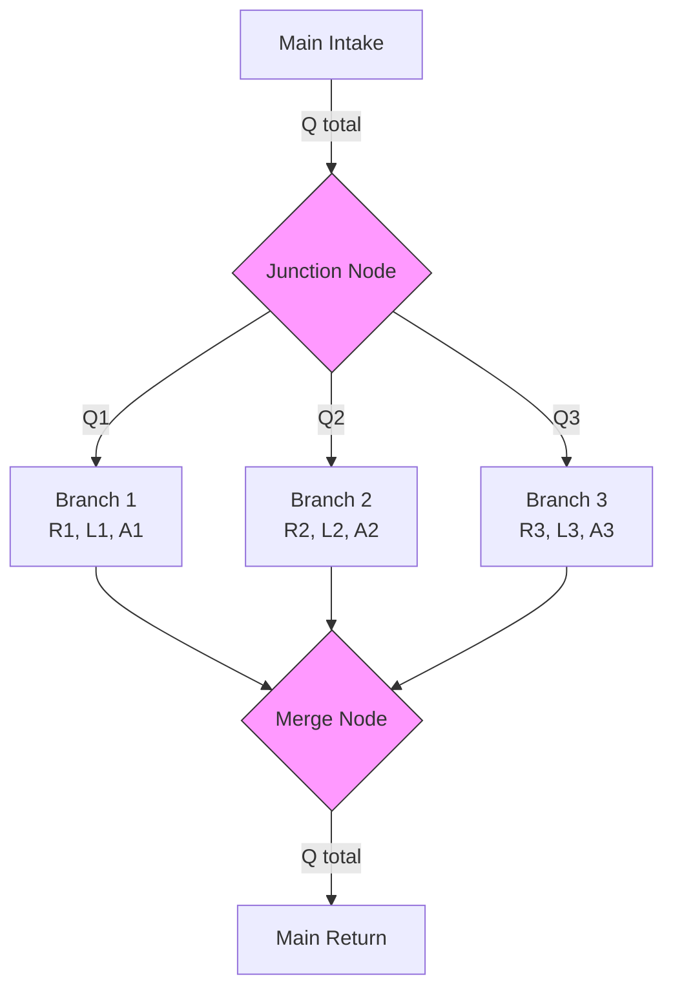
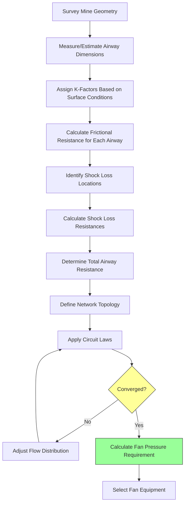

## Fundamental Physics of Mine Airway Resistance

Airway resistance in underground mines governs the pressure differential required to move air through the ventilation network. Unlike conventional HVAC systems with smooth ductwork, mine airways exhibit complex resistance characteristics due to rough surfaces, irregular cross-sections, obstructions, and geometric discontinuities.

The total resistance encountered by airflow consists of two primary components: **frictional resistance** along the airway surfaces and **shock losses** at discontinuities such as bends, junctions, and obstructions.

## The Atkinson Equation

The Atkinson equation represents the fundamental relationship between pressure drop and airflow in mine airways:

$$P = RQ^2$$

Where:
- $P$ = pressure drop across the airway (Pa or in. w.g.)
- $R$ = airway resistance (Ns²/m⁸ or in. w.g.·min²/1000 ft³)
- $Q$ = volumetric airflow rate (m³/s or cfm)

This square-law relationship reflects the turbulent flow regime that dominates mine ventilation systems. The resistance term $R$ encapsulates the physical characteristics of the airway.

### Calculating Frictional Resistance

The frictional resistance for a mine airway derives from the Darcy-Weisbach equation adapted for mine conditions:

$$R_f = \frac{kPL}{A^3}$$

Where:
- $R_f$ = frictional resistance
- $k$ = friction factor (K-factor) (kg/m³)
- $P$ = perimeter of the airway (m or ft)
- $L$ = length of the airway (m or ft)
- $A$ = cross-sectional area (m² or ft²)

The $A^3$ term in the denominator demonstrates why small reductions in airway area dramatically increase resistance. A 10% reduction in area increases resistance by approximately 37%.

### Friction Factor (K-Factor) Determination

The friction factor quantifies surface roughness and turbulence intensity. Typical K-factor values for mine airways:

| Airway Type | K-Factor (kg/m³) | K-Factor (lb/ft³) |
|-------------|------------------|-------------------|
| Smooth concrete-lined drift | 0.004 - 0.006 | 0.00025 - 0.00037 |
| Shotcrete-lined drift | 0.006 - 0.009 | 0.00037 - 0.00056 |
| Unlined rock drift (smooth blasting) | 0.009 - 0.015 | 0.00056 - 0.00094 |
| Unlined rock drift (rough) | 0.015 - 0.030 | 0.00094 - 0.0019 |
| Timber-supported drift | 0.020 - 0.040 | 0.0012 - 0.0025 |
| Rubble-filled or deteriorated airway | 0.040 - 0.100 | 0.0025 - 0.0062 |

K-factors must be determined through field measurements or selected conservatively based on airway condition per MSHA guidelines (30 CFR Part 57).

## Shock Losses in Mine Airways

Shock losses occur at airflow discontinuities where kinetic energy converts to turbulence and heat. The shock loss pressure drop follows:

$$P_s = X \cdot \frac{\rho v^2}{2}$$

Where:
- $P_s$ = shock loss pressure drop (Pa)
- $X$ = shock loss coefficient (dimensionless)
- $\rho$ = air density (kg/m³)
- $v$ = air velocity (m/s)

This can be expressed in terms of airflow and area:

$$P_s = X \cdot \frac{\rho Q^2}{2A^2}$$

### Common Shock Loss Coefficients

| Discontinuity Type | X Coefficient |
|-------------------|---------------|
| Smooth 90° bend (r/d > 2) | 0.20 - 0.35 |
| Sharp 90° bend (r/d < 1) | 1.10 - 1.30 |
| Airway junction (through flow) | 0.20 - 0.40 |
| Airway junction (90° turn) | 1.00 - 1.50 |
| Sudden enlargement | $(1 - A_1/A_2)^2$ |
| Sudden contraction | $0.5(1 - A_2/A_1)$ |
| Door in closed position | 0.05 - 0.10 |
| Door opened 90° | 2.50 - 5.00 |
| Regulator (partially closed) | 2.00 - 20.0 |

The equivalent shock resistance for incorporating into the Atkinson equation:

$$R_s = \frac{X \rho}{2A^2}$$

## Ventilation Network Analysis

Mine ventilation systems comprise complex networks where airways connect in series and parallel configurations. Circuit analysis techniques determine airflow distribution and pressure requirements.

### Series Airway Circuits

For airways in series, the total resistance equals the sum of individual resistances:

$$R_{total} = R_1 + R_2 + R_3 + ... + R_n$$

The same airflow passes through each segment, and pressure drops are additive:

$$P_{total} = R_{total}Q^2 = (R_1 + R_2 + R_3)Q^2$$

### Parallel Airway Circuits

For airways in parallel, airflow splits among branches while pressure drop remains equal across all paths. The equivalent resistance relationship:

$$\frac{1}{\sqrt{R_{eq}}} = \frac{1}{\sqrt{R_1}} + \frac{1}{\sqrt{R_2}} + \frac{1}{\sqrt{R_3}} + ... + \frac{1}{\sqrt{R_n}}$$

Airflow distributes inversely proportional to the square root of resistance:

$$\frac{Q_1}{Q_2} = \sqrt{\frac{R_2}{R_1}}$$

This means airflow preferentially follows low-resistance paths. A branch with half the resistance carries only 1.41 times the airflow, not double.

## Network Modeling Process

Comprehensive ventilation network analysis follows this systematic approach:

The Hardy Cross method or computer-based network solvers iteratively balance the network by adjusting flows until Kirchhoff's laws are satisfied at all nodes.

## Practical Calculation Example

Consider a 500 m drift with the following characteristics:
- Cross-section: 4.5 m × 4.0 m (rectangular)
- K-factor: 0.012 kg/m³ (unlined rock)
- Required airflow: 50 m³/s
- One 90° sharp bend (X = 1.2)

**Frictional resistance:**

$$A = 4.5 \times 4.0 = 18 \text{ m}^2$$
$$P = 2(4.5 + 4.0) = 17 \text{ m}$$
$$R_f = \frac{0.012 \times 17 \times 500}{18^3} = \frac{102}{5832} = 0.0175 \text{ Ns}^2/\text{m}^8$$

**Shock loss resistance:**

Air density at typical mine conditions: $\rho = 1.2$ kg/m³

$$R_s = \frac{1.2 \times 1.2}{2 \times 18^2} = \frac{1.44}{648} = 0.0022 \text{ Ns}^2/\text{m}^8$$

**Total resistance and pressure:**

$$R_{total} = 0.0175 + 0.0022 = 0.0197 \text{ Ns}^2/\text{m}^8$$
$$P = 0.0197 \times 50^2 = 49.25 \text{ Pa} \approx 0.20 \text{ in. w.g.}$$

## MSHA Regulatory Considerations

Mine Safety and Health Administration (MSHA) regulations under 30 CFR Part 57 require accurate determination of ventilation system resistance for:

- Fan selection and pressure capacity verification
- Quarterly ventilation surveys documenting airflow distribution
- Emergency evacuation planning based on smoke propagation modeling
- Air reversal capability assessment

Resistance calculations must account for worst-case scenarios including airway deterioration, equipment placement, and seasonal air density variations.

## Optimization Strategies

Reducing mine ventilation resistance decreases fan power requirements (proportional to $Q \times P = RQ^3$) and operational costs:

1. **Airway enlargement**: Increasing area by 20% reduces resistance by approximately 49%
2. **Surface treatment**: Shotcrete lining can reduce K-factors by 30-50%
3. **Streamlining**: Installing turning vanes at bends reduces shock losses by 70-80%
4. **Airway maintenance**: Regular scaling and debris removal prevents resistance increase
5. **Network reconfiguration**: Parallel airways reduce equivalent resistance

These strategies require capital investment but deliver long-term operational savings through reduced fan power consumption and improved airflow delivery efficiency.
