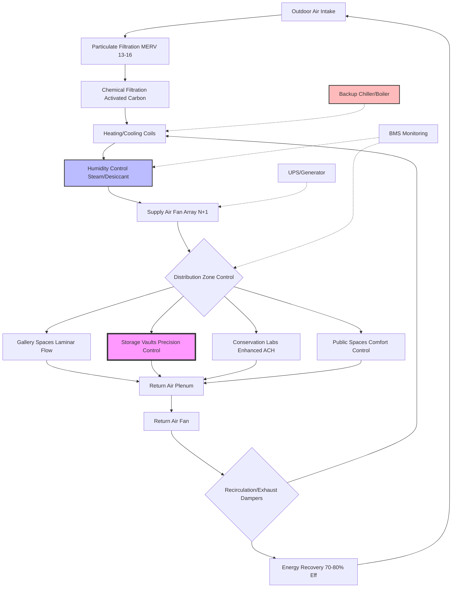

Climate control systems for museums, galleries, archives, and libraries present unique engineering challenges that balance artifact preservation requirements with visitor comfort and energy efficiency. These facilities demand exceptional precision in temperature and humidity control, superior air quality, and system redundancy to protect irreplaceable collections.

## Environmental Control Fundamentals

The preservation environment for cultural heritage materials is governed by strict thermohygrometric criteria established through decades of conservation science research. ASHRAE Handbook—HVAC Applications, Chapter 24 (Museums, Galleries, Archives, and Libraries) provides comprehensive design guidance based on ISO 11799 and other international standards.

### Temperature and Humidity Specifications by Collection Type

| Collection Type | Temperature Range | Relative Humidity | Seasonal Variation | Daily Variation |
|-----------------|-------------------|-------------------|-------------------|-----------------|
| General mixed collections | 68-72°F (20-22°C) | 45-55% | ±5°F (±3°C) | ±2°F (±1°C) |
| Paintings on canvas | 68-70°F (20-21°C) | 50-55% | ±3°F (±2°C) | ±2°F (±1°C) |
| Works on paper | 65-70°F (18-21°C) | 45-50% | ±5°F (±3°C) | ±3% RH |
| Photographs (B&W) | 65-68°F (18-20°C) | 30-40% | ±3°F (±2°C) | ±2% RH |
| Photographs (color) | 35-65°F (2-18°C) | 30-40% | ±5°F (±3°C) | ±5% RH |
| Metals and armor | 60-68°F (15-20°C) | 30-40% | ±5°F (±3°C) | ±5% RH |
| Organic materials (textiles, wood) | 65-70°F (18-21°C) | 50-55% | ±3°F (±2°C) | ±2% RH |
| Books and manuscripts | 65-70°F (18-21°C) | 35-50% | ±5°F (±3°C) | ±5% RH |
| Film and magnetic media | 35-50°F (2-10°C) | 20-30% | ±2°F (±1°C) | ±2% RH |
| Archaeological materials | 60-70°F (15-21°C) | 40-55% | ±5°F (±3°C) | ±5% RH |

### Humidity Stability Requirements

The rate of humidity change critically affects hygroscopic materials. The dimensional stability criterion for organic materials is expressed as:

$$\frac{d\phi}{dt} \leq 5\% \text{ RH/hour}$$

Where $\phi$ represents relative humidity. For highly sensitive collections, the maximum allowable rate of change reduces to:

$$\frac{d\phi}{dt} \leq 2\% \text{ RH/hour}$$

The moisture buffering capacity required from the HVAC system can be calculated using:

$$m_w = \frac{V \cdot \rho_a \cdot \Delta\omega}{\eta_{humid}}$$

Where:
- $m_w$ = moisture addition/removal rate (kg/h)
- $V$ = space volume (m³)
- $\rho_a$ = air density (kg/m³)
- $\Delta\omega$ = humidity ratio change (kg water/kg dry air)
- $\eta_{humid}$ = humidification system efficiency

## Museum HVAC System Architecture

## Pollutant Control and Filtration

Cultural heritage materials deteriorate from exposure to gaseous and particulate pollutants. The pollutant decay rate follows first-order kinetics:

$$\frac{dC}{dt} = -k \cdot C \cdot P$$

Where:
- $C$ = pollutant concentration (μg/m³)
- $k$ = material-specific decay constant (m³/μg·h)
- $P$ = pollutant potency factor

Target maximum concentrations for preservation environments:

| Pollutant | Maximum Concentration | Filtration Method |
|-----------|----------------------|-------------------|
| Particulates (PM2.5) | <5 μg/m³ | MERV 14-16 filters |
| Sulfur dioxide (SO₂) | <1 μg/m³ | Activated carbon |
| Nitrogen dioxide (NO₂) | <10 μg/m³ | Potassium permanganate |
| Ozone (O₃) | <2 μg/m³ | Activated carbon |
| Formaldehyde (HCHO) | <10 μg/m³ | Activated alumina |
| Volatile organic compounds | <100 μg/m³ | Activated carbon |
| Acetic acid | <200 μg/m³ | Sodium carbonate |

The air change effectiveness for pollutant removal is calculated as:

$$\epsilon_p = \frac{C_o - C_s}{C_o - C_z} \times 100\%$$

Where $C_o$, $C_s$, and $C_z$ represent outdoor, supply, and zone pollutant concentrations respectively.

## Balancing Preservation and Visitor Comfort

Museum HVAC systems must reconcile competing demands. Optimal preservation conditions (65-70°F, 45-50% RH) fall below typical comfort expectations (72-76°F, 40-60% RH). Design strategies include:

**Zoned Climate Control**: Separate gallery environments (preservation priority) from lobbies and cafeterias (comfort priority) using air locks and pressure differentials of 5-10 Pa.

**Seasonal Acclimatization**: Allow controlled temperature setpoint adjustments of ±3°F seasonally to reduce visitor thermal shock while maintaining humidity stability.

**Radiant Heating/Cooling**: Deploy radiant panels in visitor-dense galleries to achieve comfort at lower air temperatures, reducing convective airflow that can damage fragile objects.

**Occupancy-Responsive Ventilation**: Implement CO₂-based demand control ventilation (DCV) to meet ASHRAE 62.1 requirements (7.5 cfm/person + 0.06 cfm/ft²) without over-conditioning unoccupied spaces.

The effective temperature index for visitor comfort in museum environments is:

$$ET^* = T_a + 0.4(T_r - T_a) - 0.15(v - 0.1)$$

Where $T_a$ = air temperature, $T_r$ = mean radiant temperature, and $v$ = air velocity (m/s).

## System Redundancy and Monitoring

Collections protection requires fail-safe operation. Critical design elements include:

- **N+1 redundancy** for all primary air handling equipment
- **Dual-path humidity control** (steam injection + chilled water dehumidification)
- **Emergency power** for at least 48 hours of continuous operation
- **Building automation system** with 24/7 monitoring and alarming at ±2°F and ±3% RH deviations
- **Data logging** at 15-minute intervals for temperature, humidity, and dew point

The system reliability requirement for Class A collections spaces typically exceeds 99.9% uptime, corresponding to maximum allowable downtime of 8.76 hours annually.

