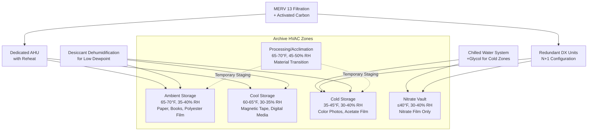

Archive storage environments demand precise HVAC control to prevent deterioration of irreplaceable materials. Chemical degradation rates double with every 10°F temperature increase and accelerate dramatically with improper humidity levels. HVAC system design for archives requires understanding the specific storage requirements for different media types, implementing appropriate zoning strategies, and maintaining tight environmental tolerances.

## Storage Conditions by Media Type

Different archival materials require distinct environmental parameters based on their chemical composition and degradation mechanisms.

### Primary Collection Categories

| Media Type | Temperature | Relative Humidity | Max Variation | Air Changes/Hour |
|------------|-------------|-------------------|---------------|------------------|
| Paper documents | 65-70°F | 30-40% RH | ±2°F, ±3% RH | 4-6 |
| Photographs (B&W) | 65-70°F | 30-40% RH | ±2°F, ±3% RH | 4-6 |
| Color photographs | 35-45°F | 30-40% RH | ±2°F, ±3% RH | 4-6 |
| Nitrate film | ≤40°F | 30-40% RH | ±2°F, ±3% RH | 8-10 |
| Acetate film | 35-45°F | 30-40% RH | ±2°F, ±3% RH | 4-6 |
| Polyester film | 65-70°F | 30-40% RH | ±2°F, ±3% RH | 4-6 |
| Magnetic tape | 60-65°F | 25-35% RH | ±2°F, ±3% RH | 4-6 |
| Digital optical media | 60-70°F | 20-30% RH | ±3°F, ±5% RH | 2-4 |

### Material-Specific Degradation Mechanisms

**Paper Collections:**
The cellulose hydrolysis rate determines paper longevity. At 70°F and 50% RH, paper degrades approximately twice as fast as at 60°F and 35% RH. Lignin-containing papers yellow through oxidation accelerated by light, high temperature, and high humidity. Acidic papers undergo autocatalytic degradation requiring lower temperature and humidity for preservation.

**Photographic Materials:**
Color dye stability follows Arrhenius reaction kinetics. Cold storage at 35-45°F extends dye life by 5-10 times compared to room temperature storage. Gelatin emulsions require controlled humidity to prevent brittleness below 25% RH or fungal growth above 60% RH. Silver gelatin prints tolerate wider temperature ranges than color materials but still benefit from stable conditions.

**Film Base Materials:**
Cellulose nitrate film undergoes autocatalytic decomposition releasing nitrogen oxides, requiring cold isolated storage with high ventilation rates. Cellulose acetate suffers vinegar syndrome (acetic acid release) accelerated by elevated temperature and humidity. Polyester base films demonstrate superior stability but still require environmental control for emulsion preservation.

**Magnetic Media:**
Oxide shedding and binder hydrolysis occur in magnetic tapes at high humidity. Low temperature storage (60-65°F) reduces chemical degradation rates. Relative humidity below 25% causes static electricity issues while above 40% accelerates hydrolysis. Temperature cycling causes dimensional changes leading to mechanical stress.

## Archive HVAC Zoning Strategy

## Cold Storage System Design

Cold storage vaults for color photographs and acetate film require specialized HVAC approaches distinct from standard refrigeration.

**Temperature Control:**
Maintain 35-45°F using dedicated chilled water loops or direct expansion systems. Avoid freezing temperatures that can cause emulsion cracking. Install redundant cooling with automatic failover. Use glycol solutions in chilled water systems serving cold zones to prevent freeze damage during low-load conditions.

**Humidity Management:**
Cold temperatures reduce absolute moisture capacity requiring careful humidity control. Calculate dewpoint temperature to prevent condensation on cold surfaces. Use desiccant dehumidification upstream of cooling coils to achieve low dewpoint without excessive refrigeration. Reheat after cooling to achieve target relative humidity at storage temperature.

**Thermal Buffering:**
High-mass construction reduces temperature swings during equipment cycling. Insulate cold storage zones to R-30 minimum. Install vapor barriers on warm side of insulation to prevent moisture migration. Provide vestibule entries with temperature/humidity gradients to minimize infiltration during access.

## Humidity Control Systems

Archival humidity requirements demand year-round precision control regardless of outdoor conditions.

**Dehumidification:**
Standard cooling-based dehumidification cannot achieve 30-40% RH at 65-70°F during winter. Desiccant dehumidifiers using silica gel or molecular sieve wheels provide low dewpoint air. Regenerate desiccant using gas heat or waste heat recovery. Calculate required dewpoint depression based on outdoor air ventilation loads and infiltration rates.

**Humidification:**
Steam-to-steam generators provide clean humidification without mineral particulates. Avoid evaporative media humidifiers that can harbor microorganisms. Control humidification based on dewpoint rather than relative humidity to prevent overshoot during temperature setpoint changes. Install high-limit humidistats to prevent runaway conditions.

**Control Strategy:**
Implement PI or PID control loops with narrow deadbands (±2% RH). Sequence dehumidification before cooling and humidification after heating to minimize energy use. Monitor absolute humidity (grains/lb or g/kg) to track moisture addition/removal independent of temperature changes.

## Air Filtration and Quality

Particulate matter, gaseous pollutants, and biological contaminants accelerate material degradation.

**Particulate Filtration:**
MERV 13 filters (85% efficient at 1-3 μm) remove most particulates including dust, soot, and mold spores. Higher MERV ratings increase pressure drop and fan energy. Bag filters provide large surface area with acceptable pressure drop. Monitor differential pressure and replace filters before excessive loading.

**Gaseous Filtration:**
Activated carbon adsorbs volatile organic compounds, sulfur dioxide, and nitrogen oxides. Potassium permanganate-impregnated alumina targets formaldehyde and other aldehydes. Size gas-phase filtration based on outdoor pollutant concentrations and required removal efficiency. Replace media based on breakthrough testing or scheduled intervals.

**Ventilation Rates:**
Minimize outdoor air to reduce filtration loads and humidity control requirements. ASHRAE Standard 62.1 does not apply to unoccupied storage areas. Provide 4-6 air changes per hour for general collections, 8-10 for nitrate film vaults. Use air circulation to prevent stratification without excessive velocities that entrain dust.

**Positive Pressurization:**
Maintain 0.02-0.05 in. w.c. positive pressure relative to adjacent spaces to prevent infiltration of uncontrolled air. Seal penetrations and install appropriate door sweeps. Balance supply and exhaust flows accounting for infiltration pathways.

## Monitoring and Alarming

Continuous monitoring with rapid alarm response prevents collection damage during equipment failures.

Install calibrated temperature and humidity sensors every 1000-2000 sq ft within storage zones. Use NIST-traceable calibration standards annually. Provide redundant sensors for critical collections. Implement building automation system trending with 15-minute interval logging minimum. Configure alarms for ±3°F and ±5% RH deviations with escalating notifications. Include power failure, equipment status, and filter differential pressure alarms. Maintain backup power for critical HVAC equipment serving irreplaceable collections.