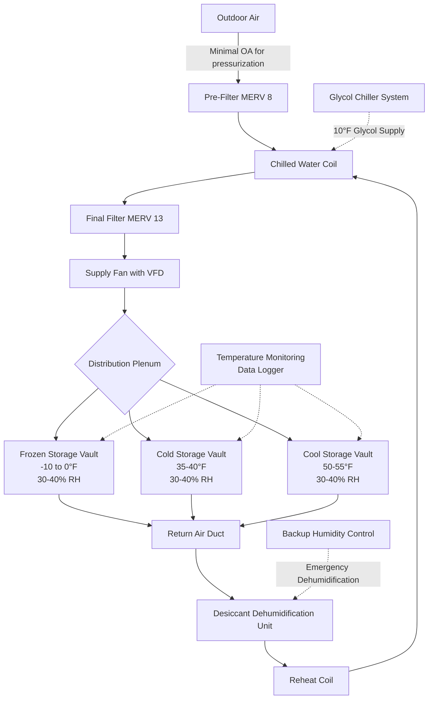

Film archival storage demands precision HVAC control to slow chemical degradation processes that compromise image permanence. The thermal degradation kinetics of film base materials follow Arrhenius relationships where reaction rates double approximately every 10°F temperature increase. This fundamental principle drives cold storage strategies that extend film lifespan from decades to centuries.

## Film Base Material Chemistry and Storage Requirements

Different film base materials exhibit distinct degradation mechanisms that dictate specific storage conditions.

### Storage Conditions by Film Type

| Film Type | Temperature | Relative Humidity | Storage Duration Expectation | Primary Degradation Mechanism |
|-----------|-------------|-------------------|------------------------------|-------------------------------|
| Nitrate Film | 35-40°F (2-4°C) | 30-40% | 50-100 years (separate facility) | Autocatalytic decomposition, fire hazard |
| Acetate (B&W) | 35-40°F (2-4°C) | 30-40% | 200+ years | Vinegar syndrome (acetic acid release) |
| Acetate (Color) | -10 to 0°F (-23 to -18°C) | 30-40% | 200+ years | Dye fading, vinegar syndrome |
| Polyester (B&W) | 50-55°F (10-13°C) | 30-40% | 500+ years | Minimal degradation |
| Polyester (Color) | 35-40°F (2-4°C) | 30-40% | 200+ years | Dye fading only |

### Image Permanence Institute Standards

The Image Permanence Institute (IPI) established temperature-humidity relationships quantified through the Preservation Index (PI), measured in years of material longevity. Cold storage below 40°F with 30-40% RH achieves PI values exceeding 200 years for acetate materials. The Environmental Management Tool developed by IPI uses the Time-Weighted Preservation Index (TWPI) to account for seasonal variations.

## Cold Storage System Design

Film vaults require dedicated HVAC systems capable of maintaining precise low-temperature conditions with minimal temperature swing.

## System Design Parameters

### Cooling Load Calculations

Film storage cooling loads differ significantly from standard archive spaces due to reduced occupancy and minimal equipment heat generation.

**Typical Load Components:**
- Envelope transmission through insulated walls (R-30 minimum)
- Infiltration through vapor-sealed doors (0.1 ACH design maximum)
- Lighting heat gain (LED fixtures, occupancy-controlled)
- Minimal internal loads from personnel (infrequent access)
- Dehumidification reheat energy

For a 2,000 ft² frozen storage vault at -5°F with exterior walls adjacent to 70°F mechanical space:

- Transmission load: Q = U × A × ΔT = (0.033 BTU/hr·ft²·°F) × 800 ft² × 75°F = 1,980 BTU/hr
- Infiltration negligible with proper vestibule design
- Total sensible cooling: approximately 2,500-3,500 BTU/hr
- Latent load dominated by dehumidification moisture removal

### Dehumidification Strategy

Maintaining 30-40% RH at sub-freezing temperatures requires desiccant dehumidification rather than condensing coil methods. Frost formation on cooling coils prevents reliable moisture removal below 40°F dewpoint.

**Desiccant System Specifications:**
- Silica gel or molecular sieve rotating wheel
- Regeneration temperature 200-250°F
- Process air dewpoint depression to 20-30°F
- Reactivation energy supplied by natural gas or electric resistance

The psychrometric process involves cooling process air to deposit sensible heat, passing through the desiccant wheel to remove moisture, then reheating to achieve the desired temperature-humidity setpoint.

## Nitrate Film Special Requirements

Cellulose nitrate film presents unique fire safety challenges requiring complete physical separation from other collections. Nitrate decomposition is autocatalytic and exothermic, creating potential for spontaneous combustion at elevated temperatures.

**Mandatory Safety Features:**
- Separate building or fire-rated vault (2-hour minimum)
- Explosion venting sized per NFPA 40
- Continuous temperature monitoring with alarm at 90°F
- Non-sparking ventilation equipment
- Intrinsically safe electrical systems
- Nitrogen inerting for severely degraded materials

## Acclimatization Protocol

Film removed from cold storage must equilibrate to ambient conditions before handling to prevent moisture condensation on cold surfaces.

**Temperature Transition Rates:**
- From frozen storage: 24-48 hour acclimatization period
- From cold storage: 12-24 hour acclimatization period
- Maintain sealed vapor barrier packaging during temperature transition
- Monitor surface temperature before opening containers

The dewpoint differential between cold film surfaces and ambient air determines condensation risk. Film at 0°F introduced to 70°F, 50% RH environment (dewpoint 50°F) will experience condensation until surface temperature exceeds 50°F.

## Monitoring and Alarming

Continuous environmental monitoring provides documentation for insurance and collection management while enabling rapid response to system failures.

**Required Monitoring Points:**
- Temperature sensors: ±0.5°F accuracy, located at breathing height
- Humidity sensors: ±2% RH accuracy, calibrated annually
- Data logging intervals: 15 minutes maximum
- Alarm thresholds: ±3°F from setpoint, ±5% RH from setpoint
- Battery backup for monitoring systems during power failure

Temperature excursions above design conditions dramatically accelerate degradation rates. A single week at 80°F equals approximately one year of aging at 40°F for acetate film materials based on Arrhenius degradation kinetics.
