## Overview

Magnetic media storage requires precise environmental control to prevent degradation mechanisms including magnetic signal loss, binder hydrolysis, and substrate deformation. The HVAC system must maintain narrow temperature and humidity bands with minimal fluctuation to preserve analog video tapes, audio reels, and magnetic disk drives containing archival content.

The primary degradation pathways for magnetic media are temperature-dependent chemical reactions and humidity-driven hydrolysis of polyester-urethane binders. Elevated temperatures accelerate magnetic particle oxidation and binder breakdown, while excessive humidity triggers sticky-shed syndrome in tape media and corrosion in magnetic disks.

## Storage Condition Standards

### SMPTE and ISO Requirements

SMPTE 2254 and ISO 18923 establish environmental parameters for magnetic media preservation based on accelerated aging studies and chemical kinetics analysis.

**Short-Term Storage (up to 10 years):**
| Parameter | Specification | Tolerance |
|-----------|---------------|-----------|
| Temperature | 65-68°F (18-20°C) | ±2°F (±1°C) |
| Relative Humidity | 30-40% | ±5% |
| Maximum Rate of Change | 2°F/hr (1°C/hr) | Temperature |
| Maximum Rate of Change | 5%/hr | Humidity |

**Long-Term Archival Storage (50+ years):**
| Parameter | Specification | Tolerance |
|-----------|---------------|-----------|
| Temperature | 50-55°F (10-13°C) | ±2°F (±1°C) |
| Relative Humidity | 20-30% | ±3% |
| Maximum Rate of Change | 1°F/hr (0.5°C/hr) | Temperature |
| Maximum Rate of Change | 3%/hr | Humidity |

The lower temperature and humidity specifications for long-term storage dramatically reduce chemical reaction rates. The Arrhenius equation predicts a doubling of media life expectancy for every 10°F (5.5°C) reduction in storage temperature within the stable range.

### Media-Specific Requirements

Different magnetic media formulations exhibit varying sensitivity to environmental conditions based on binder chemistry and substrate materials.

| Media Type | Temperature | Relative Humidity | Critical Considerations |
|------------|-------------|-------------------|-------------------------|
| Video Tape (VHS, Betacam) | 65-68°F (18-20°C) | 30-40% | Polyester-urethane binder susceptible to hydrolysis above 50% RH |
| Audio Tape (Reel-to-Reel) | 65-68°F (18-20°C) | 25-35% | Acetate backing requires lower humidity than polyester |
| Computer Tape (LTO, DLT) | 62-68°F (17-20°C) | 20-40% | Metal particle formulations tolerate wider RH range |
| Magnetic Disks (Hard Drives) | 65-70°F (18-21°C) | 30-45% | Read/write head clearance sensitive to humidity extremes |
| DAT and Hi8 Tape | 65-68°F (18-20°C) | 30-40% | Metal evaporated tape more stable but still hydrolysis-prone |

## Environmental Control System Design

```mermaid
graph TD
    A[Magnetic Media Vault] --> B[Precision Air Handler]
    B --> C[Cooling Coil with Reheat]
    B --> D[Desiccant Dehumidification]
    B --> E[HEPA Filtration]

    C --> F[Chilled Water System]
    D --> G[Regeneration Heat]

    H[Temperature Sensors] --> I[DDC Controller]
    J[RH Sensors] --> I
    K[Dewpoint Sensors] --> I

    I --> B
    I --> L[BMS Trending]

    M[Acclimation Chamber] --> N[Gradual Temp/RH Transition]
    N --> A

    style A fill:#e1f5ff
    style I fill:#fff4e1
    style M fill:#ffe1f5
```

### HVAC System Configuration

**Cooling and Dehumidification:**
The system must provide independent temperature and humidity control to maintain the narrow operating bands. A reheat cooling coil configuration using chilled water at 42-45°F (6-7°C) provides sensible cooling, while a low-temperature desiccant wheel removes moisture without overcooling. This approach prevents the cycling and temperature/humidity swings typical of conventional DX systems.

**Air Distribution:**
Laminar airflow at 20-30 fpm across storage shelves prevents stratification and ensures uniform conditions throughout the vault. Supply air diffusers must not create high-velocity jets that disturb particulate settling or cause localized humidity variations.

**Redundancy and Monitoring:**
Dual independent dehumidification trains with automatic failover prevent humidity excursions during maintenance or equipment failure. Continuous monitoring with ±1°F and ±2% RH accuracy provides early warning of system degradation. Data logging at 5-minute intervals creates audit trails for insurance and collection management.

## Degradation Mechanisms and Prevention

**Sticky-Shed Syndrome:**
Polyester-urethane binder hydrolysis occurs when water molecules break polymer chains, causing tape shedding and adhesion. Maintaining RH below 40% prevents moisture absorption into the binder layer. The reaction rate doubles for every 18°F (10°C) temperature increase.

**Magnetic Signal Decay:**
Magnetic particles slowly lose coercivity through thermal fluctuations and oxidation. Storage at 50-55°F (10-13°C) reduces thermal energy available for magnetic domain reorientation, extending signal retention from decades to centuries.

**Substrate Deformation:**
Polyester and acetate tape backing expands and contracts with humidity changes. Cycling between high and low RH creates mechanical stress, cupping, and layer-to-layer adhesion. Maintaining stable humidity within ±3% prevents dimensional changes exceeding tape backing elastic limits.

## Acclimation Protocol

Media removed from cold storage requires gradual temperature and humidity equilibration before playback to prevent condensation and thermal shock. Transfer tapes from 50°F storage to a 65°F acclimation chamber at no more than 5°F per hour. Allow 24 hours for full equilibration before threading through playback equipment. This prevents moisture condensation on cold magnetic surfaces and oxide shedding from rapid temperature changes.

## System Performance Verification

Validate HVAC system performance quarterly using calibrated dataloggers placed throughout the vault volume. Verify temperature uniformity within ±2°F and humidity uniformity within ±5% between all measurement locations. Test backup dehumidification switchover annually and verify response time meets collection risk tolerance. Review trending data for drift, cycling frequency, and setpoint deviations exceeding control thresholds.
