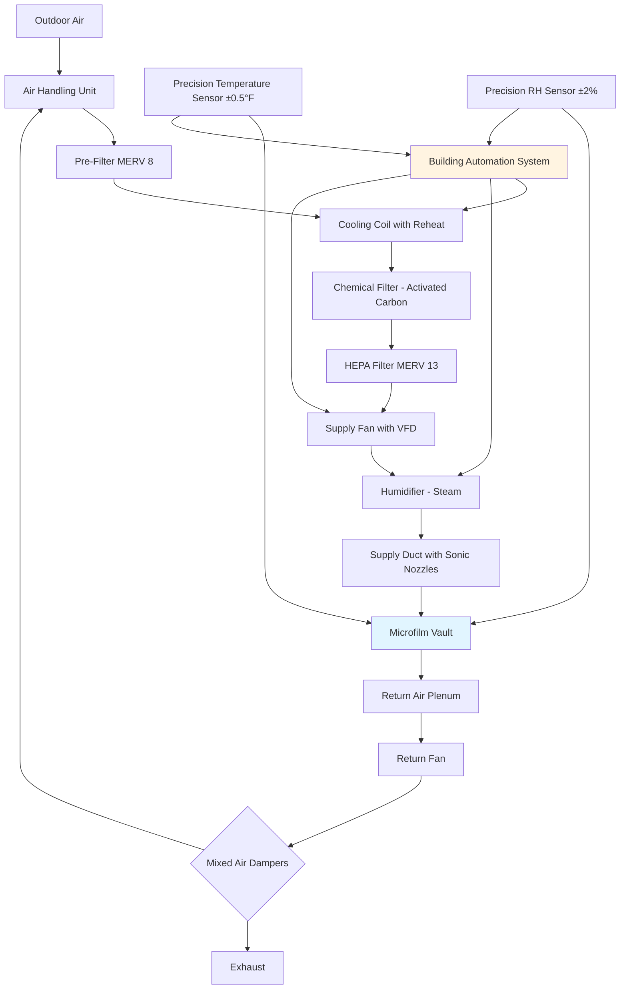

Microfilm preservation demands precise environmental control to prevent chemical degradation, dimensional instability, and image deterioration. Different microfilm types—silver halide, diazo, and vesicular—require specific temperature and humidity conditions based on their chemical composition and long-term stability characteristics.

## Microfilm Type Storage Requirements

The three primary microfilm formats exhibit distinct environmental sensitivities governed by their chemical structure and degradation mechanisms.

| Film Type | Temperature Range | Relative Humidity | Maximum Rate of Change | Primary Degradation Mechanism |
|-----------|-------------------|-------------------|------------------------|-------------------------------|
| Silver Halide (Medium-term) | 65-70°F (18-21°C) | 30-40% | ±2°F/hour, ±3%/day | Oxidation, redox blemishes |
| Silver Halide (Archival) | ≤35°F (2°C) | 30-40% | ±2°F/hour, ±3%/day | Vinegar syndrome in acetate base |
| Diazo Film | 65-70°F (18-21°C) | 30-50% | ±2°F/hour, ±3%/day | Dye fading, base hydrolysis |
| Vesicular Film | 65-70°F (18-21°C) | 30-50% | ±2°F/hour, ±3%/day | Softening of thermoplastic layer |

### Silver Halide Microfilm

Silver halide film, the most stable format for archival preservation, consists of metallic silver particles suspended in gelatin on a polyester or acetate base. For medium-term storage (up to 100 years), maintain 65-70°F at 30-40% RH. Archival storage (500+ years) requires ≤35°F at 30-40% RH to arrest chemical degradation processes.

The lower humidity limit prevents gelatin embrittlement and cracking. The upper limit controls oxidation reactions and prevents redox blemishes—microscopic silver particles that migrate to the film surface. Acetate-base films require cold storage to prevent autocatalytic deacetylation (vinegar syndrome).

### Diazo Microfilm

Diazo film contains azo dye couplers that form colored images through diazotype chemistry. Storage at 65-70°F and 30-50% RH minimizes dye fading. Humidity below 30% causes base embrittlement, while humidity above 50% accelerates hydrolytic degradation of the dye molecules.

Elevated temperatures increase the rate of dye fading exponentially following Arrhenius kinetics. Each 10°F temperature increase approximately doubles the degradation rate.

### Vesicular Microfilm

Vesicular film records images as microscopic bubbles in a thermoplastic layer. Storage temperatures must remain below 65-70°F to prevent softening of the plastic matrix, which would cause bubble coalescence and image degradation. Humidity control at 30-50% RH prevents dimensional changes in the film base.

## Microfilm Vault HVAC System

## HVAC System Design Requirements

### Temperature Control

Precision cooling with reheat capability maintains setpoint within ±2°F. Use direct expansion (DX) or chilled water cooling coils with modulating hot water or electric reheat. Temperature sensors with ±0.5°F accuracy and 0.1°F resolution enable tight control.

Supply air temperature typically operates 5-8°F below vault setpoint to provide adequate sensible cooling without excessive air velocity. Variable frequency drives (VFDs) on supply fans modulate airflow based on thermal load.

### Humidity Control

Maintain RH within ±3% of setpoint using precision steam humidification. Desiccant dehumidification provides superior control compared to overcooling and reheat methods. Install RH sensors with ±2% accuracy calibrated semiannually.

Calculate moisture load from air infiltration, occupancy, and film off-gassing. Silver halide films release acetic acid vapor requiring continuous ventilation.

### Air Distribution

Design air distribution for minimal velocity at film storage locations (<50 fpm) to prevent mechanical vibration and localized temperature stratification. Use perforated diffusers or sonic nozzles for uniform airflow patterns.

Maintain positive pressurization (+0.02-0.05 in. w.c.) relative to adjacent spaces to prevent infiltration of uncontrolled air and contaminants.

### Filtration Requirements

Implement three-stage filtration per ANSI/AIIM MS23 and MS45 standards:

1. **Pre-filtration**: MERV 8 filters remove large particulates
2. **Chemical filtration**: Activated carbon or potassium permanganate media remove oxidizing gases (O₃, NOₓ, SO₂)
3. **Fine filtration**: MERV 13 filters capture particles >0.3 μm

Oxidizing gases accelerate silver image degradation through redox reactions. Maintain gaseous contaminant levels below ANSI IT9.11 limits: <1 ppb for oxidizing gases.

### Air Change Rate

Provide 4-6 air changes per hour (ACH) minimum for medium-term storage vaults. Archival cold storage requires 2-4 ACH. Higher air change rates improve temperature uniformity but increase energy consumption and filtration costs.

## Control Strategies

### Environmental Monitoring

Install redundant temperature and humidity sensors with independent alarm systems. Log environmental data at 15-minute intervals minimum. Configure alarms for:

- Temperature deviation >±3°F from setpoint
- Humidity deviation >±5% from setpoint
- Rate of change >2°F/hour or 3%RH/day
- Sensor failure or communication loss

### Failure Mode Protection

Design systems with fail-safe operation during mechanical failures:

- Dual cooling systems with automatic switchover
- Emergency dehumidification using desiccant backup
- UPS power for controls and monitoring
- Sealed vault construction to maintain conditions during short-term HVAC outages

## Energy Considerations

Cold storage vaults for archival silver halide film consume 15-25 kWh/ft²/year. Medium-term storage operates at 8-12 kWh/ft²/year. Heat recovery from exhaust air reduces operating costs by 20-30%.

Vapor barriers (perm rating <0.1) on all vault surfaces minimize moisture migration and reduce dehumidification loads. Insulation values of R-30 walls and R-40 ceiling limit heat gain in cold storage applications.
