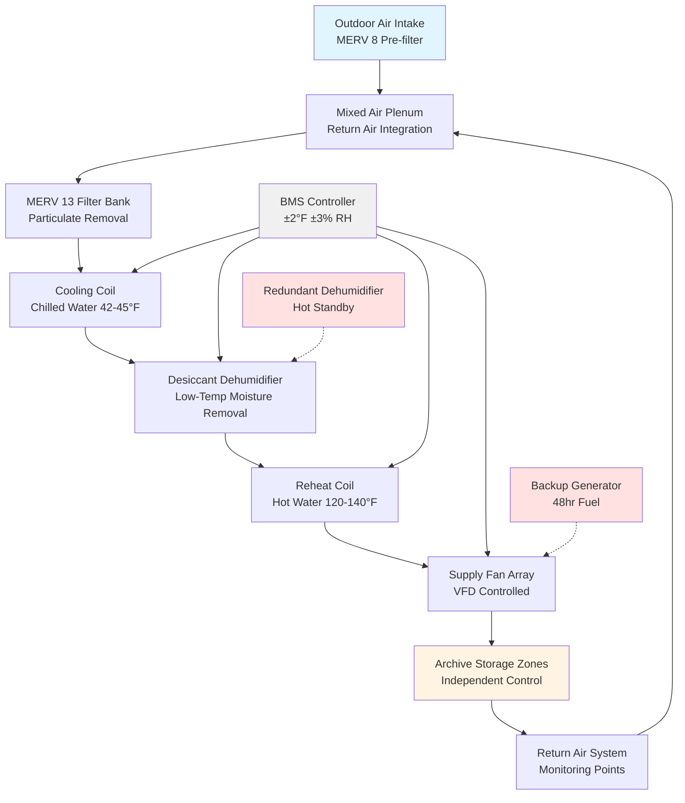

Paper documents represent the most common archival material, yet their preservation demands precise environmental control. The chemical degradation of cellulose-based materials accelerates exponentially with temperature and fluctuating relative humidity, making HVAC system performance critical to collection longevity.

## Temperature and Relative Humidity Requirements

NARA (National Archives and Records Administration) establishes baseline environmental conditions for paper-based collections, with specific requirements varying by material composition and preservation priority.

### Standard Paper Document Storage Conditions

| Material Type | Temperature Range | Relative Humidity | Air Changes/Hour | Filtration |
|--------------|-------------------|-------------------|------------------|------------|
| Alkaline Paper | 65-70°F (18-21°C) | 30-40% | 4-6 ACH | MERV 13 minimum |
| Acidic Paper | 60-65°F (15-18°C) | 30-35% | 4-6 ACH | MERV 13 minimum |
| Newsprint | 55-60°F (13-15°C) | 25-35% | 6-8 ACH | MERV 13 minimum |
| Parchment/Vellum | 60-65°F (15-18°C) | 45-55% | 4-6 ACH | MERV 13 minimum |
| Coated Paper | 65-70°F (18-21°C) | 35-45% | 4-6 ACH | MERV 13 minimum |

Lower temperatures within these ranges extend preservation life. For every 10°F reduction in storage temperature, chemical degradation rates decrease by approximately 50%, following the Arrhenius equation for reaction kinetics.

## Material Sensitivity and Degradation Mechanisms

Different paper types exhibit distinct sensitivities to environmental conditions based on their chemical composition and manufacturing process.

### Degradation Sensitivity Matrix

| Material | Primary Degradation Mode | Temperature Sensitivity | RH Sensitivity | Critical Threshold |
|----------|--------------------------|------------------------|----------------|-------------------|
| Acidic Paper | Acid hydrolysis | High | Moderate | >75°F accelerates breakdown |
| Alkaline Paper | Oxidation | Moderate | Moderate | <20% RH causes embrittlement |
| Newsprint | Lignin oxidation | Very High | High | >70°F causes rapid yellowing |
| Parchment | Desiccation/gelatinization | Moderate | Very High | <40% RH causes cracking |
| Vellum | Protein degradation | Moderate | Very High | >60% RH promotes mold |
| Photographic Paper | Emulsion degradation | High | Very High | >50% RH risks silver mirroring |

Acidic paper manufactured before 1850 and between 1850-1990 contains lignin and residual acids that catalyze cellulose chain scission. These materials benefit from storage temperatures at the lower end of acceptable ranges (60-65°F) to slow autocatalytic degradation.

Parchment and vellum, composed of collagen protein, require higher relative humidity (45-55%) to maintain structural integrity. Below 40% RH, these materials lose bound water, leading to dimensional changes and cracking.

## Archive HVAC System Configuration

Archival storage requires dedicated HVAC systems with enhanced dehumidification, precise control, and redundancy to prevent environmental excursions during equipment failures.

## System Design Criteria

### Dehumidification Requirements

Maintaining 30-40% RH in archive storage requires robust dehumidification, particularly during cooling seasons when conventional cooling coils cannot achieve sufficient moisture removal without overcooling.

**Desiccant wheel dehumidifiers** provide independent humidity control without refrigeration-based limitations. Regeneration energy (typically 200-250 Btu/lb water removed) requires heat recovery or dedicated energy sources.

**Condensing dehumidifiers** operate effectively when space dewpoint exceeds coil surface temperature. For 68°F at 35% RH (45°F dewpoint), chilled water supply must be 42-45°F to enable moisture condensation.

### Temperature Control Precision

NARA standards specify ±2°F control tolerance for archival storage. Achieving this requires:

- Modulating reheat with hot water coils (preferred) or SCR-controlled electric elements
- Supply air temperature reset based on space load
- VFD fan control to minimize air turbulence
- Stratification prevention through proper air distribution

### Filtration and Air Quality

Paper degradation accelerates in presence of particulate matter and gaseous pollutants. MERV 13 filtration removes 85-90% of 1.0-3.0 micron particles, capturing most dust and mold spores.

Activated carbon filtration addresses gaseous pollutants (NOx, SOx, formaldehyde) in urban environments or spaces with off-gassing materials.

## Storage Configuration Considerations

**Oversized documents** (maps, architectural drawings, posters) require flat storage in shallow drawers or rolled storage in climate-controlled cabinets. Rolled storage must maintain consistent conditions to prevent differential expansion across the roll diameter.

**Flat storage** in metal cabinets provides thermal mass stabilization but requires adequate air circulation. Cabinet interiors may lag room conditions by 2-4 hours during HVAC setpoint changes, necessitating gradual seasonal adjustments.

**Vertical filing** increases air circulation around documents but may create localized RH variations due to proximity to HVAC supply diffusers or exterior walls.

## Monitoring and Documentation

Continuous environmental monitoring with calibrated sensors (±0.2°F, ±2% RH accuracy) provides data for preservation assessment. Data loggers should record at 15-minute intervals minimum, capturing diurnal variations and HVAC performance.

Annual HVAC system performance verification includes:
- Airflow measurement and balancing confirmation
- Dehumidification capacity testing
- Control system calibration
- Filter pressure drop evaluation
- Emergency power transfer testing

Environmental excursions exceeding ±5°F or ±10% RH for more than 4 hours require documentation and collection condition assessment.
