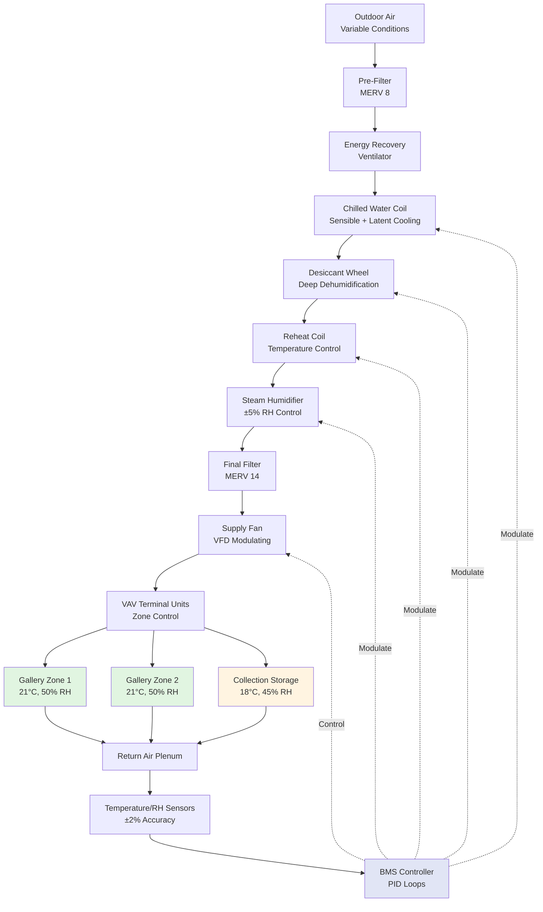

# HVAC Systems for Art Preservation Environments

Art preservation environments demand the highest level of environmental control precision. The primary threats to artwork integrity include temperature fluctuations, humidity swings, particulate contamination, and UV exposure. HVAC systems for museums, galleries, and conservation facilities must maintain stable conditions year-round while accommodating variable occupancy loads and external weather extremes.

## Environmental Control Requirements

### Temperature and Humidity Setpoints

ASHRAE Chapter 24 (Museums, Galleries, Archives, and Libraries) and the Getty Conservation Institute establish environmental control specifications based on collection sensitivity. The fundamental requirement centers on **stability rather than absolute values**.

| Control Parameter | Class AA (Precision) | Class A (Precision) | Class B (General) | Class C (Uncontrolled) |
|-------------------|---------------------|---------------------|-------------------|----------------------|
| Temperature | 21°C ± 1°C | 15-25°C, ±2°C | 15-25°C, setpoint allowed to fluctuate | No control |
| Relative Humidity | 50% ± 5% RH | 50% ± 5% RH, seasonal adjustments | 25-75% RH | No control |
| RH Fluctuation Rate | Max 5% RH/month | Max 10% RH/month | Prevent condensation | N/A |
| Short-term Variation | ±5% RH daily | ±10% RH seasonal | No rapid changes | N/A |

Class AA environments protect the most sensitive collections, requiring ±5% RH control and minimal temperature drift. This level of precision necessitates dedicated HVAC equipment with enhanced humidity control capabilities.

### Artwork Sensitivity Categories

Different materials respond uniquely to environmental conditions. The hygroscopic response—dimensional change in response to moisture content variation—determines sensitivity classification.

| Material Category | Primary Risk | Recommended RH Range | Temperature Range | Notes |
|-------------------|--------------|----------------------|-------------------|-------|
| Oil paintings on canvas | Canvas tension variation, paint layer stress | 45-55% RH ± 5% | 19-21°C ± 2°C | Avoid rapid changes |
| Wooden panel paintings | Dimensional movement, joint failure, paint delamination | 45-55% RH ± 3% | 18-21°C ± 1°C | Most sensitive category |
| Metal sculptures | Corrosion (especially bronze disease) | <40% RH or >50% RH | 18-24°C | Avoid 40-50% RH condensation zone |
| Textiles and organic fibers | Mold growth, dimensional distortion | 45-55% RH ± 5% | 18-21°C | Keep below 65% RH to prevent mold |
| Photography and film | Emulsion deterioration, base degradation | 30-40% RH (cool storage) | 2-10°C (archives) | Cold storage extends life |
| Paper and parchment | Brittleness (low RH), mold (high RH) | 45-55% RH ± 5% | 18-21°C | Stable conditions critical |

### System Design Considerations

**Humidity Control Equipment**: Standard DX cooling systems provide inadequate humidity control for art preservation. Precision systems incorporate:

- Desiccant dehumidification wheels for low-dew-point control
- Chilled water cooling coils with reheat for precise latent load management
- Ultrasonic or steam humidification for rapid response without temperature coupling
- Separate sensible and latent control loops with independent PID algorithms

**Air Distribution**: Gallery spaces require draft-free air delivery to prevent localized temperature gradients. Design parameters include:

- Supply air temperature differential: 6-8°C maximum to minimize convection currents near artwork
- Air velocity at artwork surface: <0.15 m/s to prevent particulate deposition
- Return air placement: Low returns preferred to capture stratified heat loads from lighting and occupants
- Filtration: MERV 13 minimum, MERV 14-16 for pollution-prone urban locations

**System Redundancy**: Collections with irreplaceable value require N+1 redundancy for all critical components. Backup systems must maintain control within Class A limits during primary equipment failure.

## Gallery Climate Control System Architecture

## Control Strategy Implementation

**Proportional-Integral-Derivative (PID) Control**: Standard two-position control introduces oscillation incompatible with preservation requirements. PID algorithms modulate cooling, dehumidification, and humidification outputs continuously to maintain setpoints without hunting.

**Seasonal Adaptation**: Some institutions implement controlled seasonal RH drift (45% RH winter, 55% RH summer) to reduce energy consumption while maintaining the critical ±5% RH short-term stability. This approach requires gradual transitions over 4-6 weeks.

**Alarm Thresholds**: Environmental monitoring systems trigger alerts when conditions exceed:
- Temperature: ±2°C from setpoint for >30 minutes
- Relative humidity: ±7% RH from setpoint for >2 hours
- Rate of change: >3% RH per hour

**Monitoring Density**: ASHRAE recommends one temperature/RH sensor per 500-750 m² of gallery space, positioned at artwork height (1.5 m above floor) away from supply diffusers and return grilles. Data logging at 15-minute intervals provides diagnostic resolution for system performance analysis.

## Energy Considerations and Economizer Limitations

Precision humidity control conflicts with outdoor air economizers. Free cooling introduces moisture load variability that compromises RH stability. Most museum HVAC systems operate in closed-loop mode with minimum outdoor air for ventilation only. Energy recovery ventilators (ERV) recover 70-80% of sensible and latent energy from exhaust air, reducing conditioning loads without compromising control precision.

Implementing art preservation environments requires balancing conservation science with engineering fundamentals. The investment in precision HVAC equipment protects collections valued far beyond system costs, making reliability and accuracy paramount over first-cost considerations.

