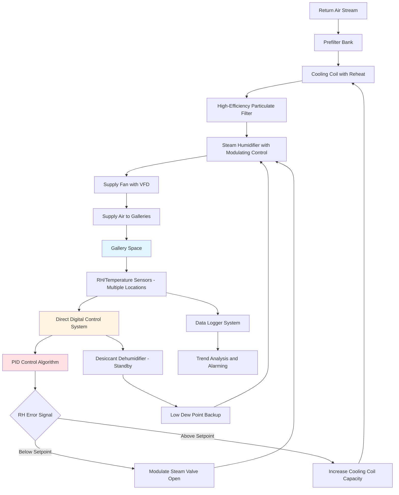

## Overview

Humidity stability represents the critical control parameter for art preservation environments. Physical damage to collection materials results from relative humidity fluctuations rather than absolute RH levels. Dimensional changes in hygroscopic materials occur when moisture content shifts in response to ambient RH changes. The magnitude and rate of these fluctuations determine stress accumulation and subsequent mechanical failure in artworks.

## Humidity Fluctuation Limits

Acceptable RH variation depends on material sensitivity and collection value. The Getty Conservation Institute and ASHRAE establish tiered specifications based on risk assessment.

### Standard Control Classes

| Class | RH Fluctuation | Application | Annual Drift |
|-------|----------------|-------------|--------------|
| AA (Precision) | ±5% RH | High-value collections, sensitive materials | ±5% RH |
| A (Tight) | ±10% RH | General museum collections | ±10% RH |
| B (Moderate) | Not exceeding 25-75% | Historic buildings without climate control | Seasonal patterns acceptable |
| C (Preventive) | Below 75% RH | Storage areas, controlled deterioration | Prevent mold growth |

The ±5% RH stability requirement for Class AA spaces demands precision HVAC equipment and robust control algorithms. Short-term fluctuations within 24 hours cause greater damage than seasonal drift occurring over months. Material stress accumulates when RH cycles repeatedly cross critical thresholds.

## Material Sensitivity to RH Changes

Different collection materials exhibit varying responses to humidity fluctuations. Hygroscopic materials pose the highest risk.

### Material Damage Thresholds

| Material Category | Critical RH Change | Time Frame | Failure Mode |
|-------------------|-------------------|------------|--------------|
| Panel paintings (wood) | >5% RH | <24 hours | Cracking, warping, paint delamination |
| Canvas paintings | >10% RH | <48 hours | Canvas slack/tension cycles |
| Ivory, bone | >3% RH | <24 hours | Microcracking, warping |
| Paper, parchment | >8% RH | <48 hours | Cockling, dimensional change |
| Photographs (albumen) | >5% RH | <24 hours | Emulsion cracking |
| Textiles (natural fibers) | >15% RH | <72 hours | Fiber weakening, mold risk |
| Lacquer, shellac | >10% RH | <48 hours | Cracking, checking |
| Metals (iron, bronze) | >60% RH sustained | Days to weeks | Corrosion initiation |

Wood panel paintings require the tightest control due to anisotropic expansion coefficients. Cross-grain dimensional changes generate internal stress that fractures paint layers and ground preparation. The critical threshold occurs at approximately 5% RH change within 24 hours.

## Humidity Control System Architecture

Precision humidity control requires dedicated equipment with sufficient capacity and response characteristics.

### Control Strategy Components

**Cooling-Based Dehumidification**
The primary air handler uses chilled water coils to condense moisture from the air stream. Dew point control maintains precise moisture removal independent of sensible cooling load. Reheat coils restore supply air temperature after overcooling for dehumidification. This approach provides stable control but requires significant energy input.

**Steam Humidification**
Electrode or resistance steam generators inject pure water vapor into the supply air stream. Modulating control valves adjust steam flow in response to RH sensor feedback. Steam humidification offers rapid response and precise control without introducing contaminants. The dispersion distance must be adequate to ensure complete vapor absorption before air reaches galleries.

**Desiccant Backup Systems**
Low-temperature desiccant dehumidifiers provide supplemental moisture removal during high-humidity periods. These systems achieve dew points below 40°F, enabling tight RH control when outdoor conditions overwhelm cooling-based dehumidification capacity. Regeneration cycles must be managed to avoid introducing heat into conditioned spaces.

## Seasonal Drift Management

Gradual seasonal RH changes minimize stress on collection materials compared to rapid fluctuations. The controlled drift approach allows RH to shift slowly between winter and summer setpoints.

### Acceptable Drift Parameters

- Maximum drift rate: 2% RH per month
- Winter setpoint: 40-45% RH (heating season)
- Summer setpoint: 50-55% RH (cooling season)
- Transition period: Minimum 8 weeks between seasonal setpoints
- No daily fluctuations exceeding ±3% RH during drift period

This strategy accommodates building envelope limitations while maintaining material stability. Collections equilibrate slowly to new moisture levels without generating internal stress. The approach reduces energy consumption by minimizing humidification loads during winter and dehumidification loads during summer.

## Microclimate Control

Localized humidity control within display cases and storage cabinets provides enhanced protection for sensitive items. Microclimate systems create stable environments independent of gallery conditions.

### Microclimate Technologies

**Passive Humidity Buffering**
Silica gel cassettes and humidity-buffering materials absorb or release moisture to stabilize RH. Art Sorb and Rhapid Gel products offer predictable performance across typical museum RH ranges. Material quantity calculations depend on case volume, air exchange rate, and desired stability level. Passive systems require periodic regeneration or replacement.

**Active Case Conditioning**
Small-scale HVAC systems condition air within sealed display cases. Miniature heat pumps with proportional control provide precise RH maintenance. These systems eliminate passive conditioning material maintenance but require electrical connections and mechanical equipment service.

## Monitoring and Verification

Continuous RH monitoring validates control system performance and provides early warning of equipment failures.

### Sensor Deployment Strategy

- Sensor density: Minimum one sensor per 2,000 ft² gallery space
- Placement height: Collection level, typically 4-5 feet above floor
- Calibration frequency: Quarterly verification against NIST-traceable standards
- Data logging interval: 15-minute intervals for trend analysis
- Alarm thresholds: ±2% RH from setpoint for Class AA spaces

Data analysis identifies control system deficiencies and building envelope air leakage. Psychrometric analysis of supply and return air conditions verifies equipment capacity and performance. Long-term trend analysis reveals seasonal patterns and equipment degradation.

## Control System Tuning

PID control algorithms require proper tuning to achieve stable RH control without hunting or overshoot.

**Proportional Band:** 8-12% RH span for humidification, 6-10% RH span for dehumidification
**Integral Time:** 10-20 minutes to eliminate offset without causing oscillation
**Derivative Time:** 2-5 minutes to anticipate load changes and improve response

Separate tuning parameters for humidification and dehumidification accommodate asymmetric system response characteristics. Adaptive control algorithms adjust parameters based on outdoor conditions and system load. Dead bands prevent simultaneous humidification and dehumidification, reducing energy waste and equipment cycling.
