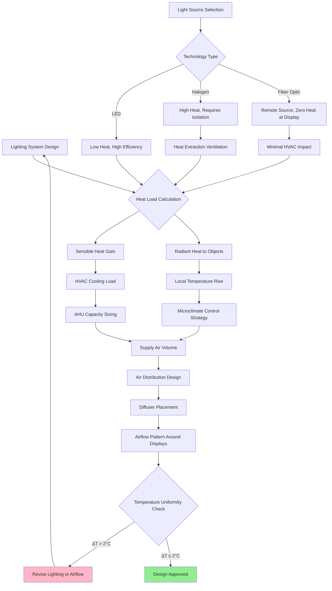

## Overview

Light exposure represents one of the primary environmental factors causing irreversible deterioration to collection materials. The photochemical degradation process is cumulative and permanent—each lux-hour of exposure contributes to molecular bond breakdown in dyes, pigments, paper fibers, and textile substrates. HVAC system design must account for lighting heat loads while supporting the precise environmental control necessary to mitigate temperature-accelerated photochemical reactions.

## Material Light Sensitivity Classifications

Different materials exhibit varying susceptibility to photochemical damage based on their molecular structure and chromophore concentration. The following classifications guide illuminance limits:

| Material Category | Maximum Illuminance | Annual Exposure Limit | UV Content Limit | Examples |
|-------------------|---------------------|----------------------|------------------|----------|
| Highly Sensitive | 50 lux | 150,000 lux-hours | <10 μW/lumen | Watercolors, textiles, dyed leather, natural history specimens, fugitive inks |
| Moderately Sensitive | 150-200 lux | 480,000 lux-hours | <75 μW/lumen | Oil paintings, undyed leather, wood, bone, ivory, lacquers |
| Low Sensitivity | 200-300 lux | No specified limit | <75 μW/lumen | Stone, ceramics, glass, metals, enamel, most inorganic materials |
| Archival Documents | 50 lux | 150,000 lux-hours | <10 μW/lumen | Manuscripts, prints, photographs, blueprints, documents |

## Lux Limits and Exposure Calculations

The total photochemical damage accumulates as the product of illuminance (lux) and exposure time (hours). This relationship allows calculation of permissible exhibition duration:

**Exposure Hour Calculation:**

```
Total Exposure (lux-hours) = Illuminance (lux) × Time (hours)

Permissible Exhibition Hours = Annual Exposure Limit ÷ Display Illuminance
```

**Example Calculation:**

For a watercolor displayed at 50 lux with a 150,000 lux-hour annual limit:

```
Permissible Hours = 150,000 lux-hours ÷ 50 lux = 3,000 hours/year

Daily Display = 3,000 hours ÷ 365 days = 8.2 hours/day maximum
```

For continuous display (24 hours/day), the maximum illuminance becomes:

```
Maximum Illuminance = 150,000 lux-hours ÷ (365 days × 24 hours) = 17 lux
```

This calculation demonstrates why rotation schedules and reduced display hours are essential for highly sensitive materials.

## UV Filtration Requirements

Ultraviolet radiation (wavelengths 300-400 nm) causes disproportionate damage relative to visible light. All light sources in museum environments require UV filtration to meet the following standards:

**UV Content Limits:**
- Highly sensitive materials: <10 μW/lumen
- Moderately sensitive materials: <75 μW/lumen
- Measurement method: Per CIE 157:2004 standard

**Common Source UV Content (unfiltered):**
- Daylight: 300-400 μW/lumen
- Fluorescent lamps: 50-200 μW/lumen
- LED (phosphor-converted white): 5-15 μW/lumen
- Incandescent: 60-80 μW/lumen

**Filtration Strategies:**
1. Window glazing with UV-absorbing interlayers (blocks >99% UV)
2. UV-filtering sleeves for fluorescent tubes
3. UV-filtering acrylic or glass for display cases
4. LED sources with minimal UV emission (preferred modern solution)

## Museum Lighting Standards

**IESNA/ICOM Guidelines:**
- Illuminance uniformity ratio: ≤3:1 across displayed surface
- Color rendering index (CRI): ≥90 for accurate color perception
- Correlated color temperature (CCT): 2700-3500K (warm) or 4000-5000K (neutral) based on curatorial preference
- Flicker: <5% for visitor comfort and artifact stability

**Measurement Requirements:**
- Monthly lux monitoring at object surface (not ambient)
- UV radiometer measurements quarterly
- Documentation of cumulative exposure for rotation planning
- Light level surveys during installation and annually

## Lighting and HVAC Coordination

The thermal load from lighting fixtures directly impacts HVAC system sizing and the precision achievable in temperature control. This interaction requires integrated design:



## Heat Load Calculations for Lighting

The heat generated by lighting systems must be precisely quantified to ensure HVAC system capacity adequacy:

**Lighting Heat Gain Formula:**

```
Q_light = (Watts_installed × Usage_factor × Ballast_factor) × 3.412 BTU/hr/W
```

**Technology-Specific Heat Gain:**

| Lighting Technology | Efficacy (lm/W) | Heat Gain (W/klm) | Radiant Fraction | HVAC Impact |
|---------------------|-----------------|-------------------|------------------|-------------|
| LED (modern) | 120-150 | 6.7-8.3 | 0.15-0.25 | Minimal, mostly convective |
| LED (older) | 80-100 | 10-12.5 | 0.20-0.30 | Low, good for tight control |
| Fluorescent T5 | 90-100 | 10-11.1 | 0.30-0.40 | Moderate, requires ventilation |
| Halogen | 15-25 | 40-67 | 0.65-0.80 | High, requires heat extraction |
| Incandescent | 10-17 | 59-100 | 0.70-0.90 | Severe, avoided in museums |

**Example Calculation:**

Gallery: 500 m² with 200 lux average using LED at 120 lm/W

```
Total Lumens Required = 500 m² × 200 lux = 100,000 lumens
Lighting Power = 100,000 lm ÷ 120 lm/W = 833 W
Heat Gain = 833 W × 3.412 BTU/hr/W = 2,842 BTU/hr
Cooling Load Addition = 2,842 BTU/hr ÷ 12,000 BTU/ton = 0.24 tons
```

Compare to halogen at 20 lm/W:

```
Lighting Power = 100,000 lm ÷ 20 lm/W = 5,000 W
Heat Gain = 5,000 W × 3.412 = 17,060 BTU/hr = 1.42 tons
```

This sixfold difference in cooling load demonstrates why LED technology is preferred for museum applications.

## Lighting Integration Strategies

**LED Lighting Systems:**
- Efficacy: 120-150 lm/W reduces HVAC load by 70-85% versus halogen
- Low UV output: <10 μW/lumen achievable without filtration
- Dimming capability: Enables exposure hour management
- Heat management: Convective heat dominates, minimal radiant heating of objects
- Lifespan: 50,000+ hours reduces maintenance disruption

**Fiber Optic Lighting for Display Cases:**
- Remote light source: Heat generated outside conditioned case volume
- Zero UV/IR at fiber terminus: Eliminates filtering requirement
- Precise beam control: Minimizes illuminated area and total exposure
- HVAC benefit: No internal heat load within microclimate-controlled case
- Application: Ideal for highly sensitive objects in sealed cases

**Daylight Exclusion Requirements:**
- Light-sensitive materials: Complete daylight exclusion mandatory
- Window treatments: Opaque roller shades or blackout curtains
- Vestibule design: Prevents transient daylight intrusion during door operation
- Emergency lighting: Photoluminescent markers instead of illuminated exit signs in sensitive storage

## Light Level Monitoring Systems

**Continuous Monitoring:**
- Lux data loggers at representative object locations
- Integration with BMS for trending and alarming
- Cumulative exposure calculation: Σ(lux × hours) over display period
- Alarm setpoints: 110% of target lux and 90% of annual exposure budget

**Periodic Verification:**
- Handheld lux meter surveys quarterly
- UV radiometer measurements with each lamp replacement
- Blue wool standard exposure cards for visual damage assessment
- Documentation of all readings for conservation records

The integration of lighting design with HVAC system performance ensures that photochemical degradation is minimized while maintaining thermal stability. Precise control of both illuminance and temperature represents the foundation of effective preventive conservation in museum environments.
