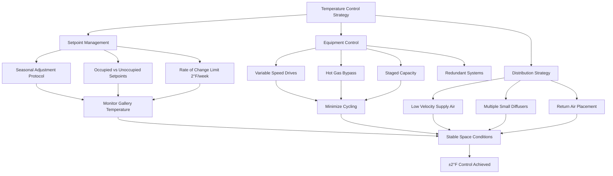

Temperature stability represents the most critical environmental parameter in art preservation. Thermal fluctuations induce dimensional changes in hygroscopic materials, generate internal stresses in composite objects, and accelerate chemical degradation reactions. Achieving stable temperature conditions requires understanding material response characteristics, implementing appropriate control strategies, and selecting HVAC equipment capable of delivering precise capacity modulation.

## Temperature Control Limits

ASHRAE Handbook—HVAC Applications Chapter 24 establishes precision classes for collection environments based on material sensitivity. The most stringent specification, Class AA, requires temperature maintained at ±2°F (±1°C) with no more than 5°F (3°C) fluctuation over 24 hours.

**Standard Temperature Ranges by Collection Type:**

| Collection Category | Temperature Range | Daily Fluctuation Limit | Annual Drift Limit |
|---------------------|-------------------|------------------------|-------------------|
| Oil paintings | 68-72°F (20-22°C) | ±2°F (±1°C) | ±4°F (±2°C) |
| Works on paper | 65-70°F (18-21°C) | ±2°F (±1°C) | ±4°F (±2°C) |
| Photographs | 65-68°F (18-20°C) | ±2°F (±1°C) | ±4°F (±2°C) |
| Textiles | 65-70°F (18-21°C) | ±2°F (±1°C) | ±4°F (±2°C) |
| Wooden artifacts | 68-72°F (20-22°C) | ±2°F (±1°C) | ±4°F (±2°C) |
| Mixed media | 68-72°F (20-22°C) | ±1°F (±0.5°C) | ±3°F (±1.5°C) |

The temperature setpoint selection balances material preservation requirements against energy consumption. Lower temperatures reduce chemical reaction rates—each 10°C reduction halves degradation velocity—but increase operational costs and relative humidity control challenges.

## Material Thermal Sensitivity

Hygroscopic materials exhibit coupled temperature-moisture response. Temperature changes alter equilibrium moisture content (EMC) at constant relative humidity through the Clausius-Clapeyron relationship. A 5°F increase at 50% RH produces approximately 0.3% moisture content reduction in wood, generating dimensional changes that stress joints and adhesive bonds.

**Thermal Expansion Coefficients and Stress Response:**

| Material | Coefficient (in/in/°F) | Stress per 10°F | Critical Concern |
|----------|----------------------|----------------|-----------------|
| Canvas (warp) | 8×10⁻⁶ | Low | Coupled RH response |
| Wood (radial) | 3-5×10⁻⁶ | Medium | Moisture-induced stress dominates |
| Wood (tangential) | 6-9×10⁻⁶ | Medium | Moisture-induced stress dominates |
| Varnish layer | 40-60×10⁻⁶ | High | Differential expansion cracking |
| Acrylic paint | 50-80×10⁻⁶ | Very high | Delamination risk |
| Gelatin (photos) | 100-150×10⁻⁶ | Critical | Curl and deformation |

Composite objects face the highest risk. A painting consists of wood stretcher, sized canvas, ground layer, paint film, and varnish—each with distinct thermal and hygric expansion properties. Temperature cycling creates differential dimensional changes that produce cracks, delamination, and structural failure.

## Temperature Control Strategy

Precise temperature stability requires three integrated approaches: thermal mass utilization, equipment capacity modulation, and controlled air distribution.

### Setpoint Stability

Maintain constant temperature setpoints throughout occupied periods. Avoid optimum start/stop algorithms that pre-heat or pre-cool spaces. The energy savings from temperature setback during unoccupied periods rarely justify the thermal cycling imposed on collections.

If overnight setback is mandated for energy conservation, limit reduction to 3-4°F maximum and implement slow recovery rates. Program setback to begin 4 hours after closure and recovery to start 4-6 hours before opening, allowing gradual temperature changes at rates below 1°F per hour.

### Gradual Seasonal Transitions

Seasonal temperature drift accommodation prevents excessive energy consumption fighting outdoor conditions. Raise summer setpoints 3-4°F above winter levels using gradual weekly adjustments of 1-2°F maximum. This seasonal floating prevents the thermal shock of abrupt changes while maintaining RH stability through coordinated humidification/dehumidification adjustment.

Begin seasonal transitions 2-3 weeks before anticipated outdoor temperature shifts. Monitor collection storage and display areas separately—interior zones with high thermal mass lag perimeter spaces by several days.

### Equipment Selection Criteria

Variable capacity HVAC equipment prevents the temperature cycling inherent in single-stage systems. Variable speed compressors, hot gas bypass, or multiple staged units provide capacity modulation from 10-100%, matching building loads without cycling.

Size equipment conservatively at 80-90% of calculated peak load to promote longer run times and better dehumidification. Install redundant systems with automatic switchover capability—equipment failure in preservation spaces cannot await normal repair schedules.

Deploy multiple temperature sensors throughout each climate zone. Place sensors away from supply diffusers and heat sources, using averaging or median selection algorithms to prevent false control signals from localized conditions.

## Verification and Commissioning

Commission temperature control systems using 30-day monitoring before collection installation. Verify control stability under varying occupancy loads, lighting heat gains, and outdoor conditions. Document maximum temperature deviations, cycling frequency, and spatial uniformity across the controlled zone.

Continuous monitoring remains essential post-occupancy. Temperature excursions beyond ±2°F thresholds require immediate investigation and correction. Trends indicating gradual drift, increasing cycling frequency, or growing spatial variations signal impending equipment degradation requiring preventive intervention.
