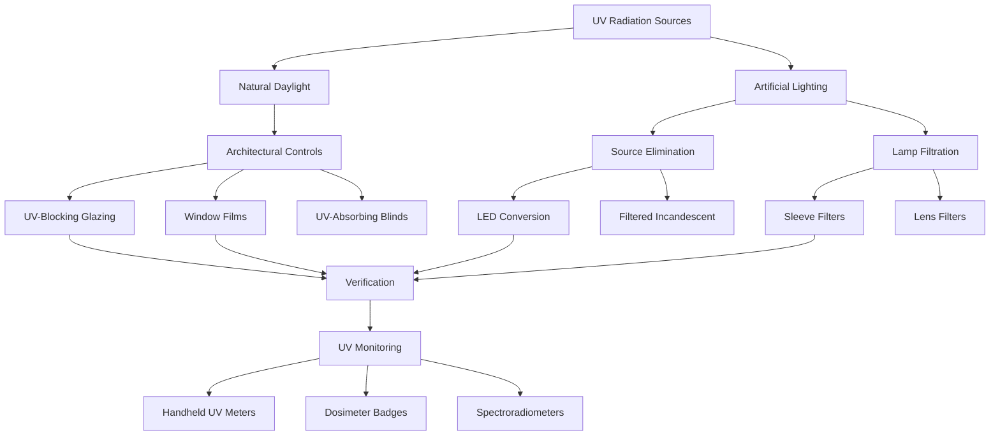

## Fundamentals of UV Damage in Collections

Ultraviolet radiation drives irreversible photochemical degradation in artifacts through energy transfer at the molecular level. When photons with wavelengths between 280-400 nm strike organic materials, they break chemical bonds in pigments, dyes, cellulose, and proteins. This process manifests as fading, embrittlement, discoloration, and structural weakening.

The damaging effect follows the Bunsen-Roscoe law of reciprocity: **Total damage = Intensity × Time**. A brief exposure to high UV intensity causes equivalent damage to prolonged exposure at lower intensity. This principle drives the conservation standard that UV radiation in exhibition spaces must approach zero for sensitive materials.

### UV Wavelength Classifications

| UV Band | Wavelength Range | Primary Sources | Penetration Characteristics |
|---------|------------------|-----------------|----------------------------|
| UV-C | 100-280 nm | Germicidal lamps (filtered by atmosphere) | Blocked by glass, highly destructive |
| UV-B | 280-315 nm | Daylight through windows | Partially transmitted by standard glass |
| UV-A | 315-400 nm | Daylight, fluorescent lamps | Readily transmitted, primary conservation concern |

Conservation standards focus on eliminating UV-A and UV-B radiation, as UV-C does not reach collection spaces under normal circumstances.

## Museum UV Protection Standards

**ASHRAE Application Handbook** and museum conservation guidelines establish the following limits:

| Material Category | Maximum UV Intensity | Equivalent Specification |
|-------------------|----------------------|--------------------------|
| Highly sensitive (textiles, watercolors, prints) | 0 μW/lumen | Zero detectable UV |
| Moderately sensitive (oil paintings, wood) | <10 μW/lumen | <75 μW/m² at 500 lux |
| Low sensitivity (metals, ceramics, stone) | <75 μW/lumen | Standard museum lighting acceptable |

Standard measurement uses the **UV Content Ratio** expressed as microwatts of UV per lumen of visible light (μW/lm). Unfiltered daylight contains 300-400 μW/lm, while unfiltered fluorescent lamps contain 100-200 μW/lm.

## UV Protection Strategies

## UV-Blocking Glazing Systems

Architectural glass designed for museums incorporates metal oxide coatings or laminated UV-absorbing interlayers.

### Glazing Performance Comparison

| Glazing Type | UV Transmission (%) | Visible Light Transmission (%) | Durability | Cost Factor |
|--------------|---------------------|--------------------------------|------------|-------------|
| Standard clear glass | 60-75 | 88-90 | Permanent | 1.0× |
| Standard laminated | 40-50 | 85-87 | Permanent | 1.3× |
| UV-filtering laminated | <1 | 80-85 | Permanent | 2.0× |
| Museum conservation glass | <0.1 | 75-82 | Permanent | 3.5-5.0× |
| Acrylic UV-filtering | <1 | 90-92 | 10-15 years (scratching) | 1.8× |

UV-filtering laminated glass uses polyvinyl butyral (PVB) interlayers doped with UV absorbers such as benzotriazoles or benzophenones. These materials absorb UV photons through electronic transitions, converting radiant energy to low-grade heat dissipated through the glass structure.

High-performance museum glazing combines low-iron glass substrates with multiple functional coatings to achieve <0.1% UV transmission while maintaining 75%+ visible light transmission and neutral color rendering.

## UV-Absorbing Films and Sleeves

Applied films provide retrofit solutions for existing glazing and lighting systems.

### Window Film Applications

Polyester-based films with UV-absorbing additives adhere to existing glass surfaces. Film thickness ranges from 50-200 micrometers with adhesive layers providing optical contact.

**Installation requirements:**
- Glass surface temperature: 40-90°F during application
- Interior application preferred for longevity
- Edge seal critical to prevent moisture infiltration
- Expected service life: 10-20 years depending on solar exposure

**Performance characteristics:**
- UV blocking efficiency: 99%+ for wavelengths <380 nm
- Visible light transmission reduction: 5-15%
- Potential for edge seal failure in high-humidity environments
- Risk of thermal stress cracking in dual-pane units (requires manufacturer approval)

### Lamp Sleeve Filters

Tubular UV-filtering sleeves fit over fluorescent and compact fluorescent lamps. Polycarbonate or acrylic materials doped with UV absorbers provide >99% UV filtration.

**Thermal considerations:**
- Sleeve reduces lamp heat dissipation by 3-7%
- Verify lamp operates within maximum rated temperature
- T5 high-output lamps require specific high-temperature sleeves
- Reduces lamp life by 5-10% due to elevated operating temperature

## LED Lighting Alternatives

Light-emitting diode technology eliminates UV radiation at the source through its fundamental physics. LEDs produce light through electroluminescence in semiconductor junctions, generating photons with energies determined by the semiconductor bandgap. Standard white LEDs use blue emitters (450-470 nm) with phosphor downconversion, producing zero UV radiation.

### LED Advantages for Conservation

**Spectral purity:** LED emission spectra contain no energy below 400 nm, eliminating UV filtration requirements entirely.

**Reduced infrared:** LEDs emit 80-90% less infrared radiation than incandescent sources, decreasing radiative heating of artifacts.

**Thermal management:** Heat generation occurs at the junction, not the emitting surface. Proper heat-sinking maintains artifact surface temperatures within ±2°F of ambient.

**Dimming capability:** Pulse-width modulation allows flicker-free dimming to 1% output, enabling circadian lighting programs without UV risk at any intensity level.

### LED Implementation Considerations

| Parameter | Museum Specification | Impact on Conservation |
|-----------|---------------------|------------------------|
| Color rendering index (CRI) | >90 preferred, >95 for critical viewing | Affects color perception accuracy |
| Correlated color temperature (CCT) | 2700-4000 K typical | Higher CCT increases photochemical risk |
| Spectral power distribution | Verify no UV content | Critical for zero-UV requirement |
| Lumen maintenance | L70 >50,000 hours | Affects long-term light level consistency |

## UV Monitoring and Verification

Continuous verification ensures filtration systems maintain effectiveness over time.

**Handheld UV meters** measure instantaneous UV intensity using photodiode sensors with UV-pass filters. Measurement accuracy: ±5% for calibrated instruments. Position sensor at artifact plane, measure at multiple locations across exhibition space.

**UV dosimeter badges** provide cumulative exposure measurement. Photosensitive materials change color in proportion to total UV exposure. Deploy badges near sensitive artifacts, replace quarterly for trending analysis.

**Spectroradiometers** map complete spectral power distribution from 280-780 nm. Laboratory-grade instruments verify zero UV content for critical installations. Measurement requires dark adaptation and multiple integration periods for low-level verification.

### Monitoring Protocol

1. Establish baseline measurements during commissioning
2. Quarterly verification for daylit galleries
3. Annual verification for artificial lighting only
4. Post-maintenance verification after any lighting or glazing work
5. Document all measurements with location, date, time, and environmental conditions

## System Integration with HVAC

UV filtration integrates with environmental control systems through several mechanisms:

**Solar load calculation:** UV-blocking glazing reduces total solar heat gain by 2-4% compared to standard glass. Adjust cooling load calculations for accurate equipment sizing.

**Lighting heat gain:** LED conversion reduces lighting heat gain by 60-75% compared to incandescent, decreasing cooling loads and enabling downsized mechanical systems.

**Film application impact:** Interior window films increase glazing surface temperature by 10-20°F under solar loading. Verify compatibility with dual-pane units to prevent seal failure.

**Monitoring integration:** Incorporate UV sensors into building automation systems for real-time alerting of filtration system failures.

## Zero-UV Goals for Sensitive Collections

The most sensitive materials require complete elimination of UV radiation. Achieve this through:

- LED-only lighting with spectroradiometric verification
- Complete daylight exclusion or museum-grade UV-blocking glazing
- Quarterly monitoring with <1 μW/lumen detection limit
- Redundant protection (architectural + lamp-level filtration)
- Documentation protocols for any UV-generating equipment

This approach extends artifact lifespan by factors of 10-50× compared to uncontrolled exhibition environments, justifying the increased initial investment in lighting and glazing systems.
