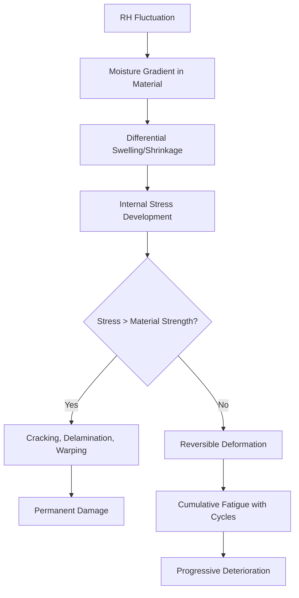
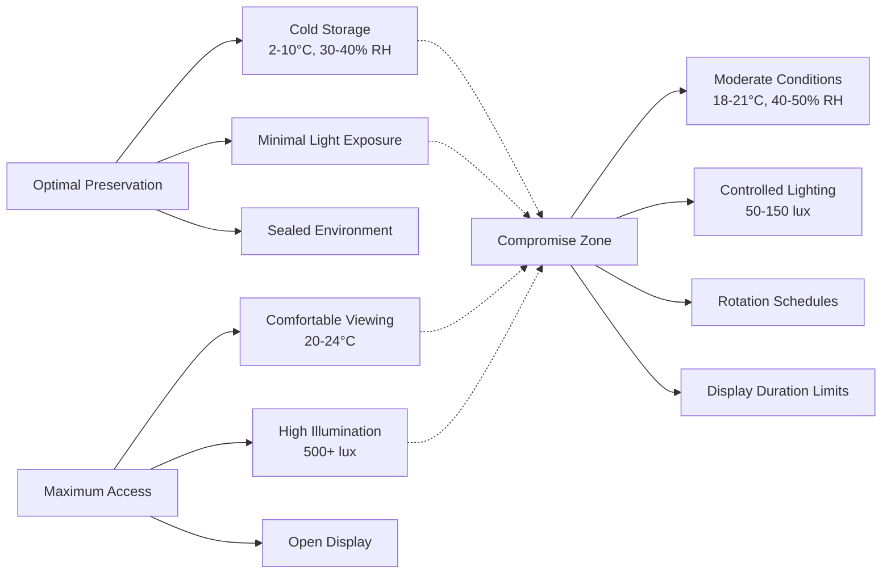

Collection materials exhibit vastly different responses to environmental conditions based on their molecular structure, hygroscopic properties, and chemical stability. Understanding the physics of material-environment interactions enables precise HVAC system design that balances preservation imperatives with operational constraints.

## Material Classification Framework

Collections divide into two fundamental categories based on moisture interaction mechanisms:

**Organic materials** contain carbon-based polymers (cellulose, proteins, lipids) with hydroxyl groups that form hydrogen bonds with water molecules. This molecular architecture creates hygroscopic behavior—materials absorb or desorb moisture to achieve equilibrium with ambient relative humidity.

**Inorganic materials** include metals, ceramics, glass, and stone. These materials exhibit minimal moisture absorption but remain vulnerable to surface condensation, corrosion, and salt crystallization when hygrothermal conditions exceed critical thresholds.

## Hygroscopic Equilibrium Physics

The moisture content of hygroscopic materials follows sorption isotherms described by the Guggenheim-Anderson-de Boer (GAB) equation:

$$M = \frac{M_m \cdot C \cdot K \cdot a_w}{(1-K \cdot a_w)(1-K \cdot a_w + C \cdot K \cdot a_w)}$$

Where:
- $M$ = equilibrium moisture content (kg water/kg dry material)
- $M_m$ = monolayer moisture content
- $C$, $K$ = material-specific constants
- $a_w$ = water activity (RH expressed as fraction)

This relationship demonstrates that moisture content changes non-linearly with RH. Small RH fluctuations cause significant moisture exchange, inducing dimensional changes through hygroscopic swelling. The volumetric strain $\epsilon_v$ relates to moisture content change:

$$\epsilon_v = \beta \cdot \Delta M$$

Where $\beta$ represents the hygroscopic expansion coefficient (typically 0.001-0.01 per 1% moisture content change for wood and paper).

## Temperature and RH Requirements by Material Type

Environmental setpoints balance degradation kinetics against dimensional stability:

| Material Category | Temperature Range | RH Range | Primary Concern | Damage Mechanism |
|-------------------|-------------------|----------|-----------------|------------------|
| Paper, books | 18-21°C | 30-50% | Acidity, mold | Hydrolytic cellulose chain scission |
| Photographs (B&W) | 18-21°C | 30-40% | Silver oxidation | Electrochemical corrosion with moisture |
| Color photographs | 2-10°C | 30-40% | Dye fading | Thermally activated chromophore degradation |
| Oil paintings | 19-24°C | 45-55% | Canvas tension | Hygroscopic strain mismatch (canvas/paint) |
| Wood artifacts | 19-24°C | 45-55% | Dimensional change | Moisture-induced swelling perpendicular to grain |
| Textiles (natural fiber) | 18-21°C | 50-55% | Fiber embrittlement | Oxidative degradation accelerated by low RH |
| Metals | 18-24°C | <35% | Corrosion | Electrochemical reactions above critical RH |
| Bone, ivory | 18-24°C | 45-55% | Cracking | Loss of structural water with RH cycling |
| Leather | 18-21°C | 50-60% | Degradation | Acid hydrolysis of collagen at low RH |
| Magnetic media | 15-20°C | 30-40% | Binder hydrolysis | Moisture-catalyzed polymer breakdown |

The Arrhenius equation quantifies temperature effects on chemical degradation rates:

$$k = A \cdot e^{-E_a/(R \cdot T)}$$

Where $k$ = reaction rate constant, $E_a$ = activation energy (50-100 kJ/mol for typical degradation), $R$ = gas constant, $T$ = absolute temperature. A 10°C temperature reduction typically halves degradation rates for organic materials.

## RH Setpoint Stability vs Range

Recent conservation research emphasizes **RH stability** over absolute values within acceptable ranges. The damage function $D$ for hygroscopic materials relates to fluctuation amplitude:

$$D \propto \sum_{i=1}^{n} |\Delta RH_i|^2 \cdot N_i$$

Where $\Delta RH_i$ represents fluctuation magnitude and $N_i$ the number of cycles. This quadratic relationship means a single 20% RH swing causes four times the damage of a 10% swing.

**Recommended control tolerances:**

- Class AA (strict control): ±5% RH, ±2°C for highly vulnerable collections
- Class A (precision control): ±5% RH, ±2°C seasonal adjustments allowed
- Class B (moderate control): ±10% RH, adjustments for climate zones
- Class C (preventive control): Prevent mold (RH <65%), freeze (T >10°C), high degradation rates

## Light Exposure Limits

Photochemical degradation follows the reciprocity law:

$$E_{total} = I \cdot t$$

Where $E_{total}$ = cumulative exposure (lux-hours), $I$ = illuminance (lux), $t$ = exposure time (hours). Damage depends on total photon dose, allowing tradeoffs between intensity and duration.

| Material Sensitivity | Maximum Illuminance | Annual Exposure Limit | UV Content |
|---------------------|---------------------|----------------------|------------|
| High (textiles, watercolors, dyed materials) | 50 lux | 150,000 lux-hours | <75 μW/lumen |
| Medium (oil paintings, undyed leather, wood) | 150-200 lux | 600,000 lux-hours | <75 μW/lumen |
| Low (metals, stone, ceramics, glass) | 300 lux | No limit | Not critical |

UV radiation (wavelength <400 nm) carries higher photon energy ($E = h \cdot c / \lambda$), causing 100-1000 times greater damage per photon than visible light.

## Pollutant Sensitivity

Gaseous pollutants accelerate degradation through:

1. **Acid deposition**: SO₂, NO₂, organic acids attack paper, textiles (target <10 μg/m³)
2. **Oxidation**: O₃ degrades rubber, dyes, pigments (target <2 μg/m³)
3. **Metal corrosion**: H₂S, carbonyl sulfides, chlorides (target <0.1 μg/m³)

Particulate matter causes abrasion and provides nuclei for hygroscopic salt formation. HVAC filtration requirements:

- MERV 13 minimum for general collections (85% efficiency at 0.3-1.0 μm)
- MERV 14-16 for high-value collections
- Carbon or potassium permanganate filters for gaseous removal

## Preservation vs Access Tradeoffs

The fundamental conflict between preservation and access requires quantitative risk assessment. The preservation index (PI) calculates expected lifetime:

$$PI = \frac{T_{half}}{N_{years}}$$

Where $T_{half}$ represents time to reduce material strength by 50% under measured conditions. A PI of 100 indicates conditions supporting 100-year useful life. Display environments typically achieve PI of 50-150, while cold storage reaches PI >500.

**Access mitigation strategies:**

1. **Rotation**: Display high-sensitivity items 3-6 months per 5-year cycle
2. **Facsimiles**: Exhibit reproductions of extremely vulnerable materials
3. **Environmental zoning**: Maintain stricter conditions in storage, relaxed in galleries
4. **Adaptive lighting**: Motion-activated or timed illumination reducing cumulative exposure
5. **Encapsulation**: Micro-environments within display cases maintaining optimal conditions

Mixed-collection galleries require compromise setpoints (typically 20°C, 50% RH) with individual cases providing specialized microclimates for outlier materials. Case design must address thermal lag, moisture buffering, and seal effectiveness to maintain independent conditions within the building envelope.
