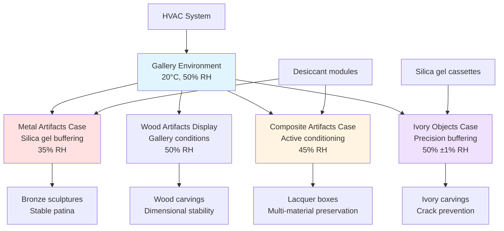

Museum collections comprise diverse material types, each with distinct environmental requirements driven by fundamental material properties. HVAC systems must accommodate wood's hygroscopic expansion, metal's corrosion susceptibility, ivory's dimensional instability, and composite artifacts' conflicting material needs. Successful preservation balances competing requirements through strategic zoning, microclimate control, and materials science principles.

## Wood Artifacts Environmental Requirements

Wood exhibits pronounced dimensional response to relative humidity variations due to its cellular structure and hygroscopic constituents. The moisture content (MC) of wood equilibrates with ambient relative humidity following sorption isotherms specific to each species.

### Dimensional Change Mechanics

Wood expands and contracts perpendicular to grain direction as moisture content varies. The dimensional change relationship follows:

$$\Delta D = D_0 \cdot \alpha_t \cdot \Delta MC$$

Where:
- $\Delta D$ = dimensional change (mm)
- $D_0$ = original dimension (mm)
- $\alpha_t$ = tangential shrinkage coefficient (0.15-0.35 for most hardwoods)
- $\Delta MC$ = moisture content change (percentage points)

Moisture content correlates approximately 1:1 with RH changes in the 30-70% range, meaning a 10% RH swing produces roughly 10 percentage point MC change and corresponding dimensional movement of 1.5-3.5% in the tangential direction.

**Target Environmental Conditions:**
- Temperature: 18-21°C (64-70°F)
- Relative humidity: 45-55% RH
- Daily fluctuation limit: ±3% RH, ±2°C
- Seasonal drift allowance: ±5% RH over months
- Rate of change: <3% RH per hour

### Wood Species Variations

Different wood species demonstrate varying sensitivity to environmental conditions:

| Wood Species | Tangential Shrinkage | Radial Shrinkage | Stability Rating | Optimal RH Range |
|--------------|---------------------|------------------|------------------|------------------|
| Oak | 8-10% | 4-5% | Moderate | 45-55% |
| Mahogany | 5-6% | 3-4% | High | 40-55% |
| Pine | 7-9% | 4-5% | Moderate | 45-55% |
| Walnut | 7-8% | 5-6% | Moderate-High | 45-55% |
| Cedar | 5-7% | 3-4% | High | 40-50% |
| Maple | 9-10% | 4-5% | Moderate | 50-55% |

Polychrome wood objects (painted or gilded surfaces) require tighter humidity control (±3% RH) because rigid surface coatings cannot accommodate substrate dimensional changes, leading to paint delamination and loss.

## Metal Artifacts Corrosion Control

Metal artifacts require low relative humidity to prevent atmospheric corrosion reactions. The critical relative humidity below which corrosion becomes negligible varies by metal composition and surface contamination.

### Corrosion Mechanisms

Electrochemical corrosion proceeds when a continuous water film forms on metal surfaces, providing an electrolyte for oxidation-reduction reactions:

**Anodic reaction (oxidation):**
$$\text{M} \rightarrow \text{M}^{n+} + n\text{e}^-$$

**Cathodic reaction (reduction):**
$$\text{O}_2 + 2\text{H}_2\text{O} + 4\text{e}^- \rightarrow 4\text{OH}^-$$

The corrosion rate follows the Arrhenius relationship with temperature and exhibits exponential dependence on relative humidity above critical thresholds.

### Metal-Specific Requirements

| Metal Type | Critical RH | Target RH | Temperature | Corrosion Products | Gaseous Threats |
|------------|-------------|-----------|-------------|-------------------|-----------------|
| Iron, steel | 60% | <35% | 18-21°C | Rust (Fe₂O₃·nH₂O) | O₂, moisture |
| Copper alloys (bronze) | 40% | 30-35% | 18-21°C | Cuprite, malachite, bronze disease | Cl⁻, SO₂, H₂S |
| Silver | 50% | <40% | 18-21°C | Silver sulfide tarnish | H₂S, carbonyl sulfide |
| Lead | 60% | <50% | 18-21°C | Lead carbonate, lead oxide | Organic acids (acetic, formic) |
| Zinc | 60% | <40% | 18-21°C | Zinc oxide, zinc carbonate | Organic acids |
| Gold | Stable | 30-50% | 18-24°C | Minimal corrosion | None significant |
| Aluminum | 70% | <50% | 18-21°C | Aluminum oxide | Chlorides, alkaline vapors |

**Bronze Disease Prevention:**

Bronze disease—a cyclic corrosion process involving cuprous chloride—requires RH below 40% to halt progression. The reaction sequence:

$$\text{CuCl} + \frac{1}{2}\text{O}_2 + \text{H}_2\text{O} \rightarrow \text{Cu}_2\text{Cl}(\text{OH})_3 + \text{HCl}$$

The liberated HCl attacks adjacent metal, perpetuating the cycle. Active bronze disease specimens require isolated storage at <30% RH with oxygen scavengers in sealed microclimates.

## Ivory and Bone Preservation

Ivory (elephant, walrus, narwhal) and bone comprise organic collagen matrix mineralized with hydroxyapatite. This composite structure exhibits extreme hygroscopic sensitivity, with dimensional changes exceeding wood.

### Dimensional Instability

The linear expansion coefficient for ivory approaches 0.005-0.008 per %RH—meaning a 10% RH swing produces 5-8% dimensional change. This extreme response causes:
- Laminar splitting along growth layers
- Warping and twisting
- Joint failure in composite objects
- Surface checking and cracking

**Environmental Specifications:**
- Temperature: 18-21°C (64-70°F)
- Relative humidity: 45-55% RH (compromise)
- Fluctuation tolerance: ±2% RH maximum (extremely tight)
- Seasonal variation: ±3% RH over 3 months
- Acclimatization: 2-4 weeks for RH changes >5%

### Historical Context Considerations

Ivory objects acclimatize to long-term environmental conditions. An ivory artifact stored at 40% RH for decades has equilibrated to that condition. Sudden increase to 55% RH causes rapid expansion and likely damage. Gradual transitions over months minimize stress:

$$\frac{dRH}{dt} \leq 1\% \text{ RH per week}$$

## Glass Artifacts Environmental Tolerance

Glass represents one of the most stable artifact materials, tolerating wide environmental ranges without deterioration under most conditions. However, certain glass compositions exhibit specific vulnerabilities.

### Stable Glass Compositions

Soda-lime glass (windows, bottles) and lead glass (crystal) demonstrate exceptional stability:
- Temperature tolerance: 10-30°C
- RH tolerance: 30-70%
- Minimal environmental control required
- Primary concern: physical protection and dust accumulation

### Unstable Glass: Weeping Glass and Crizzling

Potassium-rich medieval glass and certain 19th-century compositions undergo alkaline leaching when exposed to moisture, creating surface deposits and structural degradation.

**Weeping glass** forms hygroscopic alkaline droplets on surfaces at elevated RH:
$$\text{K}_2\text{O (in glass)} + \text{H}_2\text{O} \rightarrow 2\text{KOH (surface)}$$

**Crizzling** produces surface cracking networks from internal stress as leached alkali creates density gradients.

**Requirements for unstable glass:**
- Temperature: 18-21°C
- Relative humidity: <42% RH (critical threshold)
- Fluctuation: ±3% RH
- Storage: Desiccated microclimates with silica gel
- Handling: Gloves mandatory to prevent additional contamination

## Stone and Ceramic Materials

Stone and fired ceramics generally tolerate broad environmental ranges due to their geological origins and high-temperature formation processes. Primary concerns involve salt contamination and thermal shock rather than ambient humidity.

### Environmental Specifications

| Material | Temperature Range | RH Range | Primary Concerns |
|----------|------------------|----------|------------------|
| Marble, limestone | 15-25°C | 40-60% | Salt subflorescence, acid rain residues |
| Granite, basalt | 10-30°C | 30-70% | Minimal sensitivity, thermal gradients |
| Sandstone | 15-25°C | 40-65% | Salt damage, friable surfaces |
| Terracotta (unglazed) | 18-24°C | 40-60% | Soluble salt migration |
| Glazed ceramics | 15-25°C | 30-70% | Very stable, glaze crazing at extremes |
| Porcelain | 15-25°C | 30-70% | Excellent stability |

### Salt Damage Prevention

Soluble salts (chlorides, sulfates, nitrates) within porous stone crystallize when RH cycles cross the deliquescence point—the RH at which salts absorb moisture and dissolve. Sodium chloride deliquesces at 75% RH; crystallization upon drying creates expansion pressures exceeding stone tensile strength.

Prevention requires maintaining RH either consistently above or below the deliquescence point, avoiding repeated cycling through the transition. For stone with salt contamination: maintain <50% RH consistently or >80% RH consistently—avoiding the 50-80% danger zone.

## Composite Artifacts Environmental Compromise

Objects combining multiple materials present the most challenging preservation scenarios. A Japanese lacquer box (wood substrate, lacquer coating, metal fittings, inlaid shell) requires balancing wood's hygroscopic expansion, lacquer's brittleness, metal's corrosion tendency, and shell's dimensional sensitivity.

### Compromise Approach

Calculate weighted average setpoint based on material sensitivity:

$$RH_{setpoint} = \frac{\sum (RH_{optimal,i} \cdot w_i)}{\sum w_i}$$

Where weighting factor $w_i$ equals the inverse of material tolerance range (more sensitive materials weight higher).

**Example calculation** for object with:
- Wood body: 50% RH optimal, ±5% tolerance → $w = 1/5 = 0.20$
- Bronze fittings: 35% RH optimal, ±5% tolerance → $w = 1/5 = 0.20$
- Shell inlay: 50% RH optimal, ±2% tolerance → $w = 1/2 = 0.50$

$$RH_{setpoint} = \frac{(50 \times 0.20) + (35 \times 0.20) + (50 \times 0.50)}{0.20 + 0.20 + 0.50} = \frac{42}{0.90} = 47\% \text{ RH}$$

### Microclimate Solutions

Display cases with active or passive humidity buffering enable individual artifacts to maintain optimal conditions within galleries set for different requirements:

**Buffering capacity calculation** for display case:

$$m_{gel} = \frac{V_{case} \cdot \Delta RH \cdot \rho_{air} \cdot \omega}{BC}$$

Where:
- $m_{gel}$ = required silica gel mass (kg)
- $V_{case}$ = case volume (m³)
- $\Delta RH$ = desired RH difference from ambient (%)
- $\rho_{air}$ = air density (1.2 kg/m³)
- $\omega$ = moisture absorption per % RH (≈0.0007 kg H₂O/kg air at 20°C)
- $BC$ = buffering capacity of gel (0.10-0.15 kg H₂O/kg gel)

## Archaeological Materials Environmental Control

Archaeological materials excavated from burial environments require special consideration. Objects equilibrated to specific burial conditions for centuries undergo shock when exposed to standard museum environments.

### Burial Environment Matching

Waterlogged wood from shipwrecks contains 200-800% moisture content (dry weight basis). Immediate drying causes catastrophic collapse as water-swollen cell walls shrink. Preservation requires:
- Gradual water replacement with consolidants (polyethylene glycol)
- Controlled drying over months to years
- Final storage at 55-65% RH to maintain dimensional stability

Archaeological metals often contain active corrosion products that react violently with oxygen and moisture. Chloride-contaminated bronze requires:
- Initial storage at <15% RH to halt active corrosion
- Desalination treatment in controlled humidity cycling
- Long-term storage at <30% RH after stabilization

### Acclimatization Protocols

Objects transitioning from excavation to museum storage require gradual environmental adjustment:

| Origin Environment | Target Museum Environment | Transition Duration | Monitoring Parameters |
|-------------------|---------------------------|---------------------|----------------------|
| Waterlogged anaerobic | 55% RH, 20°C | 6-24 months | Weight, dimensions, surface condition |
| Desert/arid burial | 45% RH, 20°C | 3-6 months | Dimensional stability, salt crystallization |
| Temperate soil | 50% RH, 20°C | 1-3 months | Surface observations, RH equilibration |
| Marine/coastal | 35% RH, 20°C | 3-12 months | Chloride monitoring, corrosion activity |

## Material Requirements Comparison Table

| Material Category | Temperature | Relative Humidity | Tolerance | Primary Mechanism | Control Priority |
|------------------|-------------|-------------------|-----------|-------------------|------------------|
| Wood (unfinished) | 18-21°C | 45-55% | ±3% RH | Hygroscopic expansion | Humidity stability |
| Wood (polychrome) | 18-21°C | 50-55% | ±2% RH | Paint layer stress | Tight humidity |
| Iron/steel | 18-21°C | <35% | ±5% RH | Electrochemical corrosion | Low humidity |
| Bronze (stable) | 18-21°C | 30-35% | ±5% RH | Atmospheric corrosion | Low-moderate humidity |
| Bronze (active corrosion) | 18-21°C | <30% | ±3% RH | Bronze disease | Very low humidity |
| Silver | 18-21°C | <40% | ±5% RH | Sulfide tarnishing | H₂S removal + low RH |
| Ivory/bone | 18-21°C | 45-55% | ±2% RH | Extreme hygroscopic response | Very tight humidity |
| Glass (stable) | 15-25°C | 30-70% | ±10% RH | Minimal sensitivity | Minimal control |
| Glass (unstable) | 18-21°C | <42% | ±3% RH | Alkaline leaching | Low humidity |
| Marble/limestone | 18-25°C | 40-60% | ±10% RH | Salt subflorescence | Avoid RH cycling |
| Terracotta | 18-24°C | 40-60% | ±8% RH | Salt migration | Moderate stability |
| Composite objects | 18-21°C | 40-50% | ±5% RH | Multiple mechanisms | Compromise setpoint |
| Archaeological (variable) | Material-specific | Burial-matched | ±3% RH | Context-dependent | Gradual acclimatization |

## HVAC System Design Strategies

Accommodating diverse material requirements demands flexible HVAC strategies:

**1. Zonal Temperature/Humidity Control**
- Separate zones for incompatible material types
- Wood/organic gallery: 50% RH
- Metal gallery: 35% RH
- Mixed collections: 45% RH

**2. Microclimate Augmentation**
- Display cases with passive silica gel buffering
- Active microclimate systems for critical objects
- Sealed cases isolating sensitive materials

**3. Precision Equipment Selection**
- Desiccant dehumidification for deep dehumidification (<30% RH)
- Steam humidification for precise moisture addition
- Variable capacity systems preventing overshoot
- Dual-path systems (separate latent/sensible control)

**4. Monitoring and Alarming**
- Material-specific alarm thresholds
- Multiple sensors per zone (spatial averaging)
- Rate-of-change detection
- Historical trending for seasonal optimization

## Conclusion

Successful environmental control for diverse museum artifacts requires understanding fundamental material properties, hygrothermal behavior, and degradation mechanisms. Wood's dimensional instability, metal's corrosion susceptibility, ivory's extreme sensitivity, and composite objects' conflicting requirements drive sophisticated HVAC strategies incorporating zonal control, microclimate systems, and precision equipment. Target conditions of 18-21°C with material-specific RH setpoints (35% for metals, 45-55% for organic materials, <42% for unstable glass) balanced against tight control tolerances (±2-5% RH) provide effective preservation while accommodating practical collection management needs.
