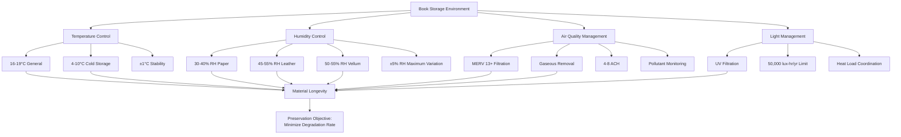

Books and manuscripts represent some of the most environmentally sensitive materials in cultural heritage collections, requiring precise HVAC control to prevent irreversible degradation. The chemical composition of paper, binding materials, and inks creates complex preservation challenges that demand integrated environmental management strategies.

## Paper Preservation Temperature and Humidity

Paper degradation follows first-order kinetic reactions, with temperature exerting the dominant influence on deterioration rates. The relationship between temperature and chemical reaction velocity follows the Arrhenius equation:

$$k = A \cdot e^{-E_a/(RT)}$$

where $k$ represents the degradation rate constant, $A$ is the frequency factor, $E_a$ is activation energy (typically 80-100 kJ/mol for cellulose hydrolysis), $R$ is the gas constant (8.314 J/mol·K), and $T$ is absolute temperature in Kelvin.

This relationship demonstrates that every 5°C temperature reduction approximately halves the degradation rate for most paper deterioration mechanisms. Optimal storage conditions maintain temperatures between 16-19°C (60-66°F) with relative humidity at 30-40% for general collections and 20-35% RH for archival materials.

Humidity control prevents multiple degradation pathways. Excessive moisture (above 65% RH) enables mold growth, foxing, and cockle formation, while low humidity (below 25% RH) causes embrittlement, particularly in sized papers. The equilibrium moisture content (EMC) of paper follows:

$$EMC = \frac{18.02 \cdot K \cdot h}{M_w \cdot (1 - K \cdot h)}$$

where $h$ is relative humidity (decimal), $K$ is the equilibrium constant, and $M_w$ is the molecular weight of water. Fluctuations exceeding ±5% RH cause dimensional changes that stress fibers and accelerate mechanical failure.

## Leather and Vellum Binding Requirements

Leather bindings require different conditions than paper bodies. Tanned leather contains collagen proteins susceptible to acid hydrolysis from atmospheric pollutants and inherent tanning residues. Optimal conditions for leather maintain 45-55% RH and 16-18°C.

Below 40% RH, leather loses plasticizing moisture, becoming brittle and prone to red rot—a powdery degradation of the grain surface. The moisture content of leather equilibrates with ambient RH following different isotherms than cellulose, creating potential conflicts in mixed-material volumes.

Vellum (prepared animal skin) exhibits extreme hygroscopic behavior, with dimensional changes approaching 2-3% per 10% RH variation. Storage conditions must maintain exceptional stability, ideally ±2% RH and ±1°C, with target conditions at 50-55% RH and 16-18°C. Unbound vellum sheets require physical restraint or controlled weighting to prevent cockling during unavoidable environmental fluctuations.

## Acid Paper Degradation Factors

Paper manufactured after 1850 often contains residual acids from alum-rosin sizing or lignin content in mechanical wood pulps. These acids catalyze cellulose chain scission through hydrolysis:

$$\text{Cellulose-O-Cellulose} + H_2O \xrightarrow{H^+} \text{Cellulose-OH} + \text{HO-Cellulose}$$

The degradation rate increases exponentially with temperature and humidity. At 25°C and 50% RH, acidic papers may lose 50% of fold endurance within 30-50 years, while identical conditions extend this period to 200-400 years for alkaline papers.

Atmospheric pollutants, particularly sulfur dioxide and nitrogen oxides, form acids upon contact with moisture in paper fibers. The reaction $SO_2 + H_2O \rightarrow H_2SO_3$ followed by oxidation to sulfuric acid creates localized pH reductions that propagate degradation. HVAC filtration removing gaseous pollutants becomes essential.

## Low-Temperature Storage Benefits

Cold storage (below 10°C) provides the most effective strategy for extending paper longevity. The theoretical lifespan extension follows:

$$\frac{L_2}{L_1} = e^{\frac{E_a}{R} \left(\frac{1}{T_1} - \frac{1}{T_2}\right)}$$

Reducing storage temperature from 20°C to 4°C extends paper life by a factor of 8-12, depending on degradation mechanism activation energies. Frozen storage (-20°C) achieves near-indefinite preservation for acidic papers but requires careful protocols for retrieval and rewarming to prevent condensation damage.

Challenges include energy consumption, need for acclimatization chambers, and moisture management during temperature cycling. Materials must warm slowly (maximum 5°C/hour) in controlled humidity to prevent condensation.

## Air Quality for Paper Preservation

Particulate and gaseous filtration forms an integral component of preservation HVAC. Dust particles provide nucleation sites for hygroscopic salts and carry mold spores, while acidic gases directly attack paper fibers.

Effective systems employ:

- **Particulate filtration**: MERV 13 minimum (85% efficient at 0.3-1.0 μm)
- **Gaseous filtration**: Activated carbon or potassium permanganate media removing SO₂, NO₂, O₃
- **Oxidant reduction**: Target ozone below 5 ppb
- **Acidic gas removal**: SO₂ below 1 μg/m³, NO₂ below 10 μg/m³

Air change rates of 4-8 ACH provide adequate dilution of internally generated pollutants (human bioeffluents, off-gassing) while maintaining filtration effectiveness.

## Light Exposure Integration with HVAC

Visible and ultraviolet radiation causes photochemical degradation independent of temperature, but thermal effects from lighting require HVAC coordination. The total radiant exposure limits for paper follow:

$$H = E \cdot t \leq 50,000 \text{ lux-hours/year}$$

LED lighting systems generating minimal infrared radiation reduce cooling loads while permitting higher illuminance levels during brief viewing periods. HVAC systems must compensate for heat gains from traditional lighting:

- Incandescent: 90-95% energy as heat
- Fluorescent: 70-75% energy as heat
- LED: 15-30% energy as heat

Integration strategies include lighting controls that reduce illumination when spaces are unoccupied and displacement ventilation patterns that remove heat from display cases before affecting collection materials.

## Environmental Requirements by Material Type

| Material Type | Temperature | Relative Humidity | Maximum RH Fluctuation | Special Considerations |
|--------------|-------------|-------------------|----------------------|------------------------|
| Modern alkaline paper | 16-19°C | 30-40% | ±5% daily, ±10% seasonal | Stable, tolerant of standard conditions |
| Acidic paper (1850-1990) | 10-16°C | 30-35% | ±3% | Cold storage preferred, consider deacidification |
| Leather bindings | 16-18°C | 45-55% | ±5% | Monitor for red rot, maintain flexibility |
| Vellum/parchment | 16-18°C | 50-55% | ±2% | Extreme hygroscopic sensitivity |
| Coated paper | 16-19°C | 35-45% | ±5% | Blocking risk above 50% RH |
| Photographic prints in books | 16-18°C | 30-40% | ±3% | Lower humidity prevents ferrotyping |
| Asian papers (kozo, gampi) | 18-21°C | 45-55% | ±5% | Higher humidity maintains sizing |
| Blueprints/diazotypes | 16-19°C | 30-40% | ±5% | Sensitive to ammonia, alkaline gases |

## System Design Considerations

Precision HVAC systems for rare book storage employ:

1. **Redundant equipment**: Dual chillers, humidifiers, and air handlers prevent excursions during maintenance
2. **Direct digital controls**: PID loop control maintaining ±1°C and ±3% RH
3. **Zoned distribution**: Separate control for reading rooms versus storage vaults
4. **Desiccant dehumidification**: Provides low dewpoint supply air for deep dehumidification
5. **Molecular filtration**: Chemical media beds sized for 50-85% single-pass efficiency

The degradation rate equation demonstrates that environmental precision generates exponential preservation benefits, justifying sophisticated control strategies for irreplaceable materials.
