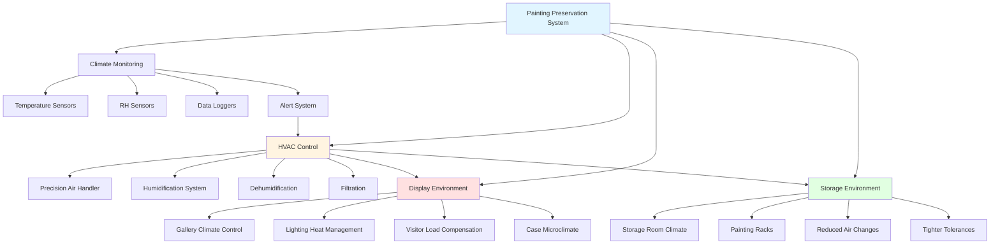

## Canvas and Panel Support Requirements

The structural substrate of paintings exhibits distinct hygroscopic behavior that drives environmental control specifications. Canvas supports, composed of linen, cotton, or synthetic fibers, demonstrate pronounced dimensional response to relative humidity variations. Natural fiber canvases expand and contract perpendicular to the weave direction according to:

$$\Delta L = L_0 \cdot \alpha_{RH} \cdot \Delta RH$$

where $\Delta L$ represents dimensional change, $L_0$ is original length, $\alpha_{RH}$ is the hygroscopic expansion coefficient (typically 0.0015-0.0025 per percent RH for linen), and $\Delta RH$ is the change in relative humidity.

Wood panel supports, including traditional oak, poplar, and mahogany substrates, respond even more dramatically to moisture fluctuations. Tangential expansion across growth rings follows:

$$\Delta W = W_0 \cdot \beta_t \cdot \Delta MC$$

where $\beta_t$ represents tangential expansion coefficient (0.20-0.35 for most hardwoods) and $\Delta MC$ is moisture content change, which correlates approximately 1:1 with RH changes in the 40-60% range.

These dimensional variations create mechanical stress at the interface between support and paint layers, making humidity stability the primary preservation concern for paintings.

## Paint Layer Sensitivity to Humidity

Paint films comprise complex layered structures with materials exhibiting different hygroscopic and mechanical properties. Oil paint layers undergo irreversible changes when exposed to excessive humidity:

- **Hydrolysis of binding medium**: Occurs above 70% RH, particularly in aged oil films
- **Salt efflorescence**: Soluble salts migrate to surface when RH exceeds 65%
- **Mold germination**: Fungal growth initiates above 65% RH with adequate nutrients
- **Delamination**: Interface failure between ground layers and support at humidity extremes

Acrylic dispersion paints demonstrate glass transition temperature (Tg) dependence on humidity. At elevated RH, plasticization lowers Tg, increasing tackiness and dirt accumulation. Below 35% RH, acrylic films become brittle with reduced flexibility.

The critical parameter is maintaining RH within the range where all layers—support, ground, paint film, and varnish—remain mechanically compatible and dimensionally stable.

## Temperature Limits to Prevent Cracking

Temperature affects painting preservation through multiple mechanisms:

**Thermal expansion differentials** between layers create stress. The coefficient of thermal expansion for oil paint ($\alpha_T \approx 40-60 \times 10^{-6}$ K$^{-1}$) differs from canvas ($\alpha_T \approx 10-15 \times 10^{-6}$ K$^{-1}$), causing interfacial shear stress:

$$\tau = E \cdot (\alpha_{paint} - \alpha_{canvas}) \cdot \Delta T$$

where $E$ represents the composite elastic modulus and $\Delta T$ is temperature change.

**Chemical reaction rates** double approximately every 10°C (Arrhenius relationship), accelerating oil oxidation, acid formation, and polymer degradation. Maintaining lower temperatures within the comfort range significantly extends painting longevity.

**Mechanical properties** of paint films degrade at elevated temperatures. Oil paints soften above 25°C, increasing susceptibility to surface damage and imprinting from contact.

## Rate of Change Restrictions

Gradual environmental transitions prevent mechanical damage more effectively than maintaining tight absolute tolerances. The painting structure responds to surface RH changes according to diffusion kinetics, creating moisture gradients within the support that generate internal stress.

Maximum recommended rates of change:

- **RH**: ±2% per hour maximum, ±5% per day maximum
- **Temperature**: ±2°C per hour maximum, ±4°C per day maximum

Seasonal drift within acceptable ranges causes less damage than frequent cycling across the same total range. Annual set point adjustment (e.g., 50% RH in summer, 45% RH in winter) accommodates building envelope limitations while preventing rapid fluctuations.

## Varnish and Glazing Considerations

Surface coatings respond independently to environmental conditions, adding complexity to preservation requirements.

**Natural resin varnishes** (dammar, mastic) exhibit low glass transition temperatures (30-40°C) and soften at typical gallery temperatures above 22°C. These varnishes accumulate dirt, yellow with age, and require periodic removal and replacement—procedures that stress the underlying paint.

**Synthetic varnishes** (acrylic, ketone resins) demonstrate superior stability with higher Tg (40-60°C), reduced sensitivity to humidity, and improved optical properties. However, they still respond to extreme conditions.

**Glazing systems** on framed paintings create isolated microclimates. Sealed glazing prevents rapid RH fluctuations but can trap moisture if paintings enter warmer environments, causing condensation. Ventilated glazing permits equilibration with gallery conditions while providing physical protection.

## Display vs Storage Conditions

Environmental specifications differ between exhibition and storage contexts based on exposure duration and accessibility requirements.

| Parameter | Display Conditions | Storage Conditions |
|-----------|-------------------|-------------------|
| Temperature | 19-22°C (66-72°F) | 17-20°C (63-68°F) |
| Relative Humidity | 45-55% | 45-50% |
| RH Tolerance | ±5% seasonal | ±3% year-round |
| Air Changes | 4-6 ACH | 2-3 ACH |
| Filtration | MERV 13 minimum | MERV 11 minimum |
| Light Exposure | <150 lux visible | Darkness |
| UV Content | <75 μW/lumen | Zero |
| Gaseous Filtration | Required (acidic gases) | Required (enhanced) |
| Temperature Gradient | <3°C vertical | <2°C vertical |

**Display environments** balance preservation with visitor comfort, necessitating higher air change rates to manage occupancy loads and lighting heat gains. Precision HVAC systems maintain narrow tolerances despite variable thermal loads.

**Storage conditions** prioritize maximum preservation through reduced temperatures, tighter humidity control, and elimination of light exposure. Lower metabolic rates at 18°C versus 22°C reduce deterioration rates by approximately 30% based on Arrhenius kinetics.

Paintings undergoing loan or exhibition require acclimatization periods—minimum 24 hours in crates before unpacking when transitioning between environments—to permit gradual equilibration and prevent condensation or rapid dimensional changes that could cause paint delamination or cracking.

The fundamental principle governing painting preservation is environmental stability. Consistent conditions within moderate ranges preserve paintings more effectively than perfect conditions with frequent variations.
