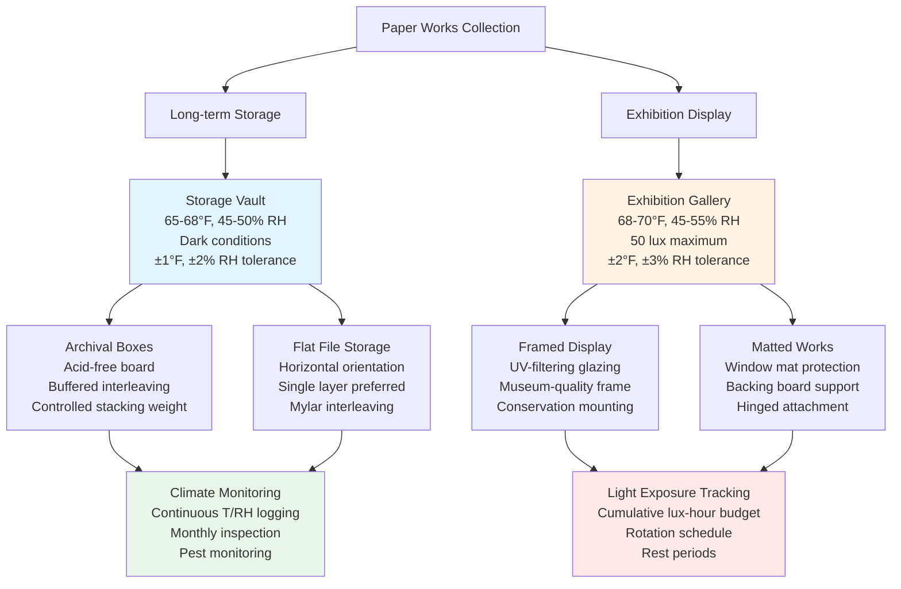

## Temperature and Humidity Requirements

Works on paper including prints, drawings, watercolors, and manuscripts represent some of the most environmentally sensitive materials in museum collections. Paper fibers undergo hygroscopic dimensional changes in response to relative humidity fluctuations, making precise environmental control essential for long-term preservation.

### Optimal Environmental Parameters

Standard conservation practice establishes narrow environmental tolerances for paper-based collections:

| Material Type | Temperature | Relative Humidity | Light Level | Annual Exposure |
|---------------|-------------|-------------------|-------------|-----------------|
| Prints (stable media) | 65-70°F (18-21°C) | 45-55% RH | 50 lux max | 150,000 lux-hours |
| Drawings (graphite) | 65-70°F (18-21°C) | 45-55% RH | 50 lux max | 150,000 lux-hours |
| Watercolors | 65-68°F (18-20°C) | 45-50% RH | 50 lux max | 50,000 lux-hours |
| Pastel drawings | 65-70°F (18-21°C) | 45-55% RH | 50 lux max | 100,000 lux-hours |
| Historic documents | 65-68°F (18-20°C) | 40-50% RH | 50 lux max | 150,000 lux-hours |
| Parchment/vellum | 60-65°F (16-18°C) | 50-60% RH | 50 lux max | 150,000 lux-hours |

Temperature setpoints remain consistent year-round, with maximum daily fluctuation not exceeding ±2°F. Relative humidity control requires tighter tolerances, with daily variations limited to ±3% RH to minimize mechanical stress on paper fibers.

## Paper Fiber Dimensional Stability

Paper responds to changes in relative humidity through hygroscopic expansion and contraction of cellulose fibers. The dimensional change can be calculated using:

$$\Delta L = L_0 \cdot \alpha_{RH} \cdot \Delta RH$$

where $\Delta L$ is the dimensional change, $L_0$ is the original dimension, $\alpha_{RH}$ is the hygroscopic expansion coefficient (typically 0.0008-0.0015 per %RH for paper), and $\Delta RH$ is the change in relative humidity.

For a 24-inch dimension experiencing a 10% RH swing:

$$\Delta L = 24 \text{ in} \cdot 0.0012 \cdot 10 = 0.29 \text{ in}$$

This 0.29-inch expansion/contraction creates significant mechanical stress, particularly at mounting points and along fold lines. Paper fibers expand primarily in width rather than length, with cross-grain expansion approximately 10 times greater than grain-direction expansion.

### Humidity Cycling Damage Mechanisms

Repeated humidity cycling causes cumulative damage through several mechanisms:

1. **Fiber fatigue** - Cyclic expansion/contraction weakens hydrogen bonds between cellulose fibers
2. **Localized stress concentration** - Differential expansion rates create shear forces at attachment points
3. **Accelerated aging** - Mechanical stress catalyzes hydrolytic degradation of cellulose chains
4. **Planar distortion** - Uneven moisture absorption causes cockling, waviness, and dimensional instability
5. **Media cracking** - Rigid media layers (gum arabic binders, ink films) cannot accommodate substrate expansion

The damage accumulation follows:

$$D_{cumulative} = \sum_{i=1}^{n} k \cdot (\Delta RH_i)^2 \cdot t_i$$

where $k$ is a material-specific constant, $\Delta RH_i$ is the magnitude of each humidity excursion, and $t_i$ is the exposure duration.

## Foxing and Biological Growth Prevention

Foxing appears as reddish-brown spots resulting from fungal growth or iron oxide formation in paper fibers. Prevention requires both humidity control and air quality management.

### Critical Humidity Thresholds

Fungal spore germination initiates above 65% RH when organic nutrients and suitable temperatures coincide. Mold growth accelerates exponentially above 70% RH. The relationship between relative humidity and mold growth rate follows:

$$r_{mold} = r_0 \cdot e^{k(RH - RH_{critical})}$$

where $r_{mold}$ is the growth rate, $r_0$ is the baseline rate, $k$ is the temperature-dependent rate constant, and $RH_{critical}$ is typically 65% for paper materials.

### Prevention Strategies

Effective foxing and mold prevention requires:

- Maintain RH below 60% continuously with ±3% control tolerance
- Provide 2-4 air changes per hour minimum with MERV 13 filtration
- Monitor for sulfur dioxide, nitrogen oxides, and particulate contamination
- Ensure surface temperatures remain above dewpoint at all times
- Implement regular collection inspection protocols
- Use archival-quality housing materials that do not emit organic acids

## Mount and Mat Considerations

Mounting systems must accommodate hygroscopic expansion while preventing mechanical damage. The differential expansion between paper and mounting substrates creates stress:

$$\sigma_{mount} = E_{paper} \cdot (\alpha_{paper} - \alpha_{mount}) \cdot \Delta RH$$

where $\sigma_{mount}$ is the mounting stress, $E_{paper}$ is the paper's elastic modulus, and $\alpha$ represents hygroscopic expansion coefficients.

### Mounting Best Practices

Conservation mounting techniques minimize stress through:

- **Hinge mounting** - Paper wheat starch or methylcellulose hinges allow free movement
- **Floating mounts** - Paper suspended with minimal attachment points
- **Window mats** - Acid-free ragboard separates artwork from glazing
- **Photo corners** - Flexible mounting without adhesive contact
- **Sink mats** - Provide air circulation gap behind artwork

All mounting materials must pass ASTM D6819 Photographic Activity Test and maintain pH 7.0-9.5 to prevent acid migration.

## Storage vs Exhibition Conditions

Storage and exhibition environments differ significantly in environmental stability and exposure duration.

### Storage Environment Specifications

Long-term storage facilities maintain tighter environmental control:

- Temperature: 65-68°F with ±1°F daily variation
- Relative humidity: 45-50% with ±2% RH daily variation
- Air changes: 4-6 ACH with MERV 14 filtration minimum
- Lighting: Complete darkness except during access
- Particulate control: ISO Class 8 (Class 100,000) cleanliness
- Gaseous pollutant limits: SO₂ <2 μg/m³, NO₂ <10 μg/m³, O₃ <2 μg/m³

Storage enclosures use unbuffered ragboard for acidic historic papers and buffered board (3% calcium carbonate) for modern papers to neutralize acid migration.

### Exhibition Environment Specifications

Exhibition galleries accommodate visitor comfort while protecting collections:

- Temperature: 68-70°F to balance conservation with occupant comfort
- Relative humidity: 45-55% with ±3% RH tolerance for visitor load
- Light exposure: 50 lux maximum with UV <75 μW/lumen
- Display duration: 3-4 months maximum per exhibition cycle
- Rest period: Minimum 2-3 years in dark storage between exhibitions
- Case microclimate: Sealed display cases with silica gel buffering

The cumulative light exposure budget governs rotation schedules. For watercolors limited to 50,000 lux-hours annually at 50 lux, maximum display time calculates as:

$$t_{max} = \frac{E_{annual}}{I \cdot h_{daily}} = \frac{50,000}{50 \cdot 8} = 125 \text{ days}$$

This allows approximately 4 months of display per year before requiring extended dark storage for recovery.

Environmental monitoring systems continuously track temperature, relative humidity, light levels, and air quality parameters. Data logging at 15-minute intervals enables detection of excursions before irreversible damage occurs, supporting proactive conservation intervention and long-term collection preservation.
