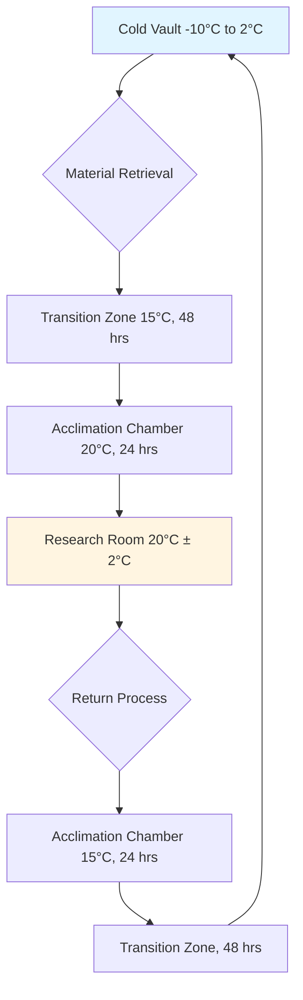

## Physical Chemistry of Photographic Degradation

Photographic materials undergo chemical degradation driven by temperature, relative humidity, and pollutant exposure. The degradation rate follows the Arrhenius relationship:

$$k = A \cdot e^{-E_a/(RT)}$$

Where:
- $k$ = reaction rate constant
- $A$ = pre-exponential frequency factor
- $E_a$ = activation energy (typically 60-100 kJ/mol for dye fading)
- $R$ = universal gas constant (8.314 J/mol·K)
- $T$ = absolute temperature (K)

This exponential temperature dependence explains why reducing storage temperature from 20°C to 2°C extends color photograph lifespan by a factor of 5-8. Each 5-6°C reduction approximately doubles the longevity of chromogenic color materials.

## Color Photograph Cold Storage Requirements

Color photographic materials contain organic dyes that undergo oxidation, reduction, and hydrolysis reactions. The cyan, magenta, and yellow image dyes degrade at different rates, causing color shifts over time.

**Recommended Storage Conditions:**

| Material Type | Temperature | Relative Humidity | Expected Lifespan Extension |
|--------------|-------------|-------------------|---------------------------|
| Color negatives (C-41) | -10°C to 2°C | 30-40% | 500+ years |
| Color slides (E-6) | -10°C to 2°C | 30-40% | 500+ years |
| Color prints (chromogenic) | 2°C to 8°C | 30-40% | 100-200 years |
| Digital prints (inkjet) | 15°C to 20°C | 30-50% | 100-200 years (varies by ink) |

### Cold Storage HVAC Design Considerations

Cold storage vaults require specialized HVAC systems to maintain precise temperature and humidity while preventing condensation during material retrieval:

The dew point temperature must be calculated to prevent condensation on cold materials:

$$T_d = T - \frac{100 - RH}{5}$$

Where $T_d$ is dew point (°C), $T$ is ambient temperature (°C), and $RH$ is relative humidity (%). Materials at 2°C brought into a 20°C, 60% RH environment will experience condensation. Transition chambers break the temperature gradient into stages below the dew point differential.

## Black and White Photograph Requirements

Gelatin-based silver halide photographs exhibit different degradation mechanisms than color materials. The primary concerns are gelatin deterioration, silver oxidation, and residual chemical reactions.

**Optimal Storage Parameters:**

- **Temperature:** 15°C to 20°C (65°F to 68°F)
- **Relative Humidity:** 30% to 40%
- **Pollutant Limits:** SO₂ < 1 μg/m³, NO₂ < 5 μg/m³, O₃ < 2 μg/m³

### Gelatin Emulsion Humidity Sensitivity

Gelatin is hygroscopic and undergoes dimensional changes with humidity fluctuations. The equilibrium moisture content (EMC) follows:

$$EMC = \frac{1800 \cdot h \cdot K}{(1-K \cdot h)(1 + K \cdot h - K)}$$

Where $h$ is relative humidity (decimal), and $K$ is the BET constant (temperature-dependent). At 30% RH, gelatin contains approximately 10% moisture by weight; at 60% RH, this increases to 18%.

**Humidity Cycling Damage:**

| RH Fluctuation Range | Gelatin Dimensional Change | Risk Level |
|---------------------|---------------------------|------------|
| ± 3% RH | ± 0.15% linear | Acceptable |
| ± 5% RH | ± 0.25% linear | Moderate risk |
| ± 10% RH | ± 0.50% linear | High risk - cracking |
| ± 20% RH | ± 1.00% linear | Severe - delamination |

HVAC systems must maintain RH within ±3% to prevent mechanical stress on gelatin layers.

## Nitrate and Acetate Film Base Hazards

### Cellulose Nitrate Film

Cellulose nitrate film (manufactured 1889-1951) presents severe fire and chemical hazards. Nitrate decomposition is autocatalytic and exothermic:

**Decomposition Stages:**

**Critical Storage Requirements:**

- **Temperature:** < 7°C (< 45°F) — each 5°C reduction halves decomposition rate
- **Relative Humidity:** 30-40%
- **Isolation:** Separate vault with explosion-proof HVAC
- **Ventilation:** Minimum 10 ACH to remove nitrogen dioxide
- **Detection:** Continuous NO₂ monitoring (alarm at 5 ppm)

The heat release from advanced decomposition can reach 1,500 kJ/kg, sufficient for self-sustained combustion at ambient temperature.

### Cellulose Acetate Vinegar Syndrome

Cellulose acetate film (safety film, 1948-present) undergoes acid-catalyzed hydrolysis, releasing acetic acid (vinegar odor):

$$\text{Acetate} + H_2O \rightarrow \text{Cellulose-OH} + \text{CH}_3\text{COOH}$$

This autocatalytic reaction accelerates as acetic acid accumulates. Storage temperature directly affects rate:

| Storage Temperature | Relative Decomposition Rate | Estimated Lifespan |
|--------------------|---------------------------|-------------------|
| 25°C (77°F) | 1.0× (baseline) | 40-60 years |
| 15°C (59°F) | 0.35× | 115-170 years |
| 5°C (41°F) | 0.13× | 310-460 years |
| -10°C (14°F) | 0.05× | 800-1200 years |

HVAC systems for acetate film must include activated carbon filtration to remove acetic acid vapors (preventing cross-contamination) and maintain RH below 40% to minimize hydrolysis.

## Daguerreotype and Early Process Sensitivities

Daguerreotypes (silver-plated copper, 1839-1860s) consist of a mercury-silver amalgam image on a polished silver surface. This delicate structure is extremely sensitive to:

- **Sulfur compounds:** Tarnishing occurs at S concentrations > 0.1 μg/m³
- **Humidity:** Corrosion accelerates above 45% RH
- **Vibration:** Image particles can dislodge from substrate

**Required Environmental Conditions:**

- Temperature: 18°C to 20°C (± 1°C)
- Relative Humidity: 35% to 40% (± 2%)
- Sulfur removal: Activated carbon + potassium permanganate filtration
- Vibration isolation: Storage on floating floors or vibration-damped shelving

## Digital Preservation vs. Analog Storage

Digital image files require different environmental controls than analog photographs. Magnetic and optical media have distinct failure mechanisms:

| Storage Medium | Temperature | RH | Primary Degradation Mode | Lifespan Estimate |
|---------------|-------------|-----|-------------------------|-------------------|
| Magnetic tape (LTO) | 16-20°C | 30-40% | Magnetic decay, binder hydrolysis | 30-50 years |
| Optical disc (DVD-R) | 18-20°C | 30-40% | Dye layer oxidation | 20-100 years (varies) |
| Hard drives | 20-25°C | 40-50% | Bearing failure, head crash | 5-10 years (powered off) |
| Solid-state (SSD) | -20 to 25°C | 30-50% | Charge leakage | 5-10 years (unpowered) |

Digital preservation requires migration strategies rather than solely environmental control. The energy barrier for charge retention in NAND flash memory is approximately 0.7 eV, resulting in significant charge loss at room temperature over 5-10 years.

## HVAC System Design Summary

Photographic collection storage requires multiple climate zones:

1. **Cold vault (-10 to 2°C):** Color materials, nitrate film
2. **Cool storage (7-15°C):** Acetate film, valuable B&W
3. **Standard archive (18-20°C):** General B&W collections, daguerreotypes
4. **Digital storage (20-25°C):** Magnetic and optical media with active monitoring

All zones must maintain ±2% RH stability, employ multi-stage filtration (MERV 13 particulate + activated carbon/permanganate), and provide isolation from vibration, light, and pollutant sources. Temperature setback is not permitted due to the condensation and dimensional change risks during thermal cycling.
