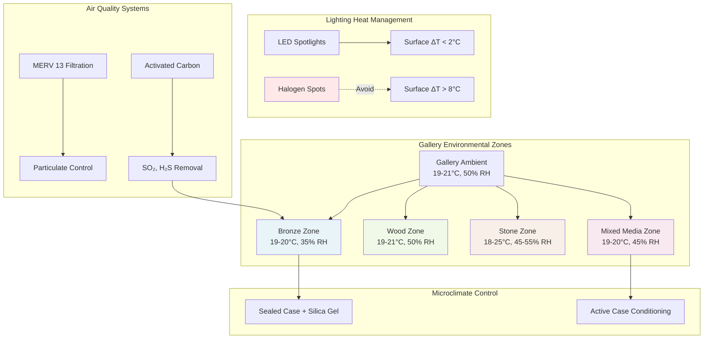

Sculpture collections present unique HVAC challenges due to diverse material compositions, three-dimensional forms with varying surface areas, and typically larger thermal masses compared to two-dimensional artworks. Environmental control must account for bronze, marble, wood, terracotta, polychrome surfaces, and increasingly common mixed media assemblages—each with distinct hygrothermal requirements.

## Material-Specific Environmental Requirements

Bronze and metal sculptures require fundamentally different conditions than organic materials. Bronze corrosion, including the destructive bronze disease (cuprous chloride conversion), accelerates at relative humidity above 40%. Optimal storage maintains RH between 30-35% at 18-21°C (64-70°F). The corrosion rate follows the Arrhenius relationship:

$$k = A \cdot e^{-\frac{E_a}{RT}}$$

where $k$ represents corrosion rate, $A$ is the pre-exponential factor, $E_a$ is activation energy (typically 40-60 kJ/mol for copper corrosion), $R$ is the gas constant (8.314 J/mol·K), and $T$ is absolute temperature.

Marble and stone sculptures tolerate broader environmental ranges due to their geological origin and inherent stability. These materials withstand 18-25°C (64-77°F) and 45-55% RH without dimensional change. However, moisture penetration can mobilize soluble salts, causing subflorescence damage. Stone requires stable conditions rather than tight tolerances—fluctuations exceeding ±5°C or ±10% RH within 24 hours pose greater risk than absolute values.

Wood sculptures exhibit the highest dimensional sensitivity. The tangential dimensional change coefficient for wood ranges from 0.15-0.35% per 1% RH change:

$$\Delta L = L_0 \cdot \alpha \cdot \Delta RH$$

where $\Delta L$ is dimensional change, $L_0$ is original dimension, $\alpha$ is the coefficient of hygroscopic expansion (0.002-0.004/% RH for tangential direction), and $\Delta RH$ is relative humidity change in percentage points. A carved oak sculpture 60 cm wide experiences approximately 1.4 mm dimensional change per 10% RH swing, creating stress concentrations at joints and polychrome interfaces.

## Sculpture Material Environmental Specifications

| Material Type | Temperature | Relative Humidity | Daily Fluctuation Limits | Special Requirements |
|--------------|-------------|-------------------|------------------------|---------------------|
| Bronze (patinated) | 18-21°C (64-70°F) | 30-35% | ±2°C, ±5% RH | Gaseous filtration for SO₂, H₂S |
| Bronze (active corrosion) | 18-21°C | <30% | ±1°C, ±3% RH | Desiccated display cases |
| Marble, limestone | 18-25°C (64-77°F) | 45-55% | ±5°C, ±10% RH | Avoid condensation cycles |
| Wood (unfinished) | 18-21°C | 45-55% | ±2°C, ±5% RH | Acclimation period required |
| Wood (polychrome) | 18-21°C | 50-55% | ±1°C, ±3% RH | Higher RH for paint layer |
| Terracotta (unglazed) | 18-24°C | 40-55% | ±5°C, ±10% RH | Moderate tolerance |
| Mixed media | 18-21°C | 45-50% | ±2°C, ±5% RH | Compromise between materials |
| Iron, steel | 18-21°C | <35% | ±2°C, ±5% RH | Oxygen scavengers if enclosed |

## Mixed Media Sculpture Environmental Control

Contemporary sculpture frequently combines incompatible materials—bronze with wood, glass with organic fibers, metal with painted surfaces. Environmental specifications must compromise between conflicting requirements while minimizing the least stable component's exposure to damaging conditions.

For bronze and wood combinations, maintain 40-45% RH at 19-20°C. This represents elevated humidity for bronze (acceptable for stable patinas without active corrosion) and reduced humidity for wood (approaching equilibrium moisture content minimum). Calculate the compromise setpoint:

$$RH_{compromise} = \frac{RH_{material1} \cdot S_{material1} + RH_{material2} \cdot S_{material2}}{S_{material1} + S_{material2}}$$

where $S$ represents material sensitivity (inverse of acceptable fluctuation range). Higher sensitivity materials weight the compromise toward their preferred conditions.

Microclimate display cases enable individual sculptures to maintain optimal conditions within gallery spaces serving multiple material types. A sealed case with silica gel buffering maintains 35% RH for a bronze sculpture while the gallery operates at 50% RH for wood works. The buffering capacity required:

$$m_{gel} = \frac{V_{case} \cdot \Delta RH \cdot \rho_{air} \cdot MR}{BC \cdot 100}$$

where $m_{gel}$ is silica gel mass (kg), $V_{case}$ is case volume (m³), $\Delta RH$ is desired humidity difference from ambient (percentage points), $\rho_{air}$ is air density (1.2 kg/m³), $MR$ is mixing ratio change per % RH (approximately 0.0007 kg water/kg dry air at 20°C), and $BC$ is buffering capacity (typically 0.10-0.15 kg water/kg gel at 40% RH).

## Stone and Metal Moisture Considerations

Stone sculpture moisture management focuses on preventing freeze-thaw damage and salt mobilization rather than dimensional stability. Porous limestone or sandstone can absorb 5-15% water by weight. When stored below 0°C, ice formation creates expansion pressures exceeding 200 MPa, causing spalling and exfoliation.

Bronze disease occurs when cuprous chloride (CuCl) oxidizes to cuprous hydroxychloride in humid air, releasing hydrochloric acid that further attacks the metal. The critical relative humidity threshold depends on contamination levels but typically occurs at 40-45% RH. Active corrosion requires reduction to below 30% RH to halt the reaction cycle.

Metal corrosion rates follow atmospheric pollutant concentrations. Sulfur dioxide creates sulfuric acid on bronze surfaces; hydrogen sulfide tarnishes silver alloys. Gaseous filtration using activated carbon impregnated with potassium permanganate removes these contaminants to below 5 μg/m³ (compared to urban outdoor levels of 20-100 μg/m³).

## Display Lighting Heat Loads and Microclimate Effects

Sculpture lighting creates localized thermal gradients that can exceed ±10°C at the illuminated surface compared to the gallery ambient. High-intensity spotlights (100-200 lux for light-stable materials) generate significant heat. A 50W halogen spotlight at 1 meter produces approximately 12 W/m² irradiance on the sculpture surface, creating surface temperature elevation:

$$\Delta T_{surface} = \frac{q \cdot A_{irradiated}}{h \cdot A_{total}}$$

where $q$ is incident heat flux (W/m²), $A_{irradiated}$ is illuminated area, $h$ is convective heat transfer coefficient (typically 5-10 W/m²·K for indoor air), and $A_{total}$ is total sculpture surface area available for convective cooling.

LED lighting reduces heat loads by 70-80% compared to halogen sources while providing equivalent illumination levels. A 7W LED spotlight replaces a 50W halogen while producing only 2-3 W of heat. This reduces surface temperature elevation from 8-10°C to 1-2°C, minimizing thermal stress in dimensionally sensitive materials.

Sculpture environmental control requires integrated HVAC design accounting for material diversity, thermal mass effects, lighting interactions, and air quality management. System design must provide zone-level control with ±2°C and ±5% RH stability for sensitive materials while maintaining energy efficiency through optimized setpoints, microclimate augmentation, and LED lighting adoption. Installation of continuous environmental monitoring with automated alarming ensures early detection of excursions that could damage irreplaceable three-dimensional artworks.
