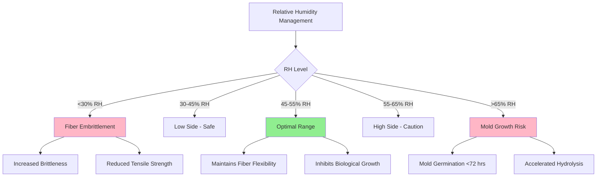
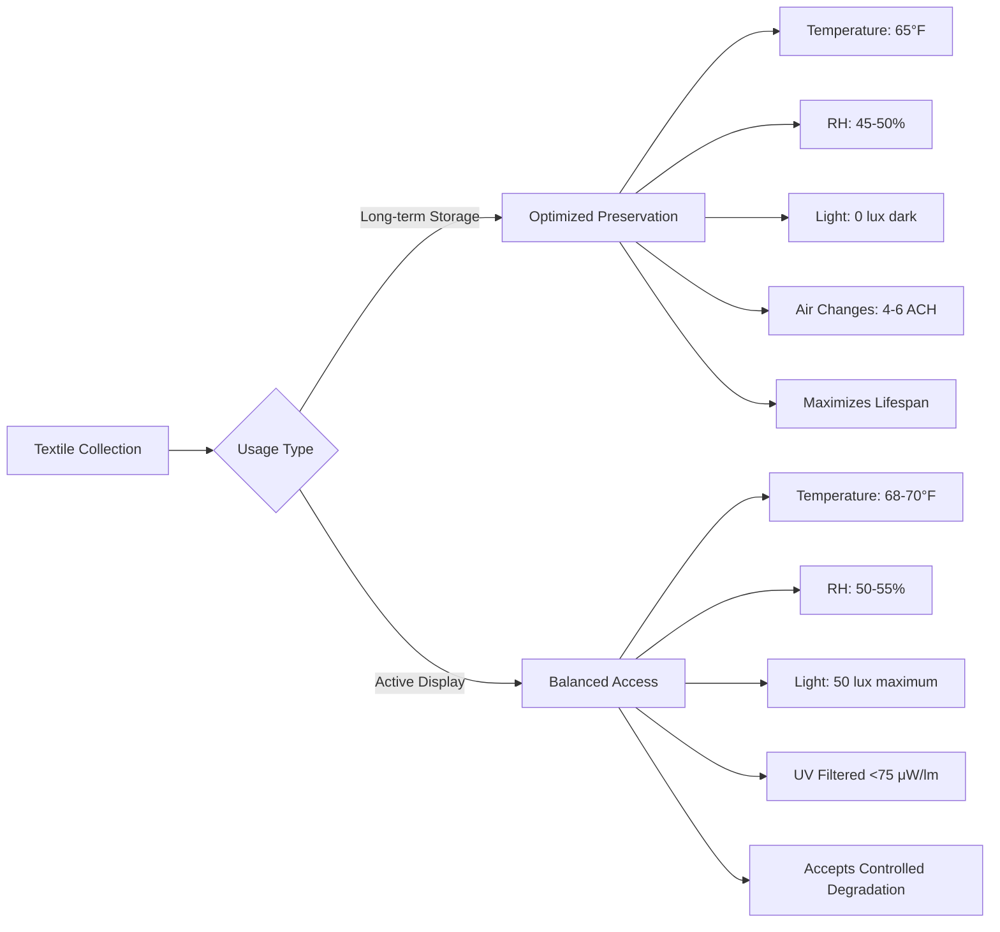

## Climate Requirements for Textile Collections

Textile preservation requires precise environmental control to prevent fiber degradation, insect infestation, and chemical deterioration. The fundamental challenge lies in balancing multiple competing degradation mechanisms that respond differently to temperature, humidity, and light exposure.

### Temperature Control: 65-70°F

The recommended temperature range of 65-70°F (18-21°C) represents an optimized compromise between slowing chemical degradation and preventing biological threats.

**Arrhenius Relationship for Chemical Degradation:**

The rate of chemical reactions in fiber degradation follows the Arrhenius equation:

$$k = A e^{-E_a/RT}$$

Where:
- $k$ = reaction rate constant
- $A$ = pre-exponential factor
- $E_a$ = activation energy (typically 50-100 kJ/mol for cellulose hydrolysis)
- $R$ = gas constant (8.314 J/mol·K)
- $T$ = absolute temperature (K)

Every 10°F (5.6°C) temperature increase approximately doubles the rate of chemical degradation. Lowering storage temperature from 75°F to 68°F extends material lifespan by approximately 40%.

**Temperature Impact on Degradation Rates:**

| Temperature | Relative Degradation Rate | Insect Activity | Energy Cost |
|-------------|---------------------------|-----------------|-------------|
| 60°F (16°C) | 0.7× | Minimal | High |
| 65°F (18°C) | 1.0× (baseline) | Low | Moderate |
| 70°F (21°C) | 1.4× | Moderate | Standard |
| 75°F (24°C) | 2.0× | High | Low |

### Relative Humidity: 45-55%

Relative humidity directly affects fiber mechanical properties through moisture sorption and desorption cycles.

**Moisture Content Equilibrium:**

Textile fibers are hygroscopic materials with equilibrium moisture content (EMC) determined by:

$$EMC = \frac{m_{water}}{m_{dry}} \times 100\%$$

For cellulosic fibers (cotton, linen): EMC ≈ 7-8% at 50% RH
For protein fibers (wool, silk): EMC ≈ 11-13% at 50% RH

**Critical RH Thresholds:**

**Humidity and Tensile Strength:**

Fiber tensile strength varies with moisture content:

$$\sigma_{tensile} = \sigma_0 \left(1 - \alpha \cdot EMC\right)$$

Where $\alpha$ ranges from 0.02-0.05 depending on fiber type. At 50% RH, cotton retains approximately 85-90% of its dry tensile strength while maintaining flexibility.

### Fiber Degradation Mechanisms

**Hydrolytic Degradation:**

Cellulose polymer chains undergo acid-catalyzed hydrolysis:

$$\text{Rate}_{hydrolysis} \propto [H^+] \cdot e^{-E_a/RT} \cdot a_w$$

Where $a_w$ is water activity (approximately equal to RH/100). Degradation accelerates exponentially above 60% RH due to increased water molecule availability.

**Photo-Oxidative Degradation:**

Light exposure causes free radical formation and chain scission:

$$\text{Damage} = \int_0^t E_v(\lambda) \cdot S(\lambda) \, d\lambda \, dt$$

Where:
- $E_v(\lambda)$ = spectral irradiance at wavelength $\lambda$
- $S(\lambda)$ = material spectral sensitivity
- Integration occurs over exposure time $t$

**Degradation Comparison by Fiber Type:**

| Fiber Type | Primary Degradation | Critical RH | Light Sensitivity | Recommended Lux |
|------------|---------------------|-------------|-------------------|-----------------|
| Cotton/Linen | Acid hydrolysis | >60% | Moderate | 50 lux |
| Silk | Photo-oxidation | >65% | Very High | 50 lux |
| Wool | Insect damage | <40% (brittle) | High | 50 lux |
| Synthetics | UV degradation | Less critical | Variable | 150 lux |

### Insect Prevention Through Climate Control

**Temperature Suppression:**

Insect developmental rates follow thermal summation models:

$$D = \frac{K}{T - T_{threshold}}$$

Where:
- $D$ = development time (days)
- $K$ = thermal constant (degree-days)
- $T$ = ambient temperature
- $T_{threshold}$ = minimum development temperature

For clothes moths (*Tineola bisselliella*): $T_{threshold}$ ≈ 45°F, optimal development at 75-80°F.

Maintaining 65-70°F significantly extends generation time, reducing population growth by 60-70% compared to 75°F storage.

### Storage vs Display Conditions

**Display Environmental Loads:**

Mounted textiles face additional stresses:

1. **Gravitational Loading:** Vertical displays experience tensile stress $\sigma = \rho g h$ where $\rho$ is fiber density, $g$ is gravitational acceleration, and $h$ is height from support point.

2. **Thermal Radiation from Lighting:** Display lighting adds sensible heat load:

$$q_{light} = \frac{P_{lamp} \times f_{radiant}}{A_{display}}$$

Requiring localized cooling to maintain temperature setpoint.

### Historic Costume Care Considerations

**Dimensional Stability:**

Costumes stored on forms must account for hygroscopic expansion:

$$\frac{\Delta L}{L_0} = \beta \cdot \Delta EMC$$

Where $\beta$ is the hygroscopic expansion coefficient (0.01-0.02 for textiles). RH fluctuations exceeding ±5% cause dimensional cycling leading to mechanical fatigue.

**Multi-Material Assemblies:**

Historic costumes combine materials with different hygroscopic properties. Differential expansion creates internal stresses:

$$\sigma_{internal} = E \cdot (\beta_1 - \beta_2) \cdot \Delta EMC$$

Where $E$ is elastic modulus. This necessitates extremely stable RH control (±3% variation maximum) for composite garments.

### HVAC System Requirements

**Precision Control Parameters:**

- Temperature stability: ±2°F
- RH stability: ±3%
- Air filtration: MERV 13 minimum (85% efficient at 1-3 μm)
- Gaseous filtration: Activated carbon for VOC removal
- Air velocity: <50 fpm across surfaces
- Outside air: 10-15% to maintain positive pressure

**Psychrometric Load Management:**

Total cooling load includes:

$$q_{total} = q_{sensible} + q_{latent} = \dot{m}_{air} \left[c_p \Delta T + h_{fg} \Delta \omega\right]$$

Where $\omega$ is humidity ratio. Textile storage requires sensible heat ratio (SHR) typically 0.85-0.95 with precision dehumidification for independent temperature and humidity control.

## References

- ASHRAE Handbook - HVAC Applications, Chapter 24: Museums, Galleries, Archives, and Libraries
- ISO 11799:2015 - Information and documentation — Document storage requirements for archive and library materials
- Canadian Conservation Institute Technical Bulletin 13: Relative Humidity - Its Importance, Measurement, and Control in Museums