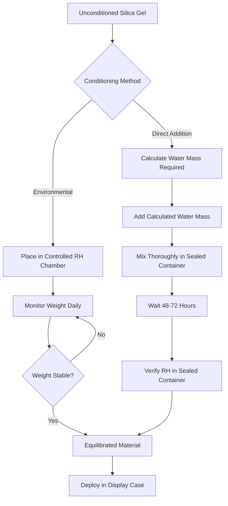
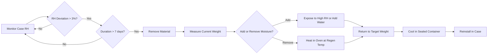

## Fundamentals of Passive Humidity Buffering

Passive humidity buffering relies on hygroscopic materials that absorb and release moisture in response to ambient relative humidity changes. The physical mechanism involves adsorption of water molecules onto material surfaces and absorption into porous structures through capillary condensation and molecular diffusion.

The buffering performance depends on three critical factors:

- **Moisture capacity**: Total mass of water the material can hold per unit mass of sorbent
- **Sorption kinetics**: Rate at which moisture exchange occurs with the surrounding air
- **Isotherm characteristics**: Relationship between equilibrium moisture content and relative humidity at constant temperature

### Moisture Isotherm Theory

The equilibrium moisture content (EMC) of hygroscopic materials follows the Brunauer-Emmett-Teller (BET) isotherm for multilayer adsorption:

$$
\frac{w}{w_m} = \frac{C \cdot \phi}{(1-\phi)[1+(C-1)\phi]}
$$

Where:
- $w$ = equilibrium moisture content (kg water/kg dry material)
- $w_m$ = monolayer moisture content
- $C$ = BET constant related to heat of adsorption
- $\phi$ = relative humidity (decimal)

For silica gel and engineered buffering materials, the modified Guggenheim-Anderson-de Boer (GAB) model provides better accuracy across the full RH range:

$$
\frac{w}{w_m} = \frac{C \cdot K \cdot \phi}{(1-K\phi)(1-K\phi+CK\phi)}
$$

Where $K$ is an additional parameter accounting for multilayer properties.

## Buffering Material Comparison

| Material | Capacity at 50% RH | Buffering Range | Conditioning Required | Regeneration Temp | Cost Factor |
|----------|-------------------|-----------------|----------------------|-------------------|-------------|
| Regular silica gel | 0.10-0.15 kg/kg | 30-70% RH | Yes (pre-equilibrate) | 120-150°C | 1.0× |
| Art-Sorb | 0.25-0.35 kg/kg | 40-60% RH | Moderate | 80-100°C | 3.5-4.0× |
| ProSorb | 0.30-0.40 kg/kg | 35-65% RH | Minimal | 70-90°C | 4.0-4.5× |
| Indicating silica gel | 0.08-0.12 kg/kg | 20-60% RH | Yes | 120°C | 1.2× |
| Molecular sieve | 0.15-0.20 kg/kg | 10-40% RH | Extensive | 200-250°C | 2.5× |

## Silica Gel Conditioning Process

Conditioning prepares buffering material to the target relative humidity by establishing equilibrium moisture content. The process requires controlled environment exposure or direct moisture addition.

### Conditioning Calculation

The water mass required to condition silica gel to a target RH is:

$$
m_{water} = m_{gel} \cdot (w_{target} - w_{initial})
$$

Where:
- $m_{water}$ = mass of water to add (kg)
- $m_{gel}$ = mass of dry silica gel (kg)
- $w_{target}$ = EMC at target RH from isotherm
- $w_{initial}$ = current moisture content

For Art-Sorb conditioned to 50% RH starting from dry state:

$$
m_{water} = 10 \text{ kg} \times (0.30 - 0.02) = 2.8 \text{ kg water}
$$

## Buffering Capacity Requirements

The required buffering material mass depends on case volume, air exchange rate, and external humidity variations. The fundamental capacity equation is:

$$
M_{buffer} = \frac{V \cdot \rho_{air} \cdot N \cdot \Delta\omega \cdot t}{\Delta w \cdot \varepsilon}
$$

Where:
- $M_{buffer}$ = required buffer mass (kg)
- $V$ = case internal volume (m³)
- $\rho_{air}$ = air density (1.2 kg/m³)
- $N$ = air changes per day (0.1-1.0 for typical cases)
- $\Delta\omega$ = humidity ratio difference between case and room (kg/kg)
- $t$ = time period without regeneration (days)
- $\Delta w$ = material moisture capacity swing (kg/kg)
- $\varepsilon$ = buffering efficiency factor (0.6-0.8)

### Practical Sizing Rule

For standard museum display cases, a simplified approach based on volumetric ratio:

$$
R_{buffer} = \frac{M_{buffer}}{V} = \frac{k \cdot ACH \cdot \Delta RH}{100 \cdot \Delta w}
$$

Where:
- $R_{buffer}$ = buffer mass per unit volume (kg/m³)
- $k$ = empirical constant (0.05-0.15)
- $ACH$ = air changes per hour
- $\Delta RH$ = allowable RH deviation (%)

For a well-sealed case (0.1 ACH), target ±5% RH control with Art-Sorb:

$$
R_{buffer} = \frac{0.10 \times 0.1 \times 10}{100 \times 0.25} = 0.004 \text{ kg/m³}
$$

Multiply by safety factor 5-10 for seasonal variations and material aging.

## Art-Sorb and ProSorb Performance

Art-Sorb and ProSorb are engineered calcium silicate-based materials with superior capacity and steeper isotherm slopes than regular silica gel. The steeper slope means greater moisture uptake per unit RH change, providing more effective buffering.

### Key Performance Characteristics

**Art-Sorb**
- Optimal range: 45-55% RH
- Capacity: 0.30 kg/kg at 50% RH
- Slope: $dw/d\phi \approx 0.8$ at 50% RH
- Regeneration: 80-100°C for 8-12 hours

**ProSorb**
- Optimal range: 40-60% RH
- Capacity: 0.35 kg/kg at 50% RH
- Slope: $dw/d\phi \approx 0.9$ at 50% RH
- Regeneration: 70-90°C for 6-10 hours

The buffering effectiveness is proportional to the isotherm slope:

$$
\frac{dm_{water}}{dRH} = M_{buffer} \cdot \frac{dw}{d\phi} \cdot \frac{1}{100}
$$

A steeper slope means the material releases more moisture for a given RH drop, providing stronger buffering action.

## Regeneration Cycles

Buffering materials require periodic regeneration when external conditions consistently differ from target RH. The regeneration frequency depends on:

- Case air exchange rate
- Difference between ambient and target RH
- Material capacity utilization
- Seasonal humidity patterns

### Regeneration Decision Criteria

Monitor case RH continuously. Regenerate when:

1. Case RH drifts beyond ±3% of target for >7 days
2. Material reaches 80% of capacity in either direction
3. Seasonal change causes ambient RH shift >15%

## Case Volume Considerations

Larger case volumes require proportionally more buffering material but benefit from thermal and moisture inertia. The volume-to-surface-area ratio affects buffering demands:

$$
\frac{V}{A} = \frac{L \cdot W \cdot H}{2(LW + LH + WH)}
$$

Smaller V/A ratios (thin cases) experience faster external equilibration and require higher buffer mass per unit volume. For cases with V/A < 0.1 m, increase buffer mass by 30-50%.

## Conservation Standards and Guidelines

The National Park Service Museum Handbook and ASHRAE Chapter 24 recommend:

- Class A artifacts: ±5% RH, ±2°C
- Class B artifacts: ±10% RH, ±5°C
- Organic materials: 45-55% RH optimal
- Metals: <35% RH to prevent corrosion
- Photographic materials: 30-40% RH preferred

Buffer material selection must align with artifact sensitivity and the gallery HVAC system's capability to maintain stable ambient conditions.

## Implementation Best Practices

1. **Calculate required mass** using case volume, ACH, and target stability
2. **Condition material** to precise target RH before installation
3. **Distribute evenly** throughout case volume for uniform buffering
4. **Monitor continuously** with dataloggers (±2% RH accuracy minimum)
5. **Plan regeneration** based on seasonal patterns and case performance data
6. **Document performance** to refine buffer mass for each case type

Passive humidity buffering provides reliable microclimate control when properly designed and maintained. The physics-based approach ensures artifact preservation while reducing reliance on active HVAC systems within the display case microenvironment.
