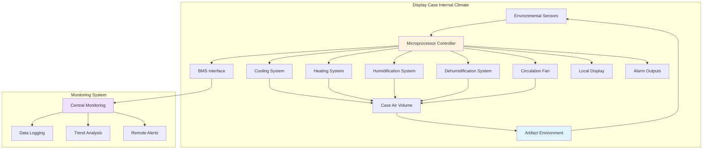

## Climate Control Methodology

Internal climate control systems for display cases establish independent environmental conditions isolated from gallery ambient conditions. These systems protect artifacts from fluctuations in temperature and relative humidity that occur in the surrounding space.

Two fundamental approaches exist: **passive control** using hygroscopic buffering materials and **active control** using mechanical conditioning equipment. The selection depends on artifact sensitivity, case construction quality, gallery conditions, and operational constraints.

## Passive Climate Control

Passive systems rely on **hygroscopic materials** to moderate relative humidity fluctuations without mechanical equipment. Silica gel remains the primary buffering agent, conditioned to the target RH level before installation.

**Operating principle:** Silica gel absorbs moisture when ambient RH rises above its equilibrium point and releases moisture when RH falls below this level. The buffering capacity depends on gel quantity, type, and the magnitude of external RH fluctuations.

**Buffering capacity calculation:**
- **Standard requirement:** 1 kg silica gel per 0.1 m³ case volume for ±5% RH control
- **Enhanced requirement:** 2-3 kg per 0.1 m³ for tighter control or challenging conditions

| Silica Gel Type | RH Range | Buffering Capacity | Reconditioning |
|-----------------|----------|-------------------|----------------|
| Regular density | 40-60% RH | Standard | Oven at 105°C |
| Art-Sorb | 30-70% RH | Enhanced | Controlled RH chamber |
| Indicating gel | 40-60% RH | Standard | Visual monitoring |
| Molecular sieve | <30% RH | High (dry) | 250°C regeneration |

**Advantages:**
- Zero energy consumption
- No mechanical failure risk
- Silent operation
- Simple maintenance

**Limitations:**
- Limited buffering duration (requires periodic reconditioning)
- Cannot control temperature
- Ineffective against large or sustained RH changes
- Requires excellent case seal (air exchange rate <0.5 per day)

## Active Climate Control

Active systems use **mechanical conditioning equipment** to maintain precise temperature and humidity within the case volume. These systems function as miniature HVAC units dedicated to individual cases or case groups.

### Case-Mounted Conditioning Units

Compact conditioning units mount directly on cases, typically at the base or rear panel. These units contain:
- **Cooling coil** (refrigerant-based or thermoelectric)
- **Heating element** (electric resistance)
- **Humidifier** (steam injection or evaporative)
- **Dehumidifier** (condensate collection)
- **Air circulation fan**
- **Microprocessor controller**

**Capacity sizing:** Units range from 50 to 500 watts cooling capacity depending on case volume, external load, and desired conditions.

| Unit Type | Cooling Capacity | Case Volume | Power Draw | Noise Level |
|-----------|-----------------|-------------|------------|-------------|
| Micro-unit | 50-100 W | <0.5 m³ | 75-150 W | 25-30 dBA |
| Compact unit | 100-250 W | 0.5-2.0 m³ | 150-300 W | 30-35 dBA |
| Standard unit | 250-500 W | 2.0-5.0 m³ | 300-600 W | 35-40 dBA |
| Multi-case system | 500-2000 W | >5.0 m³ | 600-2400 W | 40-45 dBA |

### Conditioned Air Supply Systems

Central systems deliver pre-conditioned air to multiple cases through distribution ductwork. Supply air enters the case, circulates through the display volume, and returns to the central unit via return ducting.

**Design parameters:**
- **Supply air temperature:** ±0.5°C of setpoint
- **Supply air RH:** ±2% of setpoint
- **Air change rate:** 2-6 air changes per hour
- **Air velocity:** <0.15 m/s at artifact surfaces
- **Supply diffusion:** Perforated panels or slot diffusers

**Central unit advantages:**
- Single equipment location for maintenance
- Higher efficiency at larger scale
- Better control stability
- Reduced in-case equipment footprint

**Limitations:**
- Higher installation cost
- Ductwork space requirements
- Single point of failure affects multiple cases
- Cannot accommodate different setpoints per case

## Control System Architecture

## Environmental Sensors

Sensor accuracy and placement directly affect control quality. **Temperature and RH sensors** must meet conservation-grade specifications.

**Sensor requirements per IPI guidelines:**
- **Temperature accuracy:** ±0.3°C
- **RH accuracy:** ±2% over 20-80% RH range
- **Response time:** <60 seconds to 90% of step change
- **Calibration frequency:** Annual verification against NIST-traceable standards
- **Placement:** Mid-height in case volume, minimum 150 mm from artifacts

**Advanced sensor integration:**
- Dew point calculation for condensation risk monitoring
- Predictive algorithms for seasonal conditioning adjustments
- Multi-point sensing for large cases (>2 m³)
- Artifact surface temperature measurement (non-contact IR)

## Independent Case Control

Standalone control systems provide autonomous operation independent of gallery HVAC. This autonomy ensures artifact protection continues during gallery system maintenance or failure.

**Control algorithms:**
- **PID control loops** for temperature and RH regulation
- **Deadband settings:** ±1°C and ±3% RH to minimize cycling
- **Rate-of-change limits:** Maximum 2°C/hour and 5% RH/day
- **Setback scheduling:** Reduced conditioning during closed hours if appropriate

**Alarm conditions triggering notification:**
- Temperature deviation >2°C from setpoint for >30 minutes
- RH deviation >5% from setpoint for >2 hours
- Equipment failure or loss of sensor communication
- Condensation detected on viewing glazing
- Power interruption exceeding backup duration

## System Selection Criteria

| Factor | Passive System | Active System |
|--------|---------------|---------------|
| Initial cost | Low ($500-2000) | High ($5000-25000) |
| Operating cost | Minimal | $200-1000/year |
| Control precision | ±5-10% RH | ±2% RH, ±1°C |
| Case seal requirement | Critical (<0.5 ACH) | Moderate (<2 ACH) |
| Maintenance | Quarterly gel conditioning | Monthly filter/annual service |
| Temperature control | None | Yes |
| Gallery condition tolerance | Must be stable | Can differ significantly |
| Artifact sensitivity | Low to moderate | High to extreme |

**Decision framework:**
- **Use passive systems** for moderately sensitive materials in stable gallery conditions with well-sealed cases
- **Use active systems** for highly sensitive materials, unstable gallery conditions, or when precise temperature control is required
- **Hybrid approach:** Passive buffering supplemented by active dehumidification addresses seasonal high-RH challenges

Active systems provide superior environmental control at increased cost and complexity. Proper specification, installation, and maintenance ensure long-term artifact preservation within the controlled microclimate.
