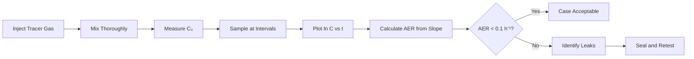
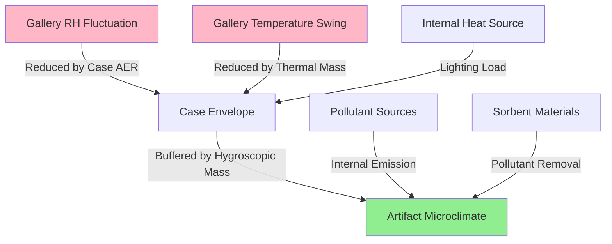

Sealed display cases function as passive climate control devices that decouple sensitive artifacts from fluctuations in gallery environmental conditions. The effectiveness of this protective strategy depends on the physics of moisture transport, air leakage pathways, and the hygrothermal buffering capacity of case materials and contents.

## Fundamental Mass Transfer Principles

The rate at which gallery air infiltrates a sealed case determines how rapidly external conditions affect the internal microclimate. Air exchange rate (AER) quantifies this phenomenon:

$$\text{AER} = \frac{Q}{V} \quad [\text{h}^{-1}]$$

where $Q$ is volumetric airflow through leakage paths (m³/h) and $V$ is internal case volume (m³). An effective sealed case achieves AER < 0.1 h⁻¹, meaning less than 10% of internal air volume exchanges per hour.

The air leakage through case penetrations follows an orifice flow relationship driven by pressure differential:

$$Q = C_d A \sqrt{\frac{2\Delta P}{\rho}}$$

where $C_d$ is the discharge coefficient (typically 0.6-0.7 for sharp-edged openings), $A$ is total leakage area (m²), $\Delta P$ is pressure difference across case envelope (Pa), and $\rho$ is air density (kg/m³).

## Air Exchange Rate Testing

The tracer gas decay method provides quantitative measurement of case tightness. After introducing a measurable tracer gas (typically SF₆ or CO₂) into the sealed case, concentration decay follows first-order kinetics:

$$C(t) = C_0 e^{-\lambda t}$$

where $C(t)$ is tracer concentration at time $t$, $C_0$ is initial concentration, and $\lambda$ is the air exchange rate constant (h⁻¹). The AER is determined from the decay slope on a semi-logarithmic plot of concentration versus time.

**Test Protocol Requirements:**
- Minimum test duration: 24 hours for tight cases (AER < 0.1 h⁻¹)
- Sample intervals: every 2-4 hours initially, then extended intervals
- Temperature stability: ±1°C during test period
- Minimum 5 data points on decay curve
- Background tracer concentration correction if applicable

## Leakage Pathway Analysis

Common leakage sites in museum display cases include:

| Location | Typical Leakage Rate | Mitigation Strategy |
|----------|---------------------|---------------------|
| Door gaskets | 30-60% of total | Dual-compression silicone gaskets |
| Access panels | 15-25% | Continuous adhesive-backed foam |
| Penetrations (cables, lighting) | 10-30% | Brush grommets or sealed conduits |
| Material joints | 10-20% | Corner sealing with flexible sealant |
| Fastener holes | 5-15% | Gasket washers on all through-bolts |

Pressure differentials arise from three mechanisms:
1. **Stack effect**: $\Delta P = \rho g h (\frac{1}{T_{\text{out}}} - \frac{1}{T_{\text{in}}})$ for vertical cases
2. **Mechanical pressurization**: Gallery HVAC supply/exhaust imbalance
3. **Thermal expansion**: Internal air expansion from lighting heat loads

## Gasket Material Selection

Effective gasket materials must maintain elastic compression over decades while remaining chemically inert. The sealing performance depends on contact stress and compression set resistance.

| Material | Compression Set (70 h @ 23°C) | Off-gassing Risk | Service Life |
|----------|-------------------------------|------------------|--------------|
| Silicone rubber | 8-15% | Very low (use peroxide-cured) | 30+ years |
| EPDM | 15-25% | Low after aging period | 20-30 years |
| Neoprene | 25-40% | Moderate (plasticizers) | 10-20 years |
| PVC foam | 40-60% | High (avoid for collections) | 5-10 years |

The required gasket compression force per unit length follows:

$$F = w \cdot \sigma_c \cdot t$$

where $w$ is gasket width, $\sigma_c$ is compression stress (typically 20-40 kPa for silicone), and $t$ is compressed thickness. Door latches must maintain this force despite dimensional changes from wood movement or thermal expansion.

## Internal Pollutant Management

Even hermetically sealed cases develop internal pollutants from:
- **Organic acid emission**: Wood, wool, leather, certain adhesives
- **Formaldehyde**: Plywood, MDF, some finishes
- **Sulfur compounds**: Wool, rubber components, certain paints
- **Particulate**: Construction debris, fiber shedding

The concentration buildup in a sealed case follows:

$$C(t) = \frac{ER}{V \cdot \lambda}(1 - e^{-\lambda t})$$

where $ER$ is internal emission rate (μg/h) and $V \cdot \lambda$ is effective ventilation rate. At equilibrium ($t \to \infty$), concentration reaches $C_{\infty} = \frac{ER}{V \cdot \lambda}$.

**Pollutant Control Strategies:**
- Use only aged, low-VOC materials for interior surfaces
- Specify powder-coated metal or inert plastics over wood when possible
- If wood required, seal all surfaces with vapor-tight barrier (aluminum foil laminate or epoxy coating)
- Include passive sorbents (activated carbon, zeolites) sized for case volume and expected pollutant load
- Test materials with Oddy test or similar corrosivity assessment before installation

## Case-Within-Gallery Strategy

The buffering effectiveness of a sealed case depends on the hygric mass of materials inside relative to air exchange rate:

$$\tau = \frac{M \cdot \mu}{V \cdot \lambda \cdot \rho_{\text{air}}}$$

where $\tau$ is time constant for moisture equilibration, $M$ is hygroscopic mass (kg), $\mu$ is moisture sorption capacity (kg moisture/kg material per %RH change), and $\rho_{\text{air}}$ is moisture content per unit volume at given conditions.

**Design Requirements for Effective Buffering:**
- AER < 0.1 h⁻¹ maintains RH within ±5% for 1-2 weeks against moderate gallery swings
- Hygroscopic buffering material (silica gel, art sorb): 10-20 kg per m³ case volume
- Thermal mass: Minimum 50 kg per m³ for temperature stabilization
- Light sources external to case or LED with minimal heat dissipation
- Temperature differential case-to-gallery: maintain < 2°C to minimize condensation risk

The moisture buffer capacity determines how long the case maintains stable RH when gallery conditions shift:

$$\Delta RH_{\text{case}} = \frac{V \cdot \lambda \cdot \Delta RH_{\text{gallery}} \cdot t}{M \cdot \mu}$$

A well-designed sealed case with adequate buffering mass can maintain internal RH within ±5% for 500-1000 hours even when gallery RH varies by ±15%.

## Performance Verification

**Acceptance Criteria:**
- Air exchange rate: < 0.1 h⁻¹ (excellent), 0.1-0.5 h⁻¹ (acceptable), > 0.5 h⁻¹ (inadequate)
- Internal RH stability: < 5% variation over 30 days with gallery RH varying ±10%
- Internal pollutant levels: Meet IPI or Image Permanence Institute guidance for specific collection materials
- Temperature stability: Within 2°C of gallery, no condensation potential

These quantitative metrics enable objective assessment of sealed case performance and inform decisions about when passive control suffices versus when active conditioning becomes necessary.
