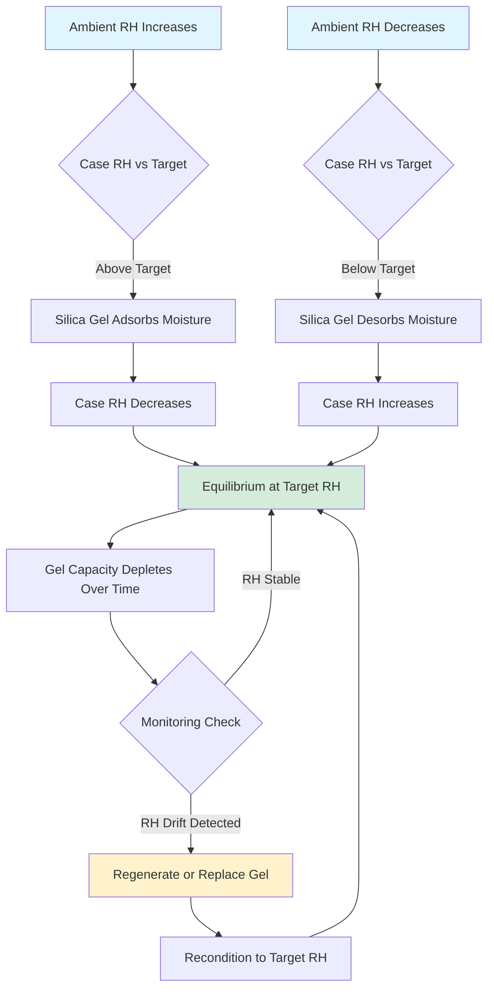

Silica gel provides passive humidity buffering within sealed or semi-sealed display cases, maintaining stable relative humidity conditions without active mechanical systems. Properly conditioned silica gel absorbs or releases moisture vapor to counteract environmental fluctuations, protecting artifacts from RH-induced degradation.

## Silica Gel Types and Characteristics

**Regular Density Silica Gel**
Standard amorphous silica gel (SiO₂·nH₂O) exhibits moisture capacity of 30-40% by weight at 40-95% RH. The material operates through physical adsorption onto the silica surface, with capacity proportional to pore surface area. Regular density gel requires larger volumes for adequate buffering but costs less per kilogram than specialty products.

**Art-Sorb (Buffered Silica)**
Art-Sorb and similar museum-grade products combine silica gel with hygroscopic salts to create precise RH buffering at specific setpoints. Common formulations target 40%, 50%, 55%, or 65% RH. The salt component provides enhanced buffering capacity at the design RH point, improving performance compared to regular silica gel. Art-Sorb cassettes simplify installation and regeneration in display cases.

**Indicating Silica Gel**
Silica gel impregnated with cobalt chloride (blue → pink) or methyl violet (orange → green) provides visual indication of saturation state. Use indicating gel only as a small fraction (5-10%) of total gel mass for monitoring purposes, as the indicator chemicals may off-gas and affect artifacts.

## Buffering Capacity and Gel Quantity

Moisture buffering capacity depends on gel mass, case volume, air exchange rate, and RH differential between target and ambient conditions.

### Required Gel Mass Calculation

**Basic Sizing Equation:**
```
M_gel = (V_case × ACH × ρ_air × ΔW × t) / (ε × 3600)
```

Where:
- M_gel = Required gel mass (kg)
- V_case = Case volume (m³)
- ACH = Air changes per hour (typically 0.1-0.5 for sealed cases)
- ρ_air = Air density (1.2 kg/m³)
- ΔW = Humidity ratio difference (kg_water/kg_air)
- t = Desired buffering period (hours)
- ε = Gel efficiency at operating RH (0.10-0.25 kg_water/kg_gel)

### Recommended Gel Quantities

| Case Volume | Target RH | Regular Silica Gel | Art-Sorb | Regeneration Interval |
|-------------|-----------|-------------------|----------|----------------------|
| 0.5 m³ | 50% | 2.5 kg | 1.5 kg | 6 months |
| 1.0 m³ | 50% | 5.0 kg | 3.0 kg | 6 months |
| 2.5 m³ | 50% | 12.5 kg | 7.5 kg | 4 months |
| 5.0 m³ | 50% | 25 kg | 15 kg | 3 months |
| 0.5 m³ | 55% | 2.0 kg | 1.2 kg | 6 months |
| 1.0 m³ | 55% | 4.0 kg | 2.4 kg | 6 months |

*Values assume sealed case construction (ACH ≤ 0.2) with ±5% RH ambient fluctuation. Double quantities for leaky cases or high ambient variability.*

## Conditioning Procedures

New silica gel arrives at arbitrary moisture content and requires conditioning to the target RH before installation. Conditioning establishes equilibrium moisture content corresponding to the desired display case RH.

**Conditioning Chamber Method:**

1. Place gel in perforated trays with maximum 25 mm layer depth for adequate air circulation
2. Position trays in a controlled chamber maintained at target RH ± 2%
3. Condition for minimum 48-72 hours per kilogram of gel mass
4. Verify equilibrium by weighing samples; weight stabilization indicates completion
5. Seal conditioned gel immediately in airtight containers until installation

**Salt Solution Conditioning:**

For small gel quantities, saturated salt solutions provide precise RH control:

| Salt Solution | Equilibrium RH at 20°C |
|---------------|------------------------|
| Lithium chloride (LiCl) | 11% |
| Magnesium chloride (MgCl₂) | 33% |
| Potassium carbonate (K₂CO₃) | 43% |
| Sodium bromide (NaBr) | 58% |
| Sodium chloride (NaCl) | 75% |
| Potassium sulfate (K₂SO₄) | 97% |

Place gel and saturated salt solution in sealed container without direct contact. Equilibration requires 5-7 days for complete moisture exchange.

## Regeneration and Replacement

Silica gel regeneration restores buffering capacity by removing accumulated moisture or adding moisture to depleted gel. Monitor gel condition through indicating silica gel color change, periodic weighing, or case RH drift.

### Thermal Regeneration (Drying)

**Procedure:**
1. Remove gel from display case
2. Spread gel in thin layers (≤ 20 mm depth) on baking sheets
3. Heat in convection oven at 120-150°C for 2-4 hours
4. Cool in sealed container with desiccant
5. Recondition to target RH before reinstallation

**Caution:** Excessive temperature (>175°C) degrades silica structure and reduces capacity. Art-Sorb should not exceed 120°C to prevent salt decomposition.

### Moisture Addition (Rehydration)

For over-dried gel, add distilled water gradually while monitoring weight:

```
Water_added = M_gel × (W_target - W_current)
```

Where W represents fractional moisture content (kg_water/kg_dry gel). Mix thoroughly and allow 24-48 hours for equilibration before use.

## Humidity Buffering Performance



## Installation Best Practices

**Gel Placement:**
Position silica gel containers at case bottom or rear to maximize air circulation without obstructing artifact viewing. Perforated cassettes or fabric bags allow vapor exchange while containing gel particles. Maintain minimum 50 mm clearance around gel containers for airflow.

**Air Circulation:**
Passive convection driven by temperature gradients provides adequate mixing in most display cases. For cases exceeding 2 m³, consider small battery-powered fans (0.001-0.005 m³/s airflow) to improve RH uniformity.

**Monitoring:**
Install dataloggers recording RH and temperature at 15-60 minute intervals. Position sensors near artifacts, not adjacent to silica gel. Acceptable RH variation: ±5% for general collections, ±3% for sensitive materials (hygroscopic metals, ivory, photographs).

## Performance Verification

Monitor case RH for minimum 2 weeks post-installation to verify buffering performance. Expected performance:

- **Excellent:** Case RH remains within ±2% of target despite ±10% ambient variation
- **Acceptable:** Case RH remains within ±5% of target despite ±10% ambient variation
- **Inadequate:** Case RH exceeds ±5% variation; indicates insufficient gel quantity, poor case sealing, or improper conditioning

Inadequate performance requires increasing gel mass by 50-100%, improving case sealing, or switching to Art-Sorb for enhanced buffering capacity.
