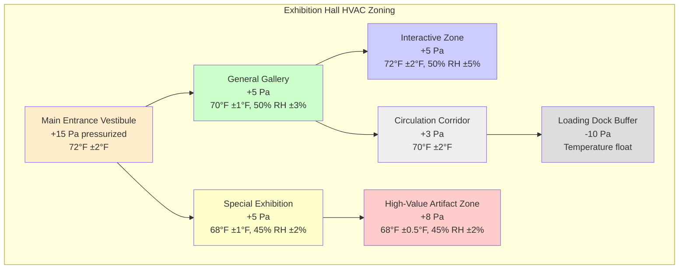

Exhibition spaces present unique HVAC challenges requiring simultaneous protection of valuable collections and comfort for high-density visitor populations. The system must accommodate dramatic occupancy fluctuations, temporary exhibit installations, and varying artifact sensitivity levels while maintaining precise environmental control.

## Visitor Load Calculations

Exhibition spaces experience highly variable occupancy requiring dynamic HVAC response. ASHRAE guidelines for museum exhibition spaces recommend design calculations based on maximum anticipated densities.

### Design Occupancy Parameters

| Space Type | Density (ft²/person) | Sensible Heat (BTU/hr/person) | Latent Heat (BTU/hr/person) | CO2 Generation (cfm/person) |
|------------|---------------------|-------------------------------|----------------------------|---------------------------|
| General Gallery | 30-50 | 250 | 200 | 0.3 |
| Special Exhibition | 15-25 | 250 | 200 | 0.3 |
| Opening Events | 10-15 | 250 | 200 | 0.3 |
| Interactive Exhibits | 20-30 | 300 | 250 | 0.35 |

**Total cooling load calculation:**

Q_total = (N × Q_sensible) + (N × Q_latent) + Q_envelope + Q_lighting + Q_equipment

Where N = floor area ÷ occupancy density factor

For a 5,000 ft² special exhibition at 20 ft²/person = 250 occupants:
- Sensible load: 250 × 250 = 62,500 BTU/hr
- Latent load: 250 × 200 = 50,000 BTU/hr
- Occupant total: 112,500 BTU/hr (9.4 tons)

## CO2 Management and Ventilation

High occupancy densities create significant CO2 buildup requiring demand-controlled ventilation strategies.

### Ventilation Requirements

**ASHRAE 62.1 ventilation rates for exhibition spaces:**
- Base ventilation: 0.06 cfm/ft² (area component)
- Occupant ventilation: 7.5 cfm/person (people component)

**CO2-based demand control:**
- Target setpoint: 800-1000 ppm (600-800 ppm above outdoor)
- Maximum acceptable: 1200 ppm
- Sensor placement: breathing zone height (48-60 inches)
- Response time: modulate outdoor air dampers to maintain setpoint

**For 5,000 ft² exhibition with 250 occupants:**
- Area component: 5,000 × 0.06 = 300 cfm
- People component: 250 × 7.5 = 1,875 cfm
- Total minimum OA: 2,175 cfm

Install CO2 sensors in multiple zones to capture spatial variations and prevent stagnant pockets in circulation paths.

## Exhibition Space Zoning Strategy

Effective zoning separates areas by collection sensitivity, occupancy patterns, and operational schedules while maintaining pressure relationships.

### Zoning Design Principles

**Pressure cascades:**
- Maintain positive pressure in exhibition areas relative to service spaces
- Entrance vestibules highest positive pressure (+15 Pa)
- Loading/service areas negative pressure to contain contaminants
- Airflow from clean to less clean spaces

**Independent control:**
- Separate AHUs for high-value artifact zones
- Dedicated humidity control per zone
- Individual temperature control ±0.5°F to ±2°F depending on sensitivity
- Override capability for special exhibitions

## Temporary Exhibit Climate Transitions

Temporary exhibits require controlled environmental transitions to prevent artifact damage from rapid climate changes.

### Transition Protocol Schedule

| Phase | Duration | Temperature Adjustment | RH Adjustment | Monitoring Frequency |
|-------|----------|----------------------|---------------|---------------------|
| Pre-Installation | 7 days | Match origin climate ±2°F | Match origin ±3% RH | Continuous logging |
| Initial Transition | 3-5 days | 1°F per day maximum | 2% RH per day maximum | Every 2 hours |
| Acclimation | 7-14 days | 0.5°F per day to target | 1% RH per day to target | Every 4 hours |
| Exhibition Period | Variable | Maintain ±1°F | Maintain ±3% RH | Daily verification |
| Pre-Departure | 5-7 days | Reverse transition protocol | Reverse transition protocol | Every 4 hours |

### Critical Transition Parameters

**Temperature transition limits:**
- Never exceed 2°F change per 24 hours for sensitive artifacts
- 1°F per 24 hours for paper, textiles, organic materials
- Monitor surface temperatures separately from ambient

**Humidity transition limits:**
- Maximum 3% RH change per 24 hours for wood, panel paintings
- 2% RH per 24 hours for composite materials
- 1% RH per 24 hours for highly sensitive hygroscopic materials

**Dewpoint control:**
- Track dewpoint to prevent condensation during transitions
- Maintain surface temperatures 5°F above ambient dewpoint
- Use portable dewpoint sensors near high-mass artifacts

## Flexible Control Systems

Exhibition spaces require adaptive HVAC control to balance competing demands of artifact preservation and visitor comfort.

### Multi-Mode Operation

**Conservation priority mode:**
- Temperature: 68°F ±0.5°F
- RH: 45% ±2%
- Air velocity: <30 fpm near artifacts
- Lighting-HVAC coordination to minimize radiant heat

**Visitor comfort priority mode:**
- Temperature: 70-72°F ±1°F
- RH: 45-50% ±3%
- Increased air circulation: 50-75 fpm
- Enhanced ventilation during high occupancy

**Event mode:**
- Pre-cooling/pre-conditioning 2-4 hours before events
- Maximum ventilation rates active
- CO2 demand control enabled
- Humidity ratio monitoring to prevent rapid RH swings from moisture loading

### System Response Characteristics

**Thermal mass compensation:**
- Building thermal mass creates lag in temperature response
- Anticipatory control algorithms adjust 30-60 minutes before expected load changes
- Night setback recovery requires 2-4 hours depending on construction

**Humidity response:**
- Dehumidification response time: 15-30 minutes
- Humidification response time: 10-20 minutes
- Use proportional-integral control to prevent overshoot
- Seasonal calibration adjustments for outdoor humidity variations

## Air Distribution Design

**Supply air considerations:**
- Low-velocity displacement ventilation (50-75 fpm) reduces dust movement
- Ceiling-mounted diffusers with throw patterns avoiding direct artifact impingement
- Return air placement at floor level to capture visitor-generated heat and moisture
- Minimum 4 air changes per hour for general galleries
- 6-8 air changes per hour for high-occupancy exhibitions

**Filtration requirements:**
- MERV 13 minimum for general exhibition spaces
- MERV 14-16 for high-value collections
- Gas-phase filtration for acidic gases and VOCs
- Particle counters to verify filtration effectiveness

Exhibition HVAC systems succeed when engineering precision meets operational flexibility, creating environments where priceless artifacts remain preserved while visitors experience comfortable engagement with cultural heritage.

