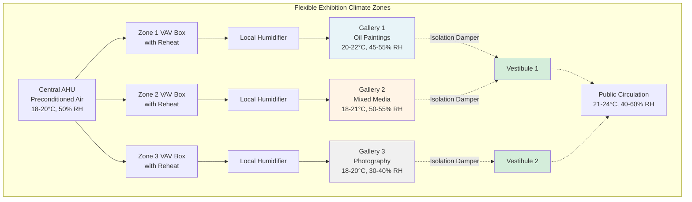

## Overview

Exhibition spaces hosting rotating collections and temporary loans require HVAC systems capable of adapting environmental conditions to match diverse artifact requirements. Unlike permanent collection galleries with fixed setpoints, these spaces demand flexible control strategies that accommodate materials ranging from oil paintings to textiles, archaeological artifacts to contemporary installations. The fundamental challenge lies in creating zone-isolated environments that can transition between different climate regimes without cross-contamination while maintaining energy efficiency and occupant comfort.

The ASHRAE Museum, Library, and Archive Collections handbook and ASHRAE Chapter 24 establish flexible environmental bands (15-25°C, 40-60% RH) as acceptable for many collection types, departing from historic rigid specifications. This approach enables exhibition designers to balance preservation requirements against loan agreement stipulations, mixed-material display challenges, and operational constraints.

## Zoned Climate Control Architecture

Effective flexible control requires physical and control system infrastructure that supports independent zone operation.

**Zone Design Principles:**

- **Physical separation:** Individual galleries or gallery subdivisions served by dedicated air handlers or terminal units with minimal air transfer between zones
- **Independent control loops:** Separate temperature and humidity sensors, controllers, and modulating devices for each zone
- **Isolation dampers:** Motorized dampers at zone boundaries to prevent air migration during different operating modes
- **Transition vestibules:** Buffer spaces between zones with 2-3°C and 5-10% RH gradients to minimize shock to artifacts during movement

**Control System Requirements:**

- Programmable logic controllers (PLCs) or building automation systems (BAS) capable of storing multiple setpoint profiles per zone
- Override capabilities for temporary exhibition installations with specific loan agreement requirements
- Ramp rate limiting to prevent rapid environmental changes (maximum 2°C per 24 hours, 3% RH per 24 hours)
- Interlock logic preventing simultaneous heating and cooling or humidification and dehumidification

## Exhibit Type Environmental Requirements

Different artifact categories demand specific temperature and humidity ranges based on material composition and degradation mechanisms.

| Exhibit Type | Temperature Range | Humidity Range | Critical Factors | Transition Rate Limit |
|--------------|-------------------|----------------|------------------|----------------------|
| Oil paintings | 20-22°C | 45-55% RH | Canvas tension, paint layer stability | 1°C/day, 2% RH/day |
| Works on paper | 18-20°C | 40-50% RH | Dimensional stability, mold prevention | 2°C/day, 3% RH/day |
| Textiles/costumes | 18-20°C | 45-55% RH | Fiber strength, pest activity | 1°C/day, 2% RH/day |
| Photographs (B&W) | 18-20°C | 30-40% RH | Emulsion cracking, fading | 2°C/day, 3% RH/day |
| Photographs (color) | 15-18°C | 30-40% RH | Dye stability, chemical degradation | 1°C/day, 2% RH/day |
| Archaeological metal | 18-21°C | 35-45% RH | Corrosion prevention | 2°C/day, 5% RH/day |
| Wood objects | 18-21°C | 45-55% RH | Dimensional stability, cracking | 1°C/day, 2% RH/day |
| Mixed media contemporary | 18-24°C | 40-60% RH | Variable based on materials | 2°C/day, 5% RH/day |

## Adjustable Setpoint Implementation

Practical implementation requires balancing artifact preservation against system capabilities and energy consumption.

**Setpoint Management Strategy:**

1. **Baseline conditioning:** Central air handlers maintain preconditioned air at neutral setpoints (19-20°C, 50% RH) to minimize terminal unit reheat and local humidification loads

2. **Zone-level adjustment:** Variable air volume (VAV) boxes with reheat coils and local steam or ultrasonic humidifiers trim conditions to zone-specific requirements

3. **Seasonal drift allowance:** Permit gradual seasonal setpoint adjustments (±2-3°C, ±5% RH) to reduce mechanical system loads during extreme outdoor conditions while remaining within acceptable preservation ranges

4. **Loan agreement accommodation:** Program temporary setpoint overrides for specific exhibitions, with automatic reversion to baseline conditions after exhibition closure

**Control Sequence Example:**

For a gallery transitioning from photography exhibition (18°C, 35% RH) to textile exhibition (20°C, 50% RH):

- Day 1-2: Increase temperature to 19°C at 0.5°C/12 hours
- Day 3-4: Increase temperature to 20°C and begin humidity increase to 40% RH
- Day 5-8: Increase humidity to 45% RH at 1.25% RH/day
- Day 9-12: Increase humidity to 50% RH at 1.25% RH/day
- Total transition period: 12 days before installation

## Zone Isolation and Air Migration Control

Preventing environmental cross-contamination between adjacent zones requires both physical barriers and control strategies.

**Isolation Methods:**

- **Pressure cascade:** Maintain slight positive pressure (+2.5 Pa) in sensitive exhibition zones relative to public circulation areas to prevent infiltration of less-controlled air
- **Vestibule buffering:** Design transition spaces with intermediate conditions and independent control to create graduated environmental steps
- **Automatic door interlocks:** Coordinate motorized isolation dampers with door position sensors to increase supply air when doors open, maintaining pressure differentials
- **Dedicated return air paths:** Prevent return air mixing between zones by providing separate return ductwork or return plenums to the central system

**Transition Vestibule Design:**

For galleries with 5°C temperature difference and 15% RH difference, design vestibule with:
- Temperature: T_gallery + 0.4(T_public - T_gallery)
- Humidity: RH_gallery + 0.4(RH_public - RH_gallery)
- Minimum vestibule volume: 20 air changes to buffer artifacts during movement
- Supply air directed toward higher-moisture zone to prevent moisture migration

## Museum HVAC Design Guidelines

ASHRAE Handbook—HVAC Applications, Chapter 24 (Museums, Galleries, Archives, and Libraries) provides fundamental design criteria:

- Environmental stability more critical than absolute setpoints: ±2°C and ±5% RH daily variation limits
- Equipment redundancy required for critical spaces: N+1 chiller and boiler capacity, dual air handling paths
- Filtration: MERV 13 minimum for particle removal, activated carbon for gaseous pollutant control
- Monitoring: Continuous data logging with 15-minute intervals for temperature and humidity verification

The American Institute for Conservation (AIC) and International Institute for Conservation (IIC) have endorsed flexible environmental guidelines recognizing that moderate fluctuations within expanded bands cause less damage than energy-intensive tight control with inevitable equipment failures.

**System Reliability Considerations:**

Flexible control does not imply relaxed reliability standards. Equipment failures causing rapid environmental swings present greater preservation risk than allowing gradual seasonal drift. Design redundant systems with automatic failover, backup power for critical environmental control components, and alarming with 24-hour response protocols.
