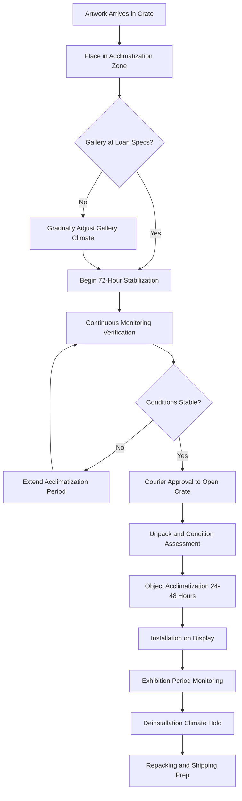

## Overview

Temporary exhibitions present unique HVAC challenges due to strict lender requirements, compressed installation schedules, and the need to rapidly achieve and maintain precise environmental conditions. Unlike permanent collections, temporary exhibits must satisfy external loan agreements that specify exact climate parameters, often requiring tighter tolerances than the borrowing institution's standard conditions.

The environmental control system must accommodate three distinct phases: crate acclimatization upon arrival, installation and display period, and deinstallation. Each phase demands different control strategies and monitoring protocols.

## Loan Agreement Climate Requirements

Lending institutions specify environmental conditions as legally binding contract terms. The borrowing facility must demonstrate capability to maintain these conditions before loan approval.

### Standard Loan Agreement Parameters

| Parameter | Typical Range | Maximum Deviation | Measurement Interval |
|-----------|---------------|-------------------|----------------------|
| Temperature | 68-72°F (20-22°C) | ±2°F (±1°C) | Continuous, 15-min logging |
| Relative Humidity | 45-55% | ±3% | Continuous, 15-min logging |
| Light Level | 50-150 lux | Per object sensitivity | Daily verification |
| Air Velocity | <30 fpm at object | <50 fpm anywhere | Commissioning + quarterly |
| Particulate | <75 μg/m³ PM10 | - | Monthly sampling |

### Conditioning System Response

The HVAC system must respond to setpoint changes within defined periods:

- **Temperature adjustment:** ≤0.5°F/hour ramp rate to prevent thermal shock
- **Humidity adjustment:** ≤2% RH/hour ramp rate to prevent dimensional changes
- **Stability period:** 72 hours of stable conditions before crate opening

## Facility Report Requirements

Lenders require detailed environmental capability documentation before approving loans. The facility report must demonstrate HVAC system capability and historical performance.

### Required Documentation Components

| Report Section | Content Requirements | Data Period |
|----------------|----------------------|-------------|
| HVAC System Description | Capacity, redundancy, control architecture, maintenance schedule | Current specifications |
| Historical Performance | Actual T/RH data for exhibition spaces | Minimum 12 months |
| Incident Log | All environmental excursions beyond ±5°F or ±5% RH | 24 months |
| Emergency Procedures | HVAC failure response, backup systems, notification protocols | Current procedures |
| Monitoring Systems | Data logger specifications, calibration records, alarm thresholds | Current equipment list |
| Pest Management | IPM protocols, monitoring data, treatment records | 12 months |
| Security Integration | Climate monitoring tie-in with security systems | System architecture |

### Performance Metrics for Loan Approval

Lending institutions evaluate HVAC reliability using quantitative metrics:

- **Setpoint maintenance:** ≥95% of readings within ±2°F and ±3% RH over preceding 12 months
- **System uptime:** ≥99.5% HVAC availability (excludes planned maintenance)
- **Recovery time:** Return to setpoint within 4 hours following any excursion
- **Redundancy:** N+1 minimum for all critical HVAC components

Facilities unable to meet these metrics may be denied loans or required to install supplemental equipment.

## Acclimatization Protocols

Rapid climate transitions cause dimensional changes in hygroscopic materials (wood, canvas, paper), potentially resulting in cracking, warping, or delamination. Proper acclimatization prevents damage.

### Crate Acclimatization Process

**Phase 1: Initial Stabilization (24-72 hours)**
- Place sealed crates in gallery or designated acclimatization room
- Gallery must be at final exhibition conditions before crate arrival
- Monitor crate microclimate if equipped with internal data loggers
- Verify no condensation on crate exterior indicating excessive RH differential

**Phase 2: Gradual Equilibration (72 hours minimum)**
- Crates remain sealed while internal atmosphere equilibrates with gallery
- Calculate equilibration time: t = (V × k) / A where V is crate volume, A is surface area, k is material coefficient
- Typical sealed crate: 3-5 days for 90% equilibration with 10% RH differential
- Monitor continuously—extend period if conditions show drift

**Phase 3: Inspection and Object Acclimatization (24-48 hours)**
- Open crates only after courier or registrar approval
- Unpack objects and allow additional equilibration before installation
- Inspect for condensation, material changes, pest activity
- Document condition with photography before installation

### Climate Transition Calculations

Maximum safe transition rates depend on material hygroscopic properties:

**Wood panels and furniture:**
- ΔRH: 2% per 24 hours maximum
- ΔT: 3°F per 24 hours maximum

**Canvas paintings:**
- ΔRH: 3% per 24 hours maximum
- ΔT: 4°F per 24 hours maximum

**Paper and photographs:**
- ΔRH: 2% per 24 hours maximum (most sensitive)
- ΔT: 3°F per 24 hours maximum

## Environmental Monitoring Requirements

Loan agreements mandate specific monitoring protocols with defined equipment specifications and data retention.

### Monitoring Equipment Standards

**Data loggers:**
- Accuracy: ±0.5°F for temperature, ±2% RH for humidity
- Resolution: 0.1°F temperature, 0.1% RH
- Sampling interval: 15 minutes maximum
- Calibration: Annual NIST-traceable certification
- Battery backup: 72 hours minimum
- Data storage: Full exhibition period plus 30 days

**Placement requirements:**
- One logger per 2,000 sq ft of exhibition space minimum
- Position at artwork height (48-60 inches above floor)
- Avoid direct air streams, lighting, or sunlight
- Shield from public view but accessible for service
- Redundant loggers for high-value loans

### Documentation During Exhibition Period

**Daily requirements:**
- Visual inspection of HVAC system operation
- Review data logger readings for any excursions
- Verify control system shows normal operation
- Document any visitor load impacts on conditions

**Weekly requirements:**
- Download and archive data logger files
- Generate trend reports for temperature and RH
- Inspect objects for any condition changes
- Test alarm notification systems

**Incident reporting:**
- Any excursion beyond loan agreement tolerances requires immediate lender notification
- Document cause, duration, corrective action, and object impact assessment
- Photograph affected objects if condition changes observed
- Provide formal incident report within 24 hours

## Supplemental Conditioning Equipment

Permanent HVAC systems may require augmentation to meet stringent loan requirements.

**Portable dehumidifiers/humidifiers:**
- Capacity: 50-100 pints/day for typical gallery
- Use when building system cannot achieve required RH
- Must include continuous drain and remote monitoring
- Calculate required capacity: Q = (V × ΔW × ρ) / t

**Local air filtration:**
- MERV 13 minimum, HEPA for sensitive materials
- Position for recirculation without direct air streams on objects
- Size for 4-6 air changes per hour in exhibition space

**Temporary air barriers:**
- Vestibules or air curtains to isolate exhibition galleries
- Minimize infiltration from adjacent spaces with different conditions
- Critical when exhibition requirements differ from building standard
