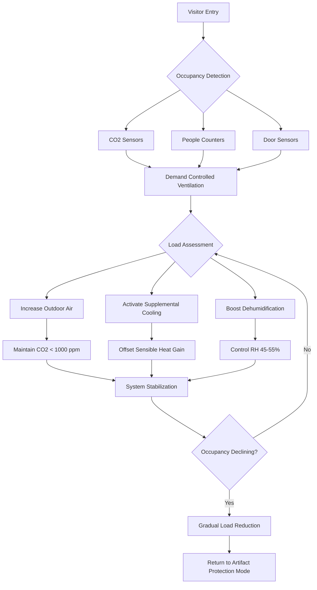

## Physical Principles of Visitor Loading

Visitors represent highly variable thermal and moisture loads that challenge museum HVAC systems designed primarily for artifact preservation. Each occupant generates sensible heat through metabolic activity and radiative exchange, latent heat through respiration and perspiration, and CO2 through respiration. These loads fluctuate dramatically between empty galleries and peak attendance events.

The fundamental heat transfer mechanism involves convection from body surfaces (approximately 70% of total heat) and radiation to surrounding surfaces (30%). Moisture generation occurs primarily through respiration (latent heat), with rates varying by activity level and duration of stay.

## Metabolic Heat Generation Rates

Human thermal output depends on activity level and body mass. For exhibition spaces, visitors typically maintain low activity levels while standing, walking slowly, or sitting.

| Activity Level | Sensible Heat (BTU/hr) | Latent Heat (BTU/hr) | Total Heat (BTU/hr) | Moisture (lb/hr) |
|---|---|---|---|---|
| Seated, quiet | 210 | 140 | 350 | 0.14 |
| Standing, light activity | 220 | 180 | 400 | 0.17 |
| Walking slowly (2 mph) | 230 | 220 | 450 | 0.21 |
| Walking moderately (3 mph) | 250 | 300 | 550 | 0.29 |

These values represent adult occupants at 75°F space temperature. Children generate approximately 75% of adult values. During opening receptions with higher activity levels and closer spacing, total heat gains approach the upper range.

## Occupancy Density Calculations

Design occupancy density determines peak load scenarios and minimum ventilation requirements per ASHRAE Standard 62.1.

| Space Type | Design Occupancy (ft²/person) | Peak Occupancy (ft²/person) | ASHRAE 62.1 Ventilation (CFM/person) |
|---|---|---|---|
| General exhibition gallery | 50-100 | 25-40 | 7.5 |
| Popular exhibition | 30-50 | 15-25 | 7.5 |
| Reception/event space | 15-30 | 10-15 | 7.5 |
| Lecture hall/auditorium | 10-15 | 7-10 | 7.5 |

For a 5,000 ft² gallery with 50 ft²/person density, design occupancy reaches 100 persons. At 400 BTU/hr per person total heat, the peak visitor load equals 40,000 BTU/hr (3.3 tons). This represents a significant addition to envelope and lighting loads.

## CO2 Generation and Ventilation Requirements

Each occupant generates approximately 0.011 CFM of CO2 at rest, increasing to 0.015-0.020 CFM with light activity. At outdoor CO2 concentrations of 400-450 ppm, indoor levels rise rapidly with inadequate ventilation.

The steady-state CO2 concentration follows:

**C_indoor = C_outdoor + (N × G) / Q**

Where:
- C_indoor = indoor CO2 concentration (ppm)
- C_outdoor = outdoor CO2 concentration (ppm)
- N = number of occupants
- G = CO2 generation rate per person (CFM)
- Q = ventilation rate (CFM)

To maintain 1,000 ppm CO2 (ASHRAE recommended limit), a 100-person gallery requires approximately 1,800-2,000 CFM outdoor air, assuming 0.015 CFM generation per person and 400 ppm outdoor concentration.

## Humidity Spikes During Peak Attendance

Moisture generation from visitors directly impacts relative humidity control. A fully occupied 5,000 ft² gallery with 100 visitors at 0.17 lb/hr moisture generation produces 17 lb/hr total moisture. This represents approximately 8.5 gallons per hour at peak occupancy.

Without adequate dehumidification capacity, relative humidity can spike 5-15% above setpoint during 2-4 hour peak periods. Museums typically maintain 45-55% RH for artifact preservation, making visitor moisture loads particularly problematic for sensitive collections.

The rate of RH increase depends on space volume and air change rate. For a gallery with 50,000 ft³ volume (10 ft ceiling height), the moisture addition rate of 17 lb/hr requires approximately 340 CFM of dehumidified outdoor air at 50% outdoor humidity to maintain equilibrium.

## HVAC System Response Strategies

Effective visitor load management requires multiple coordinated strategies:

**Demand Controlled Ventilation (DCV)**: CO2 sensors modulate outdoor air dampers to maintain 800-1,000 ppm setpoint. This provides energy savings during low occupancy periods while ensuring adequate ventilation during peak loads. Sensor placement must account for stratification and dead zones.

**Supplemental Cooling Capacity**: Design systems with 20-30% reserve cooling capacity beyond base loads to handle peak visitor events without compromising temperature control. Variable speed compressors or staged capacity enables efficient part-load operation.

**Enhanced Dehumidification**: Dedicated outdoor air systems (DOAS) with energy recovery and supplemental dehumidification coils provide independent moisture control. This prevents RH excursions during humid outdoor conditions combined with high occupancy.

**Zoning and Load Distribution**: Separate HVAC zones for high-traffic galleries versus sensitive collection storage enables targeted response. Pressurization relationships prevent migration of unconditioned air into critical spaces.

**Thermal Mass Utilization**: Night setback strategies precool structural mass before anticipated peak attendance, providing thermal buffering during load spikes. This approach reduces instantaneous cooling demand.

## Design Considerations per ASHRAE Applications Handbook

ASHRAE Chapter 24 (Museums, Galleries, Archives, and Libraries) recommends designing exhibition space HVAC systems for twice the anticipated average occupancy to accommodate special events and popular exhibitions. Control sequences should prioritize artifact preservation setpoints while managing visitor comfort within acceptable ranges.

Critical design parameters include:
- Maximum 2°F temperature swing during occupied periods
- Maximum 5% RH swing during peak loads
- CO2 levels maintained below 1,000 ppm
- Recovery time to preservation setpoints within 2-4 hours post-event
- Acoustic levels ≤ NC 35 in exhibition spaces

Systems serving both collections and high-occupancy public spaces require careful integration of preservation requirements with visitor load variability.
