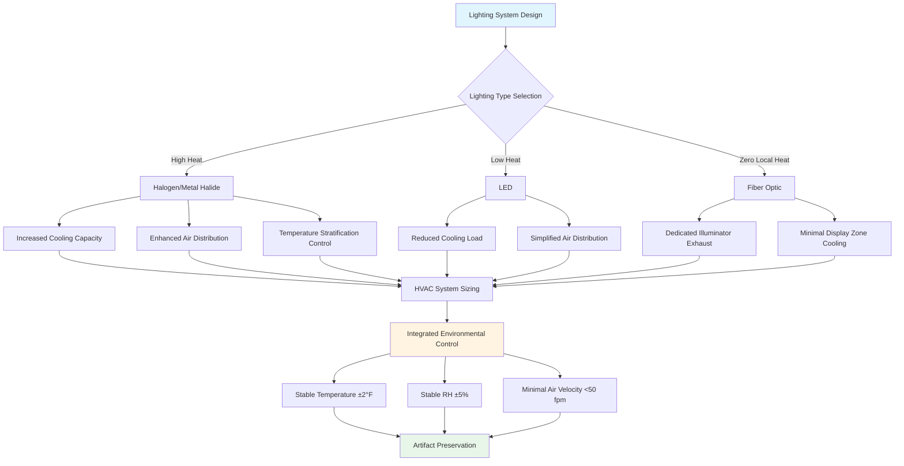

## Overview

Lighting systems in museums, galleries, archives, and libraries present unique HVAC challenges due to conflicting requirements: adequate illumination for viewing while minimizing heat gain, UV radiation, and temperature stratification that can damage sensitive collections. Proper integration between lighting and HVAC systems is critical for both artifact preservation and energy efficiency.

## Lighting Heat Load Fundamentals

All lighting systems convert electrical energy into visible light and waste heat. The heat load from lighting directly impacts HVAC cooling capacity, local temperature gradients, and air circulation patterns around displayed artifacts.

### Heat Load Calculation

The sensible heat gain from lighting is calculated as:

**Q = (W × 3.412 × BF) / 1000**

Where:
- Q = Heat gain (kBtu/hr)
- W = Total wattage of lighting fixtures
- 3.412 = Conversion factor (Btu/hr per watt)
- BF = Ballast factor (typically 1.0 for LED, 1.15-1.20 for fluorescent)

For accurate HVAC sizing, the calculation must account for lamp efficacy, fixture placement, operating schedules, and heat transfer modes.

## LED vs Halogen Heat Load Comparison

The transition from incandescent and halogen lighting to LED technology has dramatically reduced cooling loads in museum environments.

| Lighting Type | Lumens per Watt | Heat Output (%) | IR Radiation | UV Content | HVAC Impact |
|---------------|-----------------|-----------------|--------------|------------|-------------|
| Halogen | 15-25 | 90-95% | High | Moderate | 100% baseline |
| Metal Halide | 60-90 | 60-70% | Moderate | High | 40-50% reduction |
| Fluorescent (T8) | 60-100 | 75-80% | Low | Moderate (with phosphor) | 35-45% reduction |
| LED | 80-150 | 60-75% | Very Low | Minimal | 50-70% reduction |
| Fiber Optic (remote source) | Varies | Heat at source only | None at fixture | None at fixture | 80-90% reduction at display |

### Heat Load Example Calculation

**Gallery with Halogen Track Lighting:**
- 40 fixtures × 75W = 3,000W
- Q = (3000 × 3.412 × 1.0) / 1000 = 10.24 kBtu/hr

**Same Gallery with LED Replacement:**
- 40 fixtures × 12W = 480W
- Q = (480 × 3.412 × 1.0) / 1000 = 1.64 kBtu/hr
- **Reduction: 8.6 kBtu/hr (84% decrease)**

## Lighting System Characteristics and HVAC Implications

### Fiber Optic Lighting Systems

Fiber optic systems separate the heat-generating light source (metal halide or LED illuminator) from the display point, offering exceptional thermal control.

**Advantages for HVAC Integration:**
- Zero heat at fixture location eliminates localized hot spots
- No UV or IR radiation at artifact surface
- Allows close proximity lighting without thermal damage risk
- Centralizes heat source for efficient exhaust or cooling
- Simplifies microclimate control in display cases

**HVAC Design Considerations:**
- Locate illuminators in dedicated mechanical spaces with direct exhaust
- Size exhaust capacity for concentrated heat output (typically 150-250W per illuminator)
- Eliminate cooling load from display zones

### UV Filtering Requirements

UV radiation (wavelengths 280-400 nm) causes photochemical degradation in textiles, paper, pigments, and organic materials. ASHRAE and IES standards limit UV exposure to 75 microwatts per lumen for museum applications.

**Integrated UV Control Strategies:**

1. **Lamp selection**: LED sources inherently produce minimal UV
2. **UV filtering glass**: Absorbs UV before light enters space
3. **Air filtration**: HVAC filters cannot remove UV radiation but control particulate that accelerates photo-degradation
4. **Light level control**: Lower illumination reduces both heat and UV exposure

## HVAC-Lighting Coordination Strategies

## Design Integration Guidelines

### Thermal Stratification Management

Track lighting and spotlights create vertical temperature gradients that conflict with HVAC system assumptions. Warm air rising from fixtures can create 5-10°F temperature differences between floor and ceiling levels in galleries with high ceilings.

**Mitigation Strategies:**
1. Increase air change rates in upper zones (target 6-8 ACH for display zones with concentrated lighting)
2. Design return air locations near lighting fixtures to capture heat at source
3. Use ceiling-mounted diffusers with horizontal throw patterns to destratify air
4. Implement separate temperature sensors at artifact level, not ceiling-mounted locations

### Display Case Microclimate Control

Enclosed display cases require independent environmental control when internal lighting generates heat within the sealed volume.

**Design Requirements:**
- Maximum 2W per cubic foot of case volume for passive cases
- Active ventilation for cases exceeding heat density threshold
- Silica gel or mechanical dehumidification for sealed cases
- Temperature monitoring at artifact level with ±1°F accuracy

### Lighting Control and HVAC Response

Occupancy-based lighting controls and daylight harvesting systems create dynamic heat loads that HVAC systems must accommodate.

**Control Strategies:**
1. Integrate lighting control system with BAS for load anticipation
2. Size HVAC for peak lighting conditions but allow setback during reduced lighting periods
3. Program night setback temperatures accounting for zero lighting heat gain
4. Monitor space temperatures continuously to verify HVAC response adequacy

## Standards and References

**ASHRAE Handbook - HVAC Applications, Chapter 24**: Museums, galleries, archives, and libraries environmental control guidance

**IES RP-30-17**: Museum and Art Gallery Lighting recommended illumination levels and UV limits

**ASHRAE Standard 55**: Thermal environmental conditions for human occupancy (visitor comfort in galleries)

**ISO 11799**: Information and documentation - Document storage requirements for archive and library materials

**National Park Service Museum Handbook**: Environmental monitoring and control for federal collections

## Energy Optimization

The synergy between efficient lighting and reduced HVAC loads creates compounding energy savings.

**Cumulative Savings from LED Retrofit:**
- Direct lighting energy reduction: 60-80%
- Cooling energy reduction: 10-25% of total HVAC energy
- Heating energy increase: 2-5% (reduced internal gains in winter)
- Net energy savings: 35-55% for combined lighting and HVAC systems

Proper coordination between lighting designers and HVAC engineers during the design phase ensures optimal environmental conditions for collections while minimizing operational costs and energy consumption.

