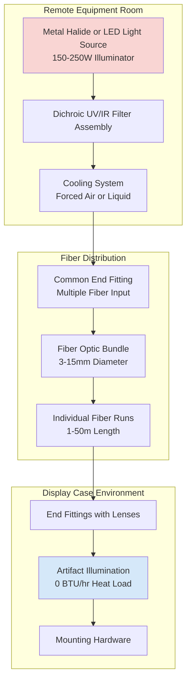

## Fiber Optic Lighting Fundamentals

Fiber optic lighting systems eliminate heat transfer to displayed artifacts by separating the light generation source from the display point. This technology transmits light through optical fibers via total internal reflection, delivering illumination without the infrared radiation and convective heat associated with conventional luminaires.

**Primary advantages for museum applications:**

- Zero heat emission at the display point
- Complete UV and IR filtration at the remote source
- Minimal impact on HVAC cooling loads within display cases
- Precise beam control and directional lighting
- No electrical wiring at artifact locations
- Extended lamp life due to controlled operating conditions

## System Architecture

The fiber optic lighting system comprises three essential components operating in thermal isolation from the conditioned display environment.

## Fiber Types and Specifications

The optical characteristics and transmission efficiency determine appropriate fiber selection for specific museum applications.

| Fiber Type | Core Material | Diameter Range | Transmission Efficiency | Maximum Run | Typical Application |
|-----------|---------------|----------------|------------------------|-------------|---------------------|
| Glass Monofiber | Silica glass | 0.5-3.0 mm | 95-98% | 100 m | Precision spotlighting, small artifacts |
| Plastic Monofiber | PMMA polymer | 1.0-5.0 mm | 85-92% | 50 m | General display lighting |
| Glass Bundle | Silica glass array | 3.0-10.0 mm | 90-95% | 75 m | Large case illumination |
| End-Glow Fiber | Silica or PMMA | 0.75-2.0 mm | Light emission along length | 15 m | Edge lighting, signage |
| Side-Glow Fiber | PMMA with notches | 2.0-8.0 mm | Distributed emission | 25 m | Linear illumination, shelving |

## Light Output and Performance

Luminous flux delivered to the artifact depends on source power, fiber transmission, and run length. The following table presents typical performance for museum-grade installations.

| Source Power | Fiber Diameter | Run Length | Output at Terminus | Illuminance at 300mm | Beam Angle |
|-------------|----------------|------------|-------------------|---------------------|------------|
| 150W Metal Halide | 5 mm single | 10 m | 1,200 lumens | 800 lux | 12-45° adjustable |
| 150W Metal Halide | 8 mm bundle | 15 m | 2,400 lumens | 1,600 lux | 25-60° adjustable |
| 250W Metal Halide | 10 mm bundle | 25 m | 3,000 lumens | 2,000 lux | 30-70° adjustable |
| 100W LED Array | 5 mm single | 10 m | 900 lumens | 600 lux | 15-50° adjustable |
| 200W LED Array | 8 mm bundle | 20 m | 2,100 lumens | 1,400 lux | 20-65° adjustable |

## Remote Light Source Configurations

The illuminator assembly resides in a controlled environment separate from display areas, allowing heat rejection and maintenance without affecting artifact conditions.

**Metal halide illuminators:**
- Color temperature: 3,000-5,500K selectable
- Color rendering index: 85-95 CRI
- Heat generation: 450-750 BTU/hr at source
- Lamp life: 6,000-10,000 hours
- Requires active cooling and UV/IR dichroic filters

**LED array illuminators:**
- Color temperature: 2,700-6,500K tunable
- Color rendering index: 90-98 CRI
- Heat generation: 300-650 BTU/hr at source
- Source life: 50,000-70,000 hours
- Integrated thermal management, reduced UV/IR output

## UV and IR Elimination

Dichroic filter assemblies installed at the illuminator remove wavelengths outside the visible spectrum before light enters the fiber optic transmission system.

**Filter specifications:**
- UV transmission: <0.01% at λ <400 nm
- IR transmission: <0.05% at λ >760 nm
- Visible transmission: 95-98% at λ 400-760 nm
- Operating temperature: Up to 300°F (149°C)
- Filter replacement: 10,000-15,000 hours

This filtration prevents photochemical degradation and eliminates infrared radiation that would otherwise contribute to artifact heating and case thermal load.

## Display Case Integration

Fiber optic terminators mount within display cases without electrical connections, eliminating ignition sources and simplifying installation in existing exhibits.

**Mounting considerations:**
- Terminator fixtures: 15-40 mm diameter, 50-150 mm length
- Beam adjustment: 180-270° horizontal, 90° vertical
- Fiber routing: Minimum bend radius 10× fiber diameter
- Penetration sealing: Maintain case vapor barrier integrity
- Heat load at display: 0.0-0.5 BTU/hr per terminus (fiber losses only)

## Museum Application Examples

**Manuscript and paper collections:**
- Illuminance: 50-100 lux maximum
- Fiber configuration: 3-5 mm single fibers, 5-10 m runs
- Typical installation: 4-6 adjustable spots per case
- Annual exposure limit: <50,000 lux-hours

**Textile and organic materials:**
- Illuminance: 50-150 lux maximum
- Fiber configuration: 5-8 mm bundles, 10-20 m runs
- Typical installation: Perimeter lighting with 8-12 points
- Color temperature: 3,000K warm white

**Paintings and photographs:**
- Illuminance: 150-300 lux
- Fiber configuration: 8-10 mm bundles, 15-30 m runs
- Typical installation: Adjustable spots with framing shutters
- CRI requirement: >90 for color accuracy

**Three-dimensional artifacts:**
- Illuminance: 150-500 lux depending on material
- Fiber configuration: Multiple fiber types for accent and fill
- Typical installation: 10-20 individual fiber runs per major exhibit
- Beam angles: 12-30° for accents, 40-70° for general illumination

## HVAC Load Reduction

Fiber optic systems eliminate lighting heat within conditioned display cases, reducing both sensible cooling loads and moisture removal requirements.

**Conventional halogen case lighting:** 15-50 BTU/hr per lamp, 60-200 BTU/hr per case
**Fiber optic case lighting:** 0-2 BTU/hr per case (fiber transmission losses only)
**Typical load reduction:** 95-100% elimination of display lighting heat

This heat elimination allows smaller, more efficient climate control systems for display cases and reduces the risk of thermal stratification within exhibits.
