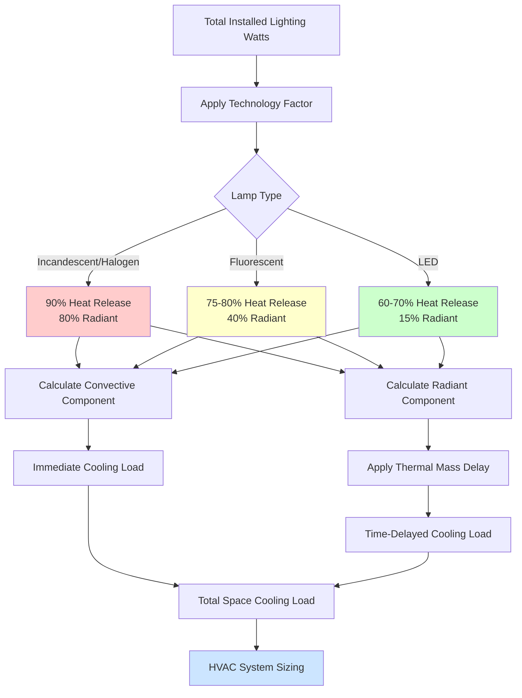

## Lighting Heat Gain Fundamentals

Lighting systems contribute substantial sensible heat to conditioned spaces through three mechanisms: convection from lamp surfaces, radiation to surrounding surfaces, and conduction through fixtures. In museums, galleries, archives, and libraries, lighting heat gains require precise calculation due to conservation requirements and the thermal sensitivity of collections.

The total heat gain from lighting equals the total installed wattage multiplied by utilization and diversity factors. However, the distribution between radiant and convective components varies significantly by lamp technology, affecting both immediate cooling loads and delayed heat transfer through building mass.

## Heat Gain Calculation Methodology

Per ASHRAE Fundamentals, the instantaneous heat gain from electric lighting is calculated as:

**q = W × FUT × FSA**

Where:
- q = heat gain (W)
- W = total installed lighting watts
- FUT = lighting use factor (fraction of lights in operation)
- FSA = special allowance factor (typically 1.0 for fluorescent and LED, may vary for enclosed fixtures)

For cooling load calculations, apply appropriate time-delay factors based on space thermal mass and lighting operation schedules. In high-mass gallery spaces with 12-hour lighting cycles, peak cooling loads from lighting may occur 2-4 hours after lights are energized.

## Lamp Technology Heat Characteristics

### Incandescent and Halogen Lamps

Incandescent lamps convert approximately 90% of input energy to heat, with only 10% producing visible light. The heat distribution is roughly 80% radiant and 20% convective. Track lighting and accent fixtures using halogen lamps create concentrated heat loads that directly impact artwork and exhibit surfaces.

**Incandescent Heat Characteristics:**
- Efficacy: 12-18 lumens/watt
- Heat output: 3.1-3.4 BTU/hr per watt
- Radiant fraction: 80%
- Surface temperature: 200-260°C

Halogen lamps operate at higher temperatures (250-350°C) but with similar energy conversion efficiency. The intense infrared radiation from halogen sources requires careful positioning to prevent localized heating of light-sensitive materials.

### Fluorescent Lamps

Fluorescent technology converts 20-25% of input energy to visible light, with the remainder released as heat. The heat distribution shifts toward convection, with approximately 60% convective and 40% radiant components.

**Fluorescent Heat Characteristics:**
- Efficacy: 50-100 lumens/watt (depending on lamp and ballast type)
- Heat output: 3.4 BTU/hr per watt (includes ballast losses)
- Radiant fraction: 40%
- Electronic ballast factor: 1.10-1.20 (adds 10-20% to lamp wattage)

Legacy magnetic ballasts generate additional heat (15-25% of lamp wattage) that must be included in load calculations. Modern electronic ballasts reduce this penalty to 10-15%.

### LED Lighting Systems

LED technology achieves 30-40% conversion efficiency to visible light, with heat released primarily through conduction to heat sinks rather than direct radiation. This fundamental difference reduces radiant heat transfer to illuminated objects by 70-80% compared to incandescent sources.

**LED Heat Characteristics:**
- Efficacy: 80-150 lumens/watt (system level with driver losses)
- Heat output: 3.4 BTU/hr per watt
- Radiant fraction: 10-20%
- Driver efficiency: 85-95% (adds 5-15% to LED wattage)

The convective cooling requirement for LED fixtures affects local air patterns. Proper fixture ventilation prevents performance degradation and premature failure.

## Lighting Power Density by Technology

| Lighting Technology | Efficacy (lm/W) | Watts per 1000 Lux (100 m²) | Heat Gain Reduction vs Incandescent |
|---------------------|-----------------|------------------------------|-------------------------------------|
| Incandescent | 15 | 6,667 W | Baseline |
| Halogen | 18 | 5,556 W | 17% |
| T8 Fluorescent | 85 | 1,176 W | 82% |
| Compact Fluorescent | 65 | 1,538 W | 77% |
| LED (Standard) | 100 | 1,000 W | 85% |
| LED (High Performance) | 140 | 714 W | 89% |

*Values represent system efficacy including ballast/driver losses for typical museum illumination of 150-200 lux at display surfaces*

## ASHRAE Lighting Heat Gain Factors

ASHRAE provides tabulated heat gain factors accounting for luminaire type, mounting configuration, and space characteristics. For museum applications, key factors include:

**Space Use Factor (FUT):**
- Gallery spaces during operating hours: 0.85-1.0
- Archive reading rooms: 0.70-0.85
- Storage areas with occupancy sensors: 0.20-0.40
- Conservation labs: 0.90-1.0

**Diversity Factor:**
- Display lighting on dimming controls: 0.60-0.80
- General ambient lighting: 0.85-0.95
- Accent and feature lighting: 0.30-0.60

Apply diversity factors to account for realistic operational patterns rather than designing for simultaneous full-load operation of all circuits.

## Concentrated Display Lighting Loads

Focused accent lighting creates localized thermal plumes that affect artifact preservation. A single 50W halogen fixture focused on a 0.5 m² painting surface delivers 100 W/m² of radiant heat flux, potentially raising surface temperature 5-8°C above ambient in still air conditions.

Calculate concentrated loads separately for:
- Artifact surface temperature prediction
- Microclimate control strategies
- Display case internal loads
- Showcase ventilation requirements

## Lighting Heat Management Strategy

## Design Recommendations

**For HVAC Load Calculations:**
1. Inventory all lighting circuits by technology type and control strategy
2. Calculate peak cooling load using appropriate diversity factors (typically 0.70-0.85 for museums)
3. Model time-delay effects for radiant heat absorption in high-mass spaces
4. Add 10-15% safety factor for future exhibit lighting additions

**For Energy Optimization:**
- LED conversion reduces lighting heat gains by 80-85% compared to legacy incandescent systems
- Each 1,000W reduction in lighting load saves approximately 1.2 tons of cooling capacity
- Lower heat gain enables smaller, more efficient HVAC equipment
- Reduced sensible loads improve humidity control precision

**For Conservation:**
- Minimize radiant heat delivery to artifact surfaces through LED adoption
- Provide localized exhaust or increased airflow at high-intensity display fixtures
- Monitor surface temperatures on critical objects under accent lighting
- Design showcase ventilation to remove fixture heat before it affects contents

The transition from incandescent to LED lighting in cultural institutions delivers dual benefits: reduced UV and infrared damage to collections and decreased HVAC cooling requirements, typically reducing total facility energy consumption by 15-25%.
