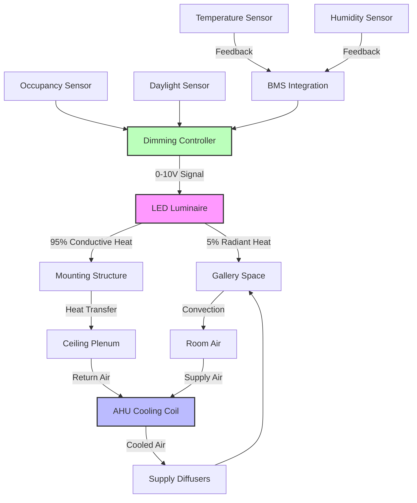

LED lighting has fundamentally transformed museum HVAC design by reducing cooling loads by 60-80% compared to legacy incandescent and halogen systems while eliminating ultraviolet radiation that degrades artifacts. The integration of LED systems with climate control requires understanding heat dissipation patterns, spectral characteristics, and dimming control strategies.

## Heat Load Reduction Analysis

LED luminaires convert 35-45% of electrical input to light, with the remainder dissipated as heat primarily through conductive pathways to the mounting structure rather than radiant heat into the conditioned space. This contrasts sharply with incandescent lamps that radiate 90% of energy as infrared heat directly into the gallery environment.

### Comparative Heat Output by Lamp Type

| Lamp Technology | Luminous Efficacy (lm/W) | Radiant Heat Fraction | Convective Heat Fraction | Heat Load per 1000 lm (W) |
|-----------------|-------------------------|----------------------|-------------------------|---------------------------|
| Incandescent | 15-17 | 85% | 15% | 59-67 |
| Halogen | 18-22 | 80% | 20% | 45-56 |
| Metal Halide | 75-100 | 60% | 40% | 10-13 |
| Compact Fluorescent | 60-70 | 30% | 70% | 14-17 |
| LED (Standard) | 90-130 | 5% | 95% | 7.7-11 |
| LED (High Performance) | 150-180 | 3% | 97% | 5.6-6.7 |

The reduced radiant heat fraction in LED systems decreases both the instantaneous cooling load and the mean radiant temperature experienced by artifacts, providing dual benefits for preservation.

## Spectral Considerations and Conservation

Museum-grade LED fixtures must meet IES TM-30 color rendering specifications with R_f > 85 and R_g near 100 to ensure accurate color perception while controlling spectral power distribution to minimize photochemical degradation.

**Critical spectral parameters:**

- **UV Content:** <0.1% of total output below 400 nm (compared to 3-5% for halogen)
- **Blue Light Hazard:** Controlled spectral output at 440-460 nm per CIE S 009
- **Infrared Emission:** <2% above 780 nm (versus 65-75% for incandescent)
- **Color Temperature:** Adjustable 2700K-4000K to match conservation requirements

The absence of UV radiation eliminates filtering requirements and associated maintenance while protecting photosensitive materials including textiles, watercolors, and photographic prints from radiation-induced fading.

## HVAC System Integration

### Cooling Load Calculation Adjustments

For a typical 5,000 ft² gallery with 30 fc average illumination:

**Legacy Halogen System:**
- Installed lighting power: 3.0 W/ft² = 15,000 W
- Sensible cooling load: 15,000 W × 3.41 = 51,150 Btu/h
- Peak lighting contribution: 35-40% of total sensible load

**LED Retrofit System:**
- Installed lighting power: 0.8 W/ft² = 4,000 W
- Sensible cooling load: 4,000 W × 3.41 = 13,640 Btu/h
- Peak lighting contribution: 12-15% of total sensible load
- **Cooling load reduction: 37,510 Btu/h (73% decrease)**

This reduction allows downsizing HVAC equipment during renovations or accommodating additional gallery space without capacity expansion.

## Dimming and Dynamic Control

LED dimming from 100% to 10% reduces both light output and power consumption linearly, unlike discharge lamps that maintain near-constant power at reduced output. This enables dynamic lighting strategies that respond to occupancy, daylight contribution, and conservation requirements.

### Dimming Control Strategies

| Strategy | Implementation | HVAC Impact | Conservation Benefit |
|----------|----------------|-------------|---------------------|
| Occupancy-Based | Motion sensors with 15-min delay | 30-50% load reduction during off-hours | Reduced cumulative light exposure |
| Daylight Harvesting | Photocells at perimeter zones | 15-25% load reduction in daylight zones | Lower exhibition fatigue |
| Time-Based | Scheduled dimming per gallery schedule | 20-35% load reduction | Controlled exposure duration |
| Artifact-Specific | Individual fixture control per sensitivity | Variable by zone | Optimized exposure per material |

Modern LED drivers with 0-10V or DALI control maintain consistent color temperature across the dimming range, preventing the color shift that occurred with dimmed incandescent sources.

## Maintenance and Lifecycle Considerations

LED L70 lifetimes of 50,000-100,000 hours (17-33 years at 8 hours/day) eliminate frequent lamp replacement that disturbed gallery conditions and required temporary climate control adjustments. Reduced maintenance access decreases HVAC system perturbations from open doors, equipment operation, and personnel heat loads.

The thermal management of LED fixtures requires adequate heat sinking to maintain junction temperatures below 85°C for rated lifetime performance. Recessed fixtures in insulated ceilings must include thermal pathways or active cooling to prevent accelerated lumen depreciation.

## Implementation Requirements

Museum LED retrofits must coordinate lighting and HVAC modifications:

1. **Load calculations:** Revise HVAC loads using actual LED fixture specifications
2. **Control integration:** Wire dimming systems to BMS for coordinated environmental control
3. **Air distribution:** Verify supply air patterns prevent direct impingement on temperature-sensitive LED drivers
4. **Zoning alignment:** Match lighting zones to HVAC zones for optimized control
5. **Monitoring:** Install power meters on lighting circuits for continuous load verification

According to IES RP-30 museum lighting recommendations and ASHRAE applications guidance, LED systems provide the optimal balance of conservation-appropriate spectral output, energy efficiency, and HVAC load reduction for contemporary museum installations.
