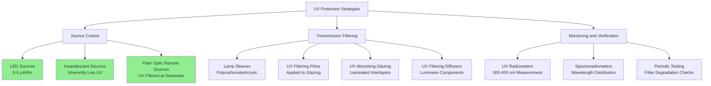

## UV Radiation and Collection Damage

Ultraviolet radiation in the 300-400 nm wavelength range causes irreversible photochemical damage to museum collections. UV energy breaks molecular bonds in organic materials, leading to fading, discoloration, embrittlement, and structural degradation. Since UV damage is cumulative and non-reversible, elimination of UV radiation is the primary defense strategy in collection preservation.

ASHRAE standards and museum conservation guidelines recommend complete elimination of UV radiation below 400 nm for all light sources in collection spaces. The allowable UV content is expressed as microwatts per lumen (μW/lm), with conservation standards requiring values below 75 μW/lm and best practice targeting complete elimination where possible.

## UV Wavelength Characteristics

UV radiation is divided into three bands based on wavelength and energy:

| UV Band | Wavelength Range | Energy Level | Damage Potential | Source Prevalence |
|---------|------------------|--------------|------------------|-------------------|
| UV-A | 315-400 nm | 3.10-3.94 eV | High | Daylight, fluorescent, metal halide |
| UV-B | 280-315 nm | 3.94-4.43 eV | Very High | Daylight (mostly filtered by glass) |
| UV-C | 100-280 nm | 4.43-12.4 eV | Extreme | Germicidal lamps only |

UV-A radiation poses the primary threat in museum environments because it passes through standard window glass and is emitted by common light sources. UV-B is largely blocked by building glazing but requires attention in skylight applications.

## UV Filtering Technologies

### UV-Absorbing Lamp Sleeves

Polycarbonate and acrylic sleeves installed over fluorescent and compact fluorescent lamps absorb UV radiation while transmitting visible light. These sleeves contain UV-absorbing compounds that convert UV photons to longer wavelengths through photoluminescence.

**Performance characteristics:**

- UV transmission reduction: 95-99% below 400 nm
- Visible light transmission: 88-92%
- Service life: 5-7 years before replacement required
- Temperature stability: Suitable for lamp operating temperatures up to 80°C
- Application: Retrofit solution for existing fluorescent installations

Sleeve degradation occurs through photolytic breakdown of UV-absorbing compounds. Periodic spectroradiometric testing verifies continued effectiveness. Replace sleeves when UV transmission exceeds 75 μW/lm or visible light transmission drops below 85% of initial values.

### UV Filtering Films and Glazing

Window films and specialized glazing systems filter UV radiation entering through daylighting apertures.

| Filter Type | UV Transmission <400nm | Visible Transmission | Durability | Application |
|-------------|------------------------|----------------------|------------|-------------|
| Standard Float Glass | 45-60% | 88-90% | Permanent | Baseline (inadequate) |
| Laminated UV Glass | <1% | 85-88% | 25+ years | New construction, skylights |
| Applied UV Film | 1-3% | 80-85% | 10-15 years | Retrofit applications |
| Museum-Grade Acrylic | <1% | 92-94% | 20+ years | Display cases, frames |
| Low-Iron UV Glass | <0.5% | 91-93% | 25+ years | Premium installations |

Laminated glazing incorporates UV-absorbing polyvinyl butyral (PVB) interlayers between glass plies. These systems provide permanent UV protection without degradation concerns associated with applied films.

Applied films use pressure-sensitive adhesives and UV-absorbing polymer layers. Installation requires meticulous surface preparation to prevent bubbling and delamination. Films degrade over time through UV exposure and require replacement when UV transmission increases or optical clarity diminishes.

### LED Zero-UV Sources

Modern LED sources emit negligible UV radiation due to their solid-state emission mechanism. LED phosphor conversion produces visible light without the plasma discharge processes that generate UV in fluorescent and HID sources.

**LED UV emission characteristics:**

- UV content: 0-5 μW/lm (compared to 75+ μW/lm for unfiltered fluorescent)
- Spectral cutoff: Minimal emission below 420 nm
- Long-term stability: No UV increase over service life
- Color rendering: CRI 80-98 available with zero UV
- Integration with HVAC: Lower cooling loads due to reduced radiant heat

LED sources eliminate the need for separate UV filtering systems, simplifying luminaire design and reducing maintenance. The absence of UV-generated ozone also benefits indoor air quality in tightly sealed museum environments served by HVAC systems.

### UV Filtering in Luminaire Design

Complete luminaire assemblies incorporate UV filtering through multiple strategies:

1. **Source selection:** Specify inherently low-UV sources (LED, incandescent, filtered fluorescent)
2. **Optical filtering:** Integrate UV-absorbing diffusers and lenses in the light path
3. **Sealed optics:** Prevent UV leakage through luminaire housing gaps
4. **Spectral verification:** Factory testing confirms UV output below specification limits

Museum-grade luminaires carry spectroradiometric test reports documenting UV emission across the 300-700 nm range. Specify maximum UV content of 10 μW/lm for critical collection lighting.

## UV Measurement and Monitoring

Verification of UV filtering effectiveness requires instrumentation capable of measuring radiation in the 300-400 nm range independently from visible light output.

**Measurement protocols:**

- **Initial commissioning:** Spectroradiometric survey of all light sources measuring UV content in μW/lm
- **Annual verification:** Spot checks using calibrated UV radiometers on representative luminaires
- **Filter replacement triggers:** UV measurement exceeding 75 μW/lm or 50% increase from baseline
- **Documentation:** Maintain UV measurement logs as part of preventive maintenance records

UV radiometers provide direct reading of UV irradiance (μW/cm²) at the measurement plane. Convert to μW/lm by dividing UV irradiance by illuminance (lux) and multiplying by 1000.

**Measurement considerations:**

- Position sensor at object plane where collections are located
- Account for reflected UV from surfaces and display cases
- Measure in operational conditions with HVAC systems running
- Dark-adapt meter before measurements in low-light gallery spaces

## Integration with HVAC Systems

UV filtering strategies affect HVAC cooling load calculations and air quality parameters:

**Thermal considerations:**

- Fluorescent lamp sleeves reduce radiant heat by 3-5% through increased light path absorption
- LED conversion reduces cooling loads by 40-60% compared to filtered fluorescent sources
- UV-filtering glazing may increase solar heat gain if visible transmission is reduced

**Air quality interactions:**

- UV radiation from unfiltered fluorescent sources generates ozone (O₃) through photolysis of oxygen
- Complete UV filtering eliminates ozone generation, reducing ventilation requirements
- Sealed luminaire designs prevent particulate accumulation on UV-filtering components

Calculate the sensible cooling load reduction when converting from fluorescent to LED sources using:

**Q = (W_fluor - W_LED) × 3.412 × BF**

Where:
- Q = sensible cooling load reduction (Btu/hr)
- W_fluor = fluorescent system wattage
- W_LED = LED system wattage
- BF = ballast factor accounting for heat to conditioned space (0.8-1.0)

The elimination of UV radiation enables precise environmental control in collection spaces by removing a variable photochemical stressor that interacts with temperature and relative humidity in accelerating deterioration mechanisms.
