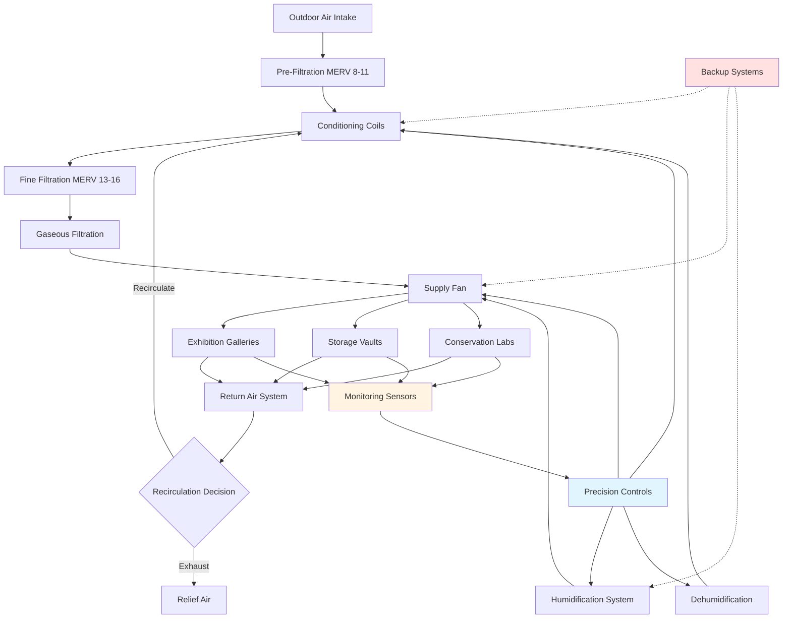

Museum HVAC systems face the unique challenge of simultaneously preserving irreplaceable artifacts while maintaining visitor comfort. These requirements demand precision environmental control, superior air quality, and operational strategies that balance competing needs across different seasons and occupancy levels.

## Temperature and Humidity Targets

Museums require stringent environmental control to prevent deterioration of collections. The ASHRAE Museum Handbook establishes class-specific targets based on collection sensitivity and institutional capabilities.

**Standard Temperature Setpoints:**
- **Class AA (Precision Control):** $70°F \pm 2°F$ ($21°C \pm 1°C$)
- **Class A (Precision Control):** $70°F \pm 5°F$ ($21°C \pm 2.8°C$)
- **Class B (Prevent Dampness):** $60-75°F$ ($15.5-24°C$)
- **Class C (Prevent Freezing):** $>36°F$ ($>2°C$)

**Relative Humidity Requirements:**
- **Class AA:** $50\% \pm 5\%$ RH
- **Class A:** $50\% \pm 10\%$ RH
- **Class B:** $25-75\%$ RH
- **Class C:** $<75\%$ RH

The rate of change matters as much as absolute values. Sudden fluctuations cause dimensional changes in hygroscopic materials, leading to cracking, warping, and delamination. Maximum recommended change rates:

$$\frac{dT}{dt} \leq 2°F/hour, \quad \frac{dRH}{dt} \leq 5\%/hour$$

Seasonal drift strategies allow gradual transitions between winter and summer setpoints, reducing energy consumption while maintaining stable short-term conditions. This approach recognizes that slow seasonal changes cause less damage than rapid daily fluctuations.

## Museum Environmental Standards

| Collection Type | Temperature | Relative Humidity | Air Changes/Hour | Filtration |
|----------------|-------------|-------------------|------------------|------------|
| General Collections | $68-72°F$ | $45-55\%$ | $8-12$ | MERV 13-16 |
| Paintings/Canvas | $68-72°F$ | $45-55\%$ | $10-15$ | MERV 16 + Gas |
| Paper/Photographs | $65-70°F$ | $30-50\%$ | $8-12$ | MERV 16 + Gas |
| Textiles/Fabrics | $65-70°F$ | $45-55\%$ | $10-15$ | MERV 16 |
| Metals | $68-72°F$ | $30-40\%$ | $6-10$ | MERV 13 + Gas |
| Organic Materials | $60-65°F$ | $45-55\%$ | $10-15$ | MERV 16 + Gas |
| Mixed Collections | $68-72°F$ | $45-55\%$ | $10-15$ | MERV 16 + Gas |

## Air Quality Requirements

Museums demand exceptional air quality to prevent chemical degradation, particulate soiling, and microbial growth.

**Particulate Filtration:**
- Minimum MERV 13 for general spaces
- MERV 16 for sensitive collections
- HEPA filtration (99.97% at 0.3 μm) for rare items

**Gaseous Contamination Control:**
- Activated carbon for organic compounds
- Potassium permanganate for oxidizing gases
- Specialty media for sulfur dioxide and nitrogen oxides

**Target Pollutant Levels:**
- Particulate Matter (PM2.5): $<15$ μg/m³
- Ozone: $<2$ ppb
- Sulfur Dioxide: $<1$ ppb
- Nitrogen Dioxide: $<10$ ppb
- Volatile Organic Compounds: $<200$ μg/m³

Outside air intake locations require careful consideration to avoid vehicle exhaust, industrial emissions, and construction dust. Pre-filtration stages protect final filters and extend service life.

## Visitor Comfort vs Collection Preservation

Museums must balance thermal comfort for visitors against optimal preservation conditions. This creates operational challenges:

**Competing Requirements:**
- Visitors prefer $72-76°F$; collections require $68-72°F$
- Active visitors generate sensible heat: $Q_s = 250$ BTU/hr per person
- Latent heat from respiration: $Q_l = 200$ BTU/hr per person
- High occupancy events temporarily increase temperature and humidity

**Balancing Strategies:**
- Zone exhibition spaces separately from storage
- Provide localized heating/cooling in high-traffic areas
- Use strategic air distribution to maintain collection microclimates
- Schedule maintenance during low-occupancy periods
- Educate visitors about preservation requirements

Calculate visitor heat load impact:

$$Q_{total} = n \times (Q_s + Q_l) = n \times 450 \text{ BTU/hr}$$

For $n = 100$ visitors: $Q_{total} = 45,000$ BTU/hr (3.75 tons cooling)

## Museum HVAC System Overview

## Energy Considerations

Museum environmental standards consume significant energy. Strategies to improve efficiency without compromising preservation:

**System Optimization:**
- Variable speed drives on fans and pumps
- Heat recovery from exhaust air streams
- Demand-based ventilation in non-collection areas
- Thermal energy storage for peak shifting
- Economizer cycles when outdoor conditions permit

**Building Envelope:**
- High-performance insulation (R-30 walls, R-50 roof)
- Low-E glazing with UV filtration
- Vapor barriers and air sealing
- Thermal mass to buffer fluctuations

**Equipment Selection:**
- High-efficiency chillers (COP > 6.0)
- Condensing boilers (>95% efficiency)
- Desiccant dehumidification for humidity control
- Energy recovery ventilators (ERV) capturing 70-80% of energy

Energy use intensity for museums typically ranges from $60-120$ kBTU/ft²/year, with precision climate control representing 40-60% of total consumption.

## Seasonal Operation Strategies

Seasonal drift allows gradual environmental changes that reduce energy while maintaining preservation standards:

**Winter Strategy:**
- Reduce setpoint to $65-68°F$
- Allow RH drift to $40-45\%$
- Minimize outside air to reduce heating load
- Humidify efficiently using steam or evaporative systems

**Summer Strategy:**
- Increase setpoint to $70-72°F$
- Allow RH drift to $50-55\%$
- Maximize economizer hours
- Dehumidify using cooling coils or desiccant systems

**Transition Periods:**
- Implement gradual setpoint changes ($<2°F$/week)
- Monitor collection response
- Adjust based on building hygrothermal behavior
- Coordinate with conservation staff

This seasonal approach can reduce HVAC energy consumption by 20-35% while maintaining Class A or B environmental conditions. The key principle: short-term stability matters more than year-round uniformity.

**Unoccupied Period Setbacks:**
Museums can implement limited setbacks during extended closures, but must maintain preservation conditions. Typical night/weekend strategies reduce fan runtime rather than temperature, saving 10-15% energy without risking collections.

The ASHRAE Museum Handbook emphasizes that environmental specifications should match institutional resources, collection vulnerability, and risk tolerance rather than pursuing maximum precision regardless of cost or benefit.
