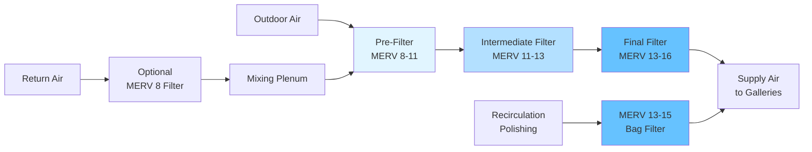

Museum collections demand superior particulate filtration to prevent accumulation of dust, soot, pollen, and fine particles that cause irreversible damage to artifacts. MERV 13-16 filters provide the high-efficiency removal necessary to maintain pristine environmental conditions for sensitive materials including paintings, textiles, paper, and metallic objects.

## MERV 13-16 Filter Performance

The filtration efficiency of MERV 13-16 filters varies significantly with particle size. MERV ratings specify minimum removal efficiency across three particle size ranges:

**MERV 13 Performance:**
- 0.3-1.0 μm particles: $E_1 \geq 50\%$ minimum efficiency
- 1.0-3.0 μm particles: $E_2 \geq 85\%$ minimum efficiency
- 3.0-10.0 μm particles: $E_3 \geq 90\%$ minimum efficiency

**MERV 14 Performance:**
- 0.3-1.0 μm particles: $E_1 \geq 75\%$ minimum efficiency
- 1.0-3.0 μm particles: $E_2 \geq 90\%$ minimum efficiency
- 3.0-10.0 μm particles: $E_3 \geq 90\%$ minimum efficiency

**MERV 15-16 Performance:**
- 0.3-1.0 μm particles: $E_1 \geq 95\%$ (MERV 16)
- 1.0-3.0 μm particles: $E_2 \geq 95\%$
- 3.0-10.0 μm particles: $E_3 \geq 95\%$

The average filtration efficiency across the filter's service life can be calculated as:

$$E_{avg} = \frac{1}{t_f} \int_0^{t_f} E(t) \, dt$$

where $E(t)$ represents time-dependent efficiency and $t_f$ is the total filter service life.

## Particle Size Removal Requirements

Museum filtration targets specific particle size ranges based on damage mechanisms:

**Critical Particle Ranges:**
- **0.1-1.0 μm:** Combustion particles, soot, diesel exhaust - penetrate deep into porous materials
- **1.0-3.0 μm:** Secondary aerosols, fine dust - settle slowly, accumulate on vertical surfaces
- **3.0-10.0 μm:** Coarse dust, pollen, textile fibers - visible soiling, abrasive damage
- **>10.0 μm:** Large particles generally captured by pre-filters

Particle deposition velocity on collection surfaces follows:

$$v_d = \frac{C \cdot D}{H} \left( Sc^{-2/3} + 10^{-3/St} \right)$$

where $C$ is particle concentration, $D$ is diffusion coefficient, $H$ is characteristic height, $Sc$ is Schmidt number, and $St$ is Stokes number. MERV 13-16 filters reduce $C$ by 85-95% for particles most likely to deposit on artifacts.

## Museum Filtration Stage Configuration

## Multiple Filter Stages

Museum HVAC systems employ staged filtration to optimize particle removal while managing pressure drop and filter life:

**Stage 1 - Pre-Filtration (MERV 8-11):**
- Removes coarse particles >3.0 μm
- Protects downstream filters from rapid loading
- Typical efficiency: 70-85% on 3-10 μm particles
- Initial pressure drop: 0.15-0.25 in. w.g.

**Stage 2 - Intermediate Filtration (MERV 11-13):**
- Captures mid-size particles 1-10 μm
- Extends final filter life
- Efficiency: 80-90% on 1-3 μm particles
- Initial pressure drop: 0.25-0.40 in. w.g.

**Stage 3 - Final Filtration (MERV 13-16):**
- High-efficiency removal of fine particles 0.3-10 μm
- Primary protection for collections
- Bag or rigid box construction
- Initial pressure drop: 0.40-0.80 in. w.g.

Total system pressure drop across all stages:

$$\Delta P_{total} = \Delta P_1 + \Delta P_2 + \Delta P_3 = \sum_{i=1}^{n} \Delta P_i$$

Typical initial total: 0.8-1.5 in. w.g., final total at changeout: 2.0-3.0 in. w.g.

## Pressure Drop Management

Pressure drop increases as filters load with particulate matter. The relationship follows:

$$\Delta P(t) = \Delta P_0 + k \cdot m_p(t)$$

where $\Delta P_0$ is initial clean pressure drop, $k$ is a loading coefficient, and $m_p(t)$ is accumulated particle mass.

**Management Strategies:**

1. **Differential Pressure Monitoring:** Install pressure sensors across each filter bank, alarm at 2.0-2.5 in. w.g. for MERV 13-16 filters
2. **Fan Selection:** Size fans for 2.5-3.0 in. w.g. total external static pressure to accommodate loaded filters
3. **Variable Speed Drives:** Maintain constant airflow as pressure drop increases, reducing energy at clean filter conditions
4. **Filter Bank Design:** Use deep-pleated or bag filters with high dust-holding capacity (400-600 grams for 24×24×12 in. bag filter)

Energy penalty from pressure drop:

$$P_{fan} = \frac{Q \cdot \Delta P}{6356 \cdot \eta_{fan}}$$

where $P_{fan}$ is fan power (hp), $Q$ is airflow (cfm), $\Delta P$ is pressure drop (in. w.g.), and $\eta_{fan}$ is fan efficiency.

## Filter Change Schedules

| Filter Stage | MERV Rating | Typical Service Life | Change Criteria |
|--------------|-------------|---------------------|-----------------|
| Pre-filter | MERV 8-11 | 3-6 months | 1.0-1.5 in. w.g. ΔP |
| Intermediate | MERV 11-13 | 6-12 months | 1.5-2.0 in. w.g. ΔP |
| Final filter | MERV 13-14 | 12-18 months | 2.0-2.5 in. w.g. ΔP |
| Premium final | MERV 15-16 | 18-24 months | 2.0-3.0 in. w.g. ΔP |

Service life varies based on outdoor air quality, percent outdoor air, and operating hours. Urban locations with high particulate loading require more frequent changes. Continuous monitoring of pressure drop provides optimal changeout timing.

**Changeout Protocol:**
1. Schedule during museum closed hours to minimize visitor exposure
2. Seal off affected zones with temporary barriers
3. Bag filters during removal to prevent re-entrainment
4. Clean filter housings before installing new filters
5. Verify filter bank integrity with leak testing (DOP test for MERV 15-16)
6. Document filter efficiency ratings and installation dates

## MERV Ratings and Museum Applications

| MERV Rating | Particle Removal Efficiency | Museum Application | Typical Filter Type |
|-------------|----------------------------|-------------------|-------------------|
| MERV 13 | 50-75% at 0.3-1.0 μm ≥85% at 1.0-10 μm | Standard galleries General collections | Pleated panel Bag filter |
| MERV 14 | 75-85% at 0.3-1.0 μm ≥90% at 1.0-10 μm | Enhanced protection Mixed collections | Deep-pleat bag Rigid box |
| MERV 15 | 85-95% at 0.3-1.0 μm ≥95% at 1.0-10 μm | Premium collections Paper, textiles | Bag filter Rigid box |
| MERV 16 | ≥95% at 0.3-1.0 μm ≥95% at 1.0-10 μm | Archives, rare books Sensitive metals | Rigid box Compact filter |

## Soiling Protection for Collections

Particulate filtration prevents three primary damage mechanisms:

**1. Disfiguring Soiling:**
Surface deposition of fine particles creates visible grime on paintings, sculptures, and display cases. The soiling rate is proportional to particle concentration:

$$\frac{dm_{soil}}{dt} = v_d \cdot C \cdot A$$

where $m_{soil}$ is deposited mass, $v_d$ is deposition velocity, $C$ is particle concentration, and $A$ is surface area. MERV 13-16 filtration reduces $C$ by 85-95%, proportionally reducing soiling rate.

**2. Abrasive Damage:**
Hard particles (silica, metal oxides) embedded in textile fibers or paper surfaces cause mechanical wear during handling. High-efficiency filtration removes these particles before deposition.

**3. Chemical Degradation:**
Carbonaceous particles (soot, diesel exhaust) contain acidic compounds and catalytic metals that accelerate degradation of organic materials. Particles in the 0.1-1.0 μm range penetrate porous materials most effectively. MERV 15-16 filters capture 85-95% of these submicron particles.

**Protection Effectiveness:**

The fractional penetration of particles through the filtration system is:

$$P = (1 - E_1)(1 - E_2)(1 - E_3)$$

For a three-stage system with MERV 11 pre-filter (85%), MERV 13 intermediate (90%), and MERV 15 final (95%):

$$P = (1 - 0.85)(1 - 0.90)(1 - 0.95) = 0.15 \times 0.10 \times 0.05 = 0.00075$$

This configuration achieves 99.925% overall particle removal, reducing collection soiling and degradation rates to negligible levels compared to unfiltered air.

Museums operating MERV 13-16 filtration with proper maintenance demonstrate artifact surface cleanliness improvements of 10-20× compared to standard MERV 8 commercial filtration, directly extending collection longevity and reducing conservation interventions.
