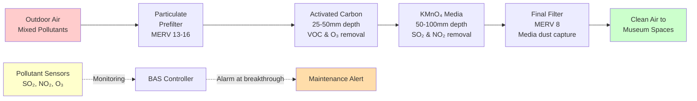

## Overview

Gaseous filtration systems protect museum collections from atmospheric pollutants that cause irreversible chemical degradation. While particulate filtration removes solid contaminants, gas-phase filtration addresses molecular pollutants that react with collection materials, causing corrosion, discoloration, and embrittlement.

## Pollutant Threats to Collections

### Primary Gaseous Contaminants

Outdoor air and internal sources introduce several damaging pollutants:

**Sulfur Dioxide (SO₂)**
- Source: Fossil fuel combustion, industrial emissions
- Effects: Acidifies hygroscopic materials, corrodes metals, weakens paper
- Mechanism: Forms sulfuric acid in presence of moisture
- Target level: <2 μg/m³ for sensitive collections

**Nitrogen Dioxide (NO₂)**
- Source: Vehicle emissions, combustion processes
- Effects: Oxidizes organic dyes, fades textiles and paintings
- Mechanism: Photochemical oxidation reactions
- Target level: <10 μg/m³

**Ozone (O₃)**
- Source: Photochemical smog, electronic equipment
- Effects: Cracks rubber, fades dyes, damages photographs
- Mechanism: Strong oxidizing agent attacks double bonds
- Target level: <2 μg/m³

**Volatile Organic Compounds (VOCs)**
- Source: Building materials, wood products, visitors
- Effects: Acidic degradation of lead-based objects
- Common compounds: Formic acid, acetic acid, formaldehyde
- Target level: <100 μg/m³ total VOCs

| Pollutant | Source | Primary Damage | Vulnerable Materials | Target Concentration |
|-----------|--------|----------------|---------------------|---------------------|
| SO₂ | Combustion | Acidification | Paper, leather, stone | <2 μg/m³ |
| NO₂ | Vehicles | Oxidation | Textiles, dyes, paintings | <10 μg/m³ |
| O₃ | Photochemical | Cracking, fading | Rubber, photographs | <2 μg/m³ |
| Acetic Acid | Wood off-gassing | Corrosion | Lead, zinc, calcareous materials | <50 μg/m³ |
| Formaldehyde | Building materials | Cross-linking | Proteins, natural history specimens | <10 μg/m³ |

## Gas-Phase Filtration Technologies

### Activated Carbon Filtration

Activated carbon removes pollutants through adsorption onto high surface area media.

**Physical Properties**
- Surface area: 800-1200 m²/g
- Pore structure: Micropores (< 2 nm) and mesopores (2-50 nm)
- Typical depth: 25-50 mm (1-2 inches)
- Face velocity: 1.5-2.5 m/s (300-500 fpm)

**Removal Mechanisms**
- Van der Waals forces attract polar molecules
- Capillary condensation in micropores
- Chemical attraction for certain compounds
- Effective for: VOCs, ozone, odors

**Performance Prediction**

The Wheeler-Jonas equation predicts breakthrough time:

$$t_b = \frac{W_e \cdot W}{C_0 \cdot Q} - \frac{\rho_b \cdot W \cdot k_v}{C_0 \cdot Q} \ln\left(\frac{C_0 - C_b}{C_b}\right)$$

Where:
- $t_b$ = breakthrough time (min)
- $W_e$ = adsorption capacity (g pollutant/g carbon)
- $W$ = carbon weight (g)
- $C_0$ = inlet concentration (g/m³)
- $Q$ = airflow rate (m³/min)
- $\rho_b$ = bed density (g/m³)
- $k_v$ = adsorption rate coefficient (min⁻¹)
- $C_b$ = breakthrough concentration (g/m³)

### Potassium Permanganate Media

Chemisorbent media chemically reacts with pollutants for permanent destruction.

**Chemical Reactions**

Potassium permanganate (KMnO₄) oxidizes reduced sulfur and nitrogen compounds:

$$\text{H}_2\text{S} + \text{KMnO}_4 → \text{K}_2\text{SO}_4 + \text{MnO}_2 + \text{H}_2\text{O}$$

$$\text{SO}_2 + 2\text{KMnO}_4 → \text{K}_2\text{SO}_4 + 2\text{MnO}_2$$

**Application Characteristics**
- Substrate: Alumina pellets impregnated with 4-6% KMnO₄
- Depth: 50-100 mm (2-4 inches)
- Face velocity: 1.3-2.0 m/s (250-400 fpm)
- Effective for: SO₂, H₂S, NO₂, formaldehyde
- Irreversible reaction prevents re-release

**Color Change Indicator**
- Fresh media: Purple/brown
- Exhausted media: Dark brown/black
- Visual indication of replacement need

### Filter Media Selection by Threat

**Single-Contaminant Applications**
- SO₂ dominant: Potassium permanganate primary
- VOC dominant: Activated carbon primary
- Mixed oxidants: Layered approach

**Multi-Threat Configuration**

Typical museum installation uses series arrangement:

1. **Particulate prefilter**: MERV 13-16 removes particles
2. **Activated carbon**: 25-50 mm depth for VOCs and ozone
3. **Chemisorbent**: 50-100 mm KMnO₄ for acid gases
4. **Final particulate**: MERV 8 prevents media dust release

## Gaseous Contaminant Monitoring

### Continuous Monitoring Strategies

**Upstream/Downstream Comparison**
- Install sensors before and after media banks
- Efficiency calculation: $\eta = \frac{C_{in} - C_{out}}{C_{in}} \times 100\%$
- Declining efficiency indicates media saturation
- Typical replacement threshold: efficiency < 80%

**Critical Pollutant Sensors**
- Electrochemical sensors: SO₂, NO₂ (range: 0-200 μg/m³)
- UV photometric: O₃ (range: 0-100 μg/m³)
- Photo-ionization detector (PID): Total VOCs
- Calibration frequency: quarterly for critical applications

**Passive Monitoring**

Diffusion badges provide time-weighted average concentrations:
- Deployment period: 2-4 weeks
- Laboratory analysis determines accumulated pollutants
- Lower cost alternative to continuous monitoring
- Location: Gallery spaces and within display cases

### Integration with Building Automation

Monitor gaseous filtration effectiveness through BAS:
- Differential pressure across media banks
- Upstream/downstream concentration ratios
- Calculated media life remaining based on airflow integration
- Automated maintenance notifications

## Maintenance and Replacement Schedules

### Service Life Prediction

Media longevity depends on pollutant loading:

$$\text{Service Life (days)} = \frac{W_e \times m_{\text{media}}}{C_{\text{avg}} \times Q \times 1440}$$

Where:
- $W_e$ = adsorption capacity (g/g)
- $m_{\text{media}}$ = media mass (g)
- $C_{\text{avg}}$ = average pollutant concentration (g/m³)
- $Q$ = airflow rate (m³/min)

**Typical Service Intervals**

| Media Type | Urban Location | Suburban Location | Rural Location |
|------------|----------------|-------------------|----------------|
| Activated Carbon (VOC) | 12-18 months | 18-24 months | 24-36 months |
| KMnO₄ (Acid gases) | 6-12 months | 12-18 months | 18-24 months |
| Combined panels | 12 months | 18 months | 24 months |

### Replacement Indicators

**End-of-life Signals**
- Sensor measurements show >20% efficiency loss
- KMnO₄ color change to dark brown/black over >50% of depth
- Accumulated pressure drop >125 Pa (0.5 in. w.g.)
- Odor breakthrough in occupied spaces
- Scheduled replacement based on integrated airflow

**Replacement Procedure**
1. Isolate media bank with isolation dampers
2. Bag out spent media as potentially hazardous waste
3. Vacuum housing to remove residual dust
4. Install fresh media with proper orientation
5. Verify no bypass around media frames
6. Reset monitoring system baselines
7. Document replacement date and media specifications

### Quality Assurance Testing

**Post-installation Verification**
- Challenge test with known concentration of target pollutant
- Measure outlet concentration to verify removal efficiency
- Conduct leak test with smoke or tracer gas
- Acceptable leakage: <1% at design airflow

**Periodic Performance Testing**
- Annual efficiency testing using portable sensors
- Quarterly visual inspection for media discoloration
- Monthly differential pressure trending
- Immediate investigation if pressure drop changes >25%

## Design Considerations

**Airflow Distribution**
- Uniform face velocity across media prevents channeling
- Plenum depth >300 mm (12 in.) upstream of media
- Perforated distribution plates for large units
- Maximum velocity variation: ±20% across face

**Safety Requirements**
- Potassium permanganate is oxidizing agent (fire hazard if contaminated)
- Store replacement media away from combustibles
- Disposal as hazardous waste may be required
- Material Safety Data Sheets (MSDS) available on-site

**Economic Analysis**

Compare gaseous filtration cost to collection damage risk:
- Media cost: $150-$400/m² ($15-$40/ft²) annually
- Conservation treatment: $500-$5,000 per object
- Irreplaceable artifact protection: invaluable
- Payback period: immediate for high-value collections

The investment in comprehensive gas-phase filtration represents essential protection for irreplaceable cultural heritage, preventing damage that no amount of conservation effort can fully reverse.
