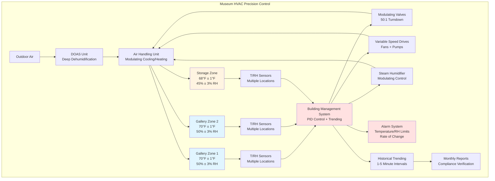

Museum collections require environmental control precision far exceeding typical building HVAC standards. Fluctuations in temperature and humidity cause dimensional changes in hygroscopic materials, surface condensation, chemical degradation, and biological growth. Precision control systems maintain stable conditions within narrow tolerances to ensure long-term preservation of irreplaceable artifacts.

## Temperature Control Requirements

Museum temperature control demands stability of ±1°F (±0.5°C) around setpoints ranging from 68-72°F (20-22°C) depending on collection type. This precision prevents thermal expansion and contraction cycles that stress materials with different coefficients of thermal expansion.

**Temperature Stability Calculation:**

The permissible temperature deviation is expressed as:

$$T_{actual} = T_{setpoint} \pm 0.5°C$$

For a 70°F (21°C) setpoint, acceptable range is 69-71°F (20.5-21.5°C).

Control systems achieving this stability require:

- **Modulating control valves** with high turndown ratios (50:1 minimum)
- **Variable speed pumps and fans** providing continuous capacity modulation
- **Multiple stages of heating/cooling** to avoid large step changes
- **Anticipatory control algorithms** responding to load changes before conditions drift
- **Distributed sensors** averaging spatial temperature variations

Supply air temperature reset based on space load prevents overcooling followed by reheat, which introduces control instability. The reset relationship:

$$T_{supply} = T_{setpoint} - \frac{Q_{space}}{\.m \cdot c_p}$$

where $Q_{space}$ is space cooling load, $\.m$ is air mass flow rate, and $c_p$ is specific heat of air.

## Humidity Control Requirements

Relative humidity control tolerances of ±3% RH (Class AA) to ±5% RH (Class A) prevent moisture-induced deterioration. Tight humidity control is critical because RH affects water content in hygroscopic materials according to sorption isotherms specific to each material.

**Humidity Control Methods:**

1. **Dedicated outdoor air systems (DOAS)** with deep dehumidification cooling outdoor air to 45-48°F dewpoint
2. **Desiccant dehumidification** for applications requiring dewpoints below 40°F
3. **Steam humidification** with distributed injection for uniform distribution
4. **Proportional-integral-derivative (PID) control** with narrow proportional bands

The moisture balance equation for space humidity:

$$\frac{dm_{water}}{dt} = \.m_{humid} - \.m_{dehum} + \.m_{internal} + \.m_{infiltration}$$

Control systems modulate humidification and dehumidification to maintain equilibrium at setpoint.

## Rate of Change Limitations

Rapid environmental changes cause greater material stress than absolute conditions. Rate of change limits protect collections:

- **Temperature:** Maximum 2°F/hour (1°C/hour)
- **Relative humidity:** Maximum 3% RH/hour for general collections, 2% RH/hour for sensitive materials

Control systems enforce rate limiting through:

$$\frac{dT}{dt} \leq 1°C/hr \quad \text{and} \quad \frac{dRH}{dt} \leq 3\%/hr$$

Implementing ramp functions during:
- Seasonal setpoint transitions
- System startup after maintenance
- Recovery from equipment failures

## Seasonal Setpoint Adjustments

Some institutions implement seasonal setpoint adjustments to reduce energy consumption while maintaining stable conditions. Winter setpoints may be 68°F/45% RH while summer setpoints are 72°F/50% RH. Transitions between seasonal setpoints occur gradually over 4-6 weeks.

The energy benefit comes from reduced humidification in winter and dehumidification in summer, but must be balanced against collection stress from the transitions.

## Control System Requirements

Museum-grade precision requires advanced control capabilities:

**Controller Specifications:**
- PID loops tuned for minimal overshoot (damping coefficient ≥ 0.7)
- Scan rates of 10-30 seconds for environmental loops
- Dead bands ≤ 0.5°F temperature, ≤ 2% RH
- Integral action with anti-windup protection
- Cascade control for supply air and space conditions

**Sensor Requirements:**
- Temperature sensors: ±0.2°F accuracy, 0.1°F resolution
- Humidity sensors: ±2% RH accuracy across 20-80% RH range
- Calibration verification quarterly with NIST-traceable standards

## Monitoring and Trending

Continuous monitoring with 1-5 minute data logging intervals provides evidence of environmental stability and early warning of drift. Key monitoring functions:

**Real-Time Monitoring:**
- Current temperature and RH in all collection spaces
- Supply air conditions (temperature, RH, dewpoint)
- Equipment status (AHU fans, pumps, valves)
- Outdoor conditions for load anticipation

**Trending and Analysis:**
- 24-hour, 7-day, and annual trend graphs
- Statistical analysis: mean, standard deviation, maximum excursion
- Compliance reporting against institutional standards
- Correlation analysis between outdoor conditions and space response

**Alarm Management:**
- High/low temperature alarms at setpoint ±2°F
- High/low RH alarms at setpoint ±5% RH
- Rate of change alarms
- Equipment failure alarms with redundant notification paths (email, text, phone)

## Precision Requirements by Collection Type

Different collection materials have varying sensitivity to environmental conditions:

| Collection Type | Temperature Range | RH Range | Tolerance Class | Maximum Rate of Change |
|----------------|-------------------|----------|-----------------|----------------------|
| Oil Paintings | 68-72°F (20-22°C) | 45-55% | ±2°F, ±3% RH (AA) | 2°F/hr, 2% RH/hr |
| Works on Paper | 68-70°F (20-21°C) | 45-50% | ±1°F, ±3% RH (AA) | 1°F/hr, 2% RH/hr |
| Photographs (B&W) | 65-70°F (18-21°C) | 30-40% | ±2°F, ±3% RH (AA) | 2°F/hr, 2% RH/hr |
| Photographs (Color) | 35-65°F (2-18°C) | 30-40% | ±2°F, ±3% RH (AA) | 2°F/hr, 2% RH/hr |
| Textiles | 68-70°F (20-21°C) | 45-55% | ±2°F, ±3% RH (AA) | 2°F/hr, 2% RH/hr |
| Wood Objects | 68-72°F (20-22°C) | 45-55% | ±2°F, ±5% RH (A) | 2°F/hr, 3% RH/hr |
| Metals | 68-72°F (20-22°C) | 35-45% | ±2°F, ±5% RH (A) | 3°F/hr, 3% RH/hr |
| Ethnographic Materials | 68-72°F (20-22°C) | 45-55% | ±2°F, ±5% RH (A) | 2°F/hr, 3% RH/hr |
| Stone/Ceramics | 68-75°F (20-24°C) | 40-60% | ±3°F, ±5% RH (B) | 3°F/hr, 5% RH/hr |
| General Mixed Collections | 68-72°F (20-22°C) | 45-55% | ±2°F, ±5% RH (A) | 2°F/hr, 3% RH/hr |

**Notes:**
- Class AA: Precision control for most sensitive materials
- Class A: Precision control for general museum collections
- Class B: Moderate control for less sensitive materials
- Temperature ranges assume display conditions; storage often maintained cooler
- Cold storage for color photographs requires specialized refrigeration systems

Achieving these precision levels requires properly sized equipment, redundant systems, continuous monitoring, and regular maintenance. The investment in precision control prevents deterioration that would be irreversible and far more costly than the HVAC infrastructure.
