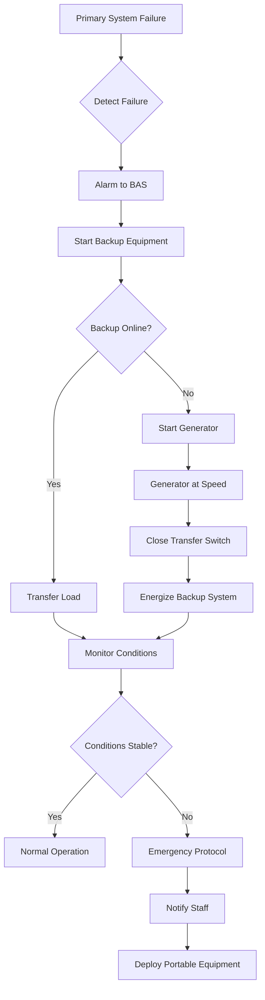

## Overview

HVAC redundancy for museum applications protects irreplaceable collections from environmental damage during equipment failures. The economic and cultural value of museum holdings justifies sophisticated backup strategies that exceed typical building requirements. Proper redundancy design balances capital investment against risk exposure.

## N+1 Redundancy Principles

N+1 redundancy provides one additional component beyond the minimum required for full system capacity. For a museum requiring three chillers at design conditions, an N+1 configuration includes four chillers, each sized at 33% capacity. This approach maintains full cooling capability during single equipment failures.

System availability improves dramatically with redundancy:

$$A_{system} = 1 - (1 - A_{component})^{n+1}$$

Where:
- $A_{system}$ = overall system availability
- $A_{component}$ = individual component reliability
- $n$ = number of components required for full capacity

For a component with 95% reliability, a 3+1 configuration achieves 99.9994% system availability versus 85.7% for a non-redundant system.

### Redundancy Configurations

**Parallel redundancy** connects identical components to shared distribution systems. When one unit fails, others absorb the load automatically. This configuration suits chillers, boilers, air handlers, and pumps.

**Standby redundancy** maintains backup equipment offline until primary systems fail. This approach reduces operating costs but introduces switching delays that may compromise sensitive collections.

**Distributed redundancy** deploys multiple smaller systems serving different zones. A failure impacts only the affected zone while other areas maintain proper conditions.

## Critical Component Backup

### Chilled Water Systems

Museum chiller plants require multiple units with isolation valves enabling maintenance without shutdown. A typical configuration includes:

- Multiple chillers totaling 125-150% of design capacity
- Dual primary/secondary pumping with VFD control
- Automatic changeover valves
- Redundant controls with battery backup
- Dedicated chilled water storage for thermal inertia

Chilled water storage provides 2-4 hours of cooling during complete chiller failure, allowing time for repairs or generator startup.

### Heating Systems

Redundant boilers prevent winter temperature excursions. Requirements include:

- N+1 boiler configuration with modular units
- Dual fuel capability (natural gas with oil backup)
- Redundant burner controls and flame safeguards
- Emergency hot water storage tanks
- Cross-connected piping with isolation valves

### Air Handling Systems

Air handlers serving collection spaces require:

- Duplicate supply and return fans with automatic switchover
- Dual filter banks with differential pressure monitoring
- Redundant humidification systems
- Backup steam or electric coils
- Battery-backed actuators maintaining damper positions during power loss

### Humidity Control

Dehumidification capacity must continue during primary system failure:

- Redundant desiccant or refrigerant dehumidifiers
- Moisture storage capacity in hygroscopic building materials
- Emergency portable dehumidifiers with pre-positioned connections
- Humidifier backups with separate water treatment

## Emergency Generator Requirements

Emergency generators maintain climate control during utility outages. Sizing calculations must account for:

$$P_{gen} = (P_{HVAC} + P_{lights} + P_{controls}) \times 1.25$$

Where generator capacity includes 25% safety margin beyond simultaneous HVAC, lighting, and control loads.

### Generator Specifications

- **Capacity**: 150-200% of critical HVAC load
- **Fuel storage**: 48-72 hour runtime at full load
- **Transfer time**: Under 10 seconds for automatic transfer switches
- **Paralleling capability**: Multiple generators with load sharing
- **Maintenance**: Weekly exercising with monthly loaded tests

Critical loads transfer automatically to emergency power within 10 seconds. Less critical systems may employ delayed transfer to reduce generator sizing.

## Failover Sequences

Automated failover sequences maintain environmental stability:

Typical failover timing:

| Event | Time from Failure |
|-------|------------------|
| Failure detection | 0-30 seconds |
| Backup equipment start | 30-60 seconds |
| Load transfer complete | 60-120 seconds |
| Generator start (if needed) | 10-15 seconds |
| Generator load acceptance | 30-45 seconds |
| Conditions stabilized | 5-15 minutes |

## Risk Assessment for Collections

Redundancy requirements scale with collection vulnerability and value. Assessment factors include:

**Environmental sensitivity:**
- Organic materials (textiles, paper, wood): High sensitivity to humidity
- Paintings on canvas: Sensitive to temperature fluctuations
- Metals: Affected by humidity and air quality
- Stone, ceramics: Relatively stable but affected by rapid changes

**Collection value:**
- Irreplaceable artifacts: Maximum redundancy
- High-value collections: N+1 minimum
- Study collections: Reduced redundancy acceptable
- Storage areas: Risk-based approach

**Allowable deviation time:**

$$t_{max} = \frac{\Delta T_{allow}}{dT/dt}$$

Where:
- $t_{max}$ = maximum time before corrective action required
- $\Delta T_{allow}$ = acceptable temperature deviation
- $dT/dt$ = rate of temperature drift after failure

For a gallery allowing 2°F deviation with 0.5°F/hour drift rate, corrective action must occur within 4 hours.

## Redundancy Level Recommendations

| Collection Type | Value Category | Redundancy Level | Backup Power | Annual Risk Budget |
|----------------|----------------|------------------|--------------|-------------------|
| World-class fine art | Irreplaceable | N+2 | Full (72hr fuel) | 0.01% failure probability |
| Major museum holdings | High value (>$10M) | N+1 | Full (48hr fuel) | 0.1% failure probability |
| Regional collections | Significant ($1-10M) | N+1 | Partial (24hr fuel) | 0.5% failure probability |
| Study collections | Moderate (<$1M) | N+0.5 | Critical only (12hr fuel) | 1% failure probability |
| General storage | Low | N+0 | Optional | 5% failure probability |

## Cost-Benefit Analysis

Redundancy investment must balance capital costs against collection risk:

**Capital costs:**
- Additional equipment: 125-200% of base system cost
- Enhanced controls: $50,000-$200,000
- Emergency generator: $100,000-$500,000 depending on size
- Fuel storage: $20,000-$100,000
- Installation complexity: 15-30% premium

**Operating costs:**
- Increased maintenance: 40-60% higher annual costs
- Additional energy: 5-15% from pump and distribution losses
- Generator testing: $5,000-$15,000 annually
- Control system maintenance: $10,000-$30,000 annually

**Risk reduction:**

$$V_{protected} = P_{failure} \times C_{collection} \times D_{damage}$$

Where:
- $V_{protected}$ = annual value protected by redundancy
- $P_{failure}$ = probability of environmental excursion
- $C_{collection}$ = collection value
- $D_{damage}$ = fraction damaged during excursion

For a $100M collection with 2% annual failure probability and potential 10% damage, redundancy protecting against this risk justifies $2M annual cost, or $20-30M capital investment at typical project economics.

**Payback considerations:**
- Insurance premium reductions: 10-30% for adequate redundancy
- Avoided restoration costs: $100,000-$10M per incident
- Reputation protection: Incalculable value
- Loan eligibility: Major exhibitions require environmental guarantees

## System Monitoring and Testing

Redundant systems require continuous verification:

- Weekly automatic equipment rotation ensuring backup readiness
- Monthly full-load testing of backup systems
- Quarterly emergency generator load bank testing
- Annual failover drills with full staff participation
- Continuous monitoring of all redundant component status

Predictive maintenance programs identify potential failures before they impact collections, further improving overall reliability.

## Conclusion

Proper HVAC redundancy protects irreplaceable museum collections from environmental damage during equipment failures. N+1 configurations, emergency power, and automated failover sequences maintain stable conditions. The high value and sensitivity of museum holdings justify redundancy investments that exceed typical building requirements. Risk-based assessment determines appropriate redundancy levels for specific collections, balancing capital costs against protection value.
