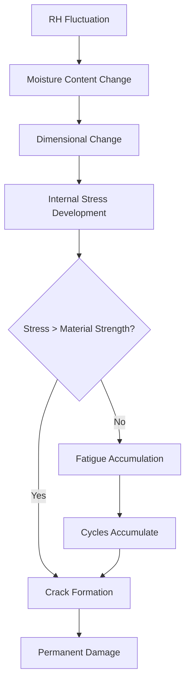
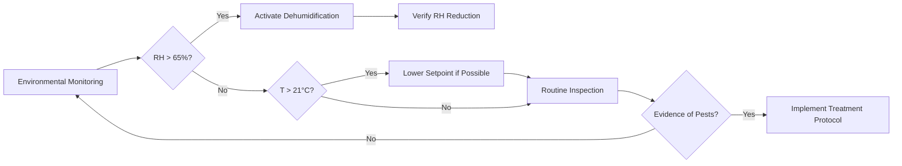

# Preventive Conservation Through Environmental Control

Preventive conservation employs environmental control as the primary defense against collection deterioration. Unlike interventive conservation that repairs damaged objects, preventive strategies create stable conditions that minimize degradation rates across entire collections. HVAC systems function as the principal tool for implementing these strategies, controlling temperature, humidity, air quality, and indirectly managing light exposure and biological activity.

## The Agents of Deterioration Framework

The Canadian Conservation Institute established ten agents of deterioration that cause damage to heritage materials. HVAC systems directly mitigate five primary agents:

| Agent | Physical Mechanism | HVAC Control Strategy |
|-------|-------------------|----------------------|
| Incorrect temperature | Accelerated chemical reactions | Setpoint optimization (15-25°C typical) |
| Incorrect relative humidity | Dimensional change, hydrolysis | Precision humidity control (±5% RH) |
| Temperature/RH fluctuations | Mechanical stress cycles | High thermal mass, gradual setpoint transitions |
| Pollutants | Chemical reaction catalysis | Filtration (MERV 13-16), activated carbon |
| Pests | Biological consumption | Temperature/RH outside viable ranges |

The remaining agents (physical forces, theft, vandalism, fire, water, light/UV, dissociation) require non-HVAC interventions, though environmental systems contribute to fire suppression and water damage prevention through detection integration.

## Chemical Degradation Kinetics

Temperature directly affects deterioration rates through the Arrhenius equation:

$$k = A e^{-E_a/RT}$$

Where:
- $k$ = reaction rate constant
- $A$ = frequency factor
- $E_a$ = activation energy (J/mol)
- $R$ = gas constant (8.314 J/mol·K)
- $T$ = absolute temperature (K)

For most organic materials, reaction rates double with every 10°C temperature increase (Q₁₀ = 2). A collection maintained at 25°C deteriorates twice as fast as one at 15°C. This relationship quantifies the preservation benefit of lower temperatures, balanced against occupant comfort and energy costs.

Relative humidity affects deterioration through multiple pathways:

1. **Hydrolysis reactions** require water molecules as reactants
2. **Dimensional changes** in hygroscopic materials create mechanical stress
3. **Corrosion rates** increase exponentially above critical RH thresholds (40-60% for most metals)

The equilibrium moisture content (EMC) of organic materials follows sorption isotherms that are material-specific and exhibit hysteresis between adsorption and desorption cycles.

## Climate Stability Requirements

Fluctuation damage often exceeds steady-state damage. Hygroscopic materials (paper, wood, textiles, hide glue) experience dimensional changes when RH varies:

$$\Delta L/L_0 = \alpha \cdot \Delta \text{RH}$$

Where $\alpha$ is the hygroscopic expansion coefficient (typically 0.001-0.003 per %RH for wood across the grain). Daily RH swings of ±10% impose fatigue stress that accumulates over years, causing cracking, delamination, and paint loss.

Conservation specifications typically demand:

- **Class AA (precision)**: ±2°C, ±5% RH, no seasonal drift
- **Class A (precision)**: ±2°C, ±5% RH, small seasonal drift allowed
- **Class B (general)**: ±5°C, ±10% RH, moderate seasonal drift
- **Class C (relaxed)**: Prevent RH extremes (<25%, >75%)

## Risk-Based Environmental Management

Traditional approaches specified narrow setpoint ranges (20°C ± 1°C, 50% ± 3% RH) that require substantial energy. Risk-based frameworks assess:

1. **Collection vulnerability**: Material composition and condition
2. **Environmental severity**: Magnitude and rate of fluctuations
3. **Exposure duration**: Cumulative time at risk conditions
4. **Value/significance**: Prioritization of resources

This approach permits wider setpoint ranges for robust collections (stable ceramics, metals in dry conditions) while maintaining strict control for vulnerable materials (watercolors, acetate film, iron).

The preservation index (PI) quantifies paper lifetime in equivalent years at 20°C, 50% RH:

$$\text{PI} = e^{[(E_a/R) \cdot (1/293.15 - 1/T)] - [(B \cdot \text{RH})/100]}$$

Where $B$ is an empirical moisture sensitivity factor. This metric enables comparison of different environmental scenarios.

## Integrated Pest Management (IPM)

HVAC systems contribute to IPM through environmental manipulation. Most heritage pests (insects, mold) require specific temperature and humidity ranges:

- **Mold growth**: Requires >65% RH sustained for 72+ hours at temperatures above 15°C
- **Insect development**: Inhibited below 13-15°C; development rate increases exponentially with temperature
- **Carpet beetles**: Thrive at 20-30°C, 60-80% RH

Maintaining collections below 18°C and 55% RH creates hostile conditions for most pests without chemical intervention. Short-term freezing (−20°C for 72 hours) or anoxia treatments eliminate active infestations.

## Light Damage Mitigation

While lighting systems are separate from HVAC, environmental control affects light-induced deterioration. Photochemical damage follows:

$$\text{Damage} = k \cdot E \cdot t$$

Where $E$ is illuminance (lux) and $t$ is exposure time. Higher temperatures accelerate photo-oxidation reactions, creating synergistic effects. Maintaining lower temperatures (18-20°C) reduces light damage rates by 30-50% compared to 25°C.

HVAC ductwork placement must avoid illuminating light-sensitive objects with warm air, which combines thermal and photochemical stress.

## System Design Implications

Achieving preventive conservation requirements demands:

- **High turndown ratio equipment**: Precise control at part-load
- **Decoupled temperature/humidity control**: Independent manipulation
- **Thermal mass integration**: Buffer against transient loads
- **Pressure control**: Prevent infiltration of unconditioned air
- **Filtration**: MERV 13 minimum, consider gaseous filtration
- **Monitoring**: Continuous logging at 15-minute intervals minimum

Energy recovery ventilators (ERVs) risk cross-contamination between exhaust and supply airstreams. Total energy recovery may transfer volatile organic compounds back into gallery spaces, necessitating sensible-only heat recovery in some applications.

---

**Related Topics**: Museum climate specifications, collection risk assessment, dew point control, seasonal setpoint strategies, hygroscopic materials behavior

