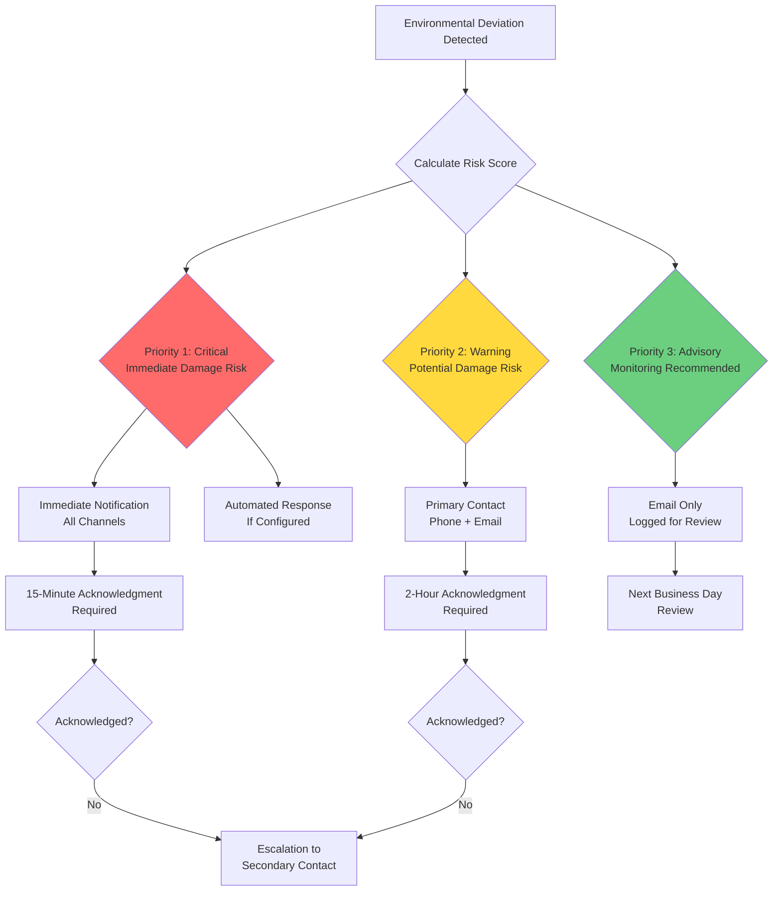
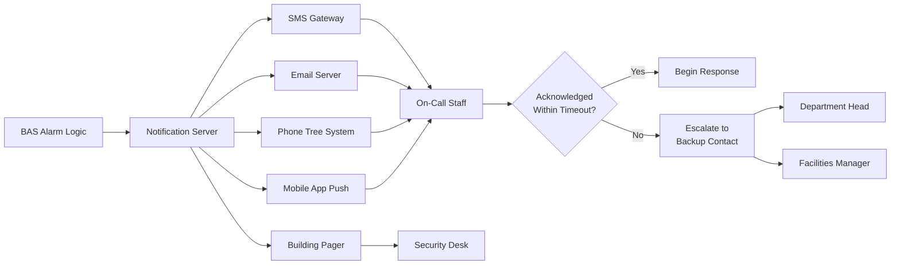

Environmental alarm systems serve as the critical interface between HVAC control failures and collection preservation staff, providing time-sensitive notification of conditions that threaten artifact integrity. Effective alarming balances sensitivity to genuine risks against alarm fatigue that desensitizes personnel to warnings.

## Alarm Physics and Thresholds

The fundamental challenge in conservation alarming lies in distinguishing between normal environmental fluctuations and conditions requiring intervention. This requires understanding the thermodynamic response of artifacts to environmental deviations.

### Setpoint Deviation Alarms

Absolute threshold alarms trigger when conditions exceed conservation target ranges. The alarm threshold must account for both artifact vulnerability and normal system variance:

$$\Delta T_{\text{alarm}} = \Delta T_{\text{damage}} - (\sigma_{\text{system}} + \sigma_{\text{sensor}})$$

where $\Delta T_{\text{damage}}$ represents the temperature deviation causing artifact stress, $\sigma_{\text{system}}$ is the expected system variance, and $\sigma_{\text{sensor}}$ accounts for sensor uncertainty.

**Typical Conservation Alarm Thresholds:**

| Parameter | Tight Control | Standard Control | Storage |
|-----------|---------------|------------------|---------|
| Temperature High | +1.5°F (+0.8°C) | +3°F (+1.7°C) | +5°F (+2.8°C) |
| Temperature Low | -1.5°F (-0.8°C) | -3°F (-1.7°C) | -5°F (-2.8°C) |
| RH High | +3% | +5% | +8% |
| RH Low | -3% | -5% | -8% |
| Dew Point Deviation | ±2°F (±1.1°C) | ±3°F (±1.7°C) | ±5°F (±2.8°C) |

Dew point alarming provides superior stability compared to RH alarming because it eliminates temperature-coupling effects. A dew point alarm triggers based on absolute moisture content rather than the temperature-dependent RH value.

### Rate-of-Change Alarms

Rate-of-change detection identifies equipment failures before absolute thresholds are breached. The critical rate depends on artifact thermal mass and hygroscopic response time:

$$\frac{dT}{dt}_{\text{alarm}} = \frac{h \cdot A}{m \cdot c_p} \cdot \Delta T_{\text{critical}}$$

where $h$ is the convective heat transfer coefficient (typically 5-15 W/m²·K for still air), $A/m$ is the surface-to-mass ratio of the artifact, $c_p$ is specific heat, and $\Delta T_{\text{critical}}$ is the damaging temperature change.

**Recommended Rate-of-Change Thresholds:**

| Artifact Category | Temperature Rate | RH Rate | Detection Period |
|-------------------|------------------|---------|------------------|
| Paintings on Panel | 2°F/hr (1.1°C/hr) | 5%/hr | 30 minutes |
| Canvas Paintings | 3°F/hr (1.7°C/hr) | 8%/hr | 30 minutes |
| Paper Collections | 4°F/hr (2.2°C/hr) | 10%/hr | 30 minutes |
| Metal Objects | 5°F/hr (2.8°C/hr) | — | 1 hour |
| Stone/Ceramic | 6°F/hr (3.3°C/hr) | — | 1 hour |

Rate-of-change alarms detect compressor failures, damper malfunctions, and control system errors significantly faster than absolute threshold alarms.

## Alarm Prioritization Hierarchy

Effective alarm systems implement tiered prioritization to direct attention appropriately:

### Risk-Based Priority Calculation

Alarm priority derives from both the magnitude of deviation and the vulnerability of affected collections:

$$P_{\text{risk}} = \left(\frac{\Delta E}{E_{\text{threshold}}}\right)^2 \cdot V_{\text{collection}} \cdot t_{\text{exposure}}$$

where $\Delta E$ is the environmental deviation, $E_{\text{threshold}}$ is the alarm setpoint, $V_{\text{collection}}$ is a vulnerability factor (1-10 scale), and $t_{\text{exposure}}$ is exposure duration.

**Priority 1 (Critical) Conditions:**
- Dew point approaches surface temperatures (condensation imminent)
- Temperature excursion >5°F (2.8°C) in collections with strict requirements
- RH excursion >10% in hygroscopic collections
- Rate of change >3× normal thresholds
- HVAC system complete failure

**Priority 2 (Warning) Conditions:**
- Setpoint deviation 50-100% of critical threshold
- Rate of change 2-3× normal thresholds
- Single-zone issues with potential to spread
- Repeated cycling at threshold boundaries

**Priority 3 (Advisory) Conditions:**
- Setpoint deviation 25-50% of critical threshold
- Equipment running outside optimal efficiency
- Trending toward alarm conditions
- Resolved alarms requiring documentation

## Notification Systems and Response Protocols

### Multi-Channel Notification Architecture

**After-Hours Response Protocol Requirements:**

1. **Primary Contact Notification** (0-5 minutes)
   - Simultaneous SMS and phone call
   - Alarm details including location, condition, and priority
   - Direct link to live monitoring dashboard

2. **Acknowledgment Window** (5-15 minutes)
   - Primary contact must acknowledge receipt
   - System confirms acknowledgment and logs response time
   - Failure triggers escalation

3. **Secondary Escalation** (15-30 minutes)
   - Automated notification to backup contacts
   - Department head and facilities manager informed
   - Security personnel dispatched for physical verification

4. **Response Initiation** (within 1 hour for Priority 1)
   - On-site assessment or remote troubleshooting
   - Decision: immediate repair, temporary mitigation, or controlled shutdown
   - Documentation of conditions and actions taken

## False Alarm Reduction Strategies

False alarms undermine alarm system effectiveness by creating response fatigue. Reduction requires both technical and procedural approaches.

### Technical False Alarm Prevention

**Sensor Quality and Placement:**
- Use Class A accuracy sensors (±0.3°F, ±2% RH per ASHRAE Guideline 2019)
- Shield sensors from radiation and airflow interference
- Avoid placement near doors, windows, or supply diffusers
- Implement redundant sensors with voting logic for critical spaces

**Alarm Delay and Confirmation:**
- Require sustained deviation for trigger (5-10 minutes typical)
- Implement hysteresis to prevent cycling: alarm sets at threshold +Δ, clears at threshold -Δ
- Use moving average filtering (15-minute window) to smooth transient spikes

$$\bar{T}_{\text{alarm}}(t) = \frac{1}{n}\sum_{i=0}^{n-1} T(t-i\Delta t)$$

where $n$ is the number of samples and $\Delta t$ is the sampling interval.

**Conditional Alarm Logic:**
- Suppress alarms during scheduled maintenance windows
- Adjust thresholds during seasonal transitions
- Disable rate-of-change alarms during controlled setpoint changes
- Require simultaneous temperature and humidity deviation for Priority 1 alarms

### Alarm Fatigue Prevention

Alarm fatigue occurs when excessive notifications desensitize personnel to warnings. Prevention strategies include:

**Alarm Rationalization:**
- Maximum 3-5 Priority 1 alarms per month per zone
- Priority 2 alarms should not exceed 10 per zone per month
- Audit alarm logs quarterly to identify nuisance alarms

**Intelligent Alarm Grouping:**
- Consolidate multiple sensor alarms in single zone to one notification
- Group correlated alarms (e.g., supply fan failure triggers multiple zone alarms → report as single system alarm)
- Suppress downstream alarms when root cause is identified

**Dynamic Threshold Adjustment:**
- Seasonal baseline recalibration (automatically adjust thresholds ±10% based on 30-day rolling average)
- Occupied vs. unoccupied mode thresholds
- Special exhibition temporary threshold modifications

## Performance Metrics and Testing

**Alarm System Key Performance Indicators:**

| Metric | Target | Calculation Method |
|--------|--------|-------------------|
| False Alarm Rate | <5% of total alarms | Monthly audit of alarms vs. verified conditions |
| Acknowledgment Time (P1) | <15 minutes | Automated logging from notification to acknowledgment |
| Acknowledgment Time (P2) | <2 hours | Automated logging from notification to acknowledgment |
| Response Time (P1) | <1 hour | From alarm to on-site personnel or remote action |
| Missed Alarm Rate | 0% | Quarterly sensor failure injection testing |
| Alarm-to-Incident Ratio | >80% | Alarms resulting in documented intervention |

**Quarterly Testing Protocol:**
1. Simulate sensor failures (disconnect, out-of-range signals)
2. Verify notification delivery to all channels
3. Confirm escalation logic executes properly
4. Test after-hours response (drill with on-call staff)
5. Validate alarm prioritization with mixed-severity scenarios

Environmental alarm systems function as the fail-safe mechanism protecting collections from HVAC system failures. Properly designed alarming balances responsiveness to genuine threats with suppression of nuisance alarms, maintaining staff vigilance while preventing alarm fatigue that compromises collection safety.
