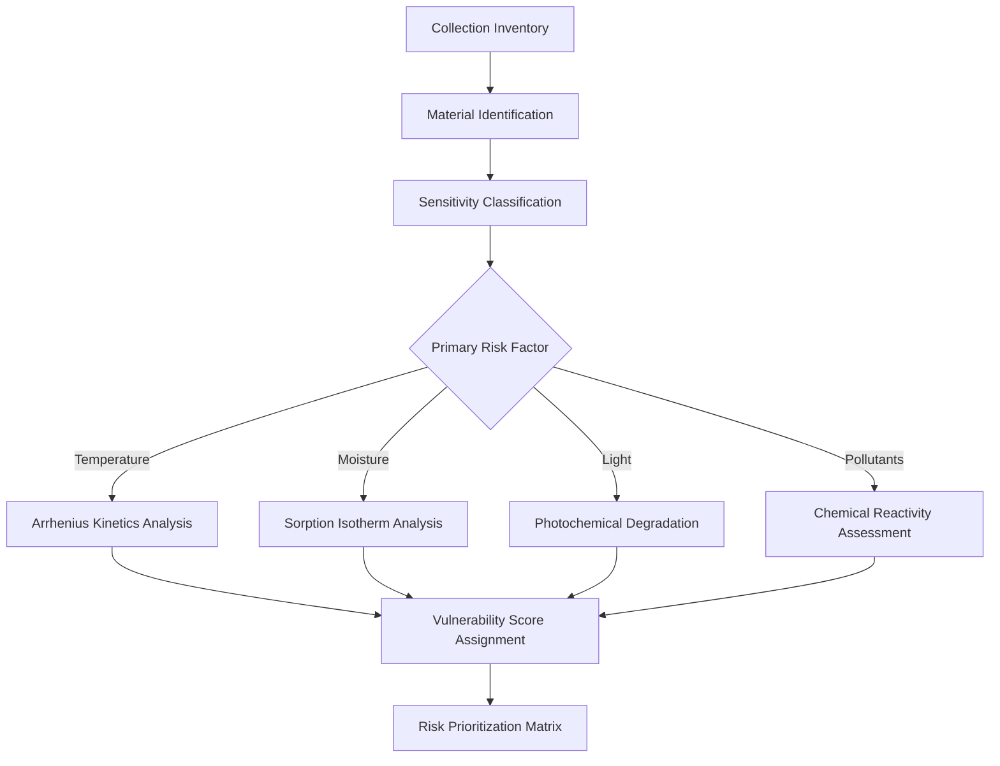
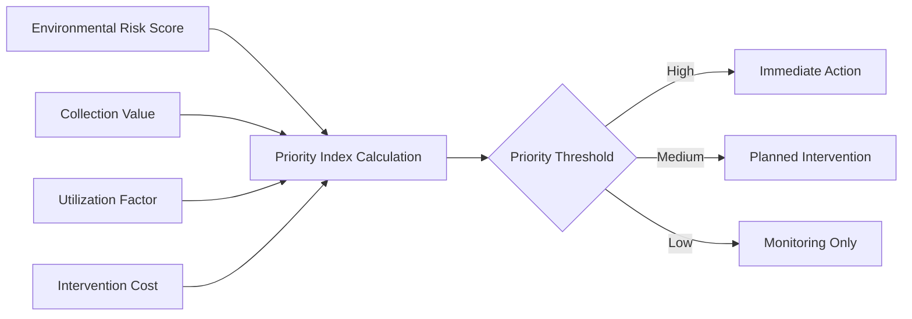

## Overview

Collection surveys establish the quantitative foundation for preventive conservation strategies by documenting existing conditions, identifying environmental impacts, and prioritizing climate control interventions. The survey process integrates physical condition assessment with environmental data to create actionable risk profiles for collections.

The fundamental relationship between environmental exposure and deterioration rate follows an Arrhenius-type dependency:

$$k = A \cdot e^{-E_a / RT}$$

Where $k$ represents the deterioration rate constant, $A$ is the pre-exponential factor, $E_a$ is activation energy (J/mol), $R$ is the gas constant (8.314 J/mol·K), and $T$ is absolute temperature (K). This relationship demonstrates why small temperature variations have exponential effects on degradation rates.

## Survey Methodologies

### Environmental Conditions Survey

Environmental surveys quantify the exposure conditions affecting collections through systematic monitoring of temperature, relative humidity, light levels, and pollutant concentrations. The survey duration must capture seasonal variations, typically requiring 12 months of continuous data collection at 15-minute intervals.

**Critical parameters and measurement requirements:**

| Parameter | Accuracy | Resolution | Sampling Rate |
|-----------|----------|------------|---------------|
| Temperature | ±0.5°C | 0.1°C | 15 minutes |
| Relative Humidity | ±2% RH | 0.1% RH | 15 minutes |
| Light (Visible) | ±10% | 10 lux | On demand |
| UV Radiation | ±5% | 1 µW/lm | On demand |
| Particulates (PM2.5) | ±10% | 1 µg/m³ | 1 hour |

The moisture buffering capacity of collections affects short-term RH fluctuations. The effective moisture penetration depth $\delta_m$ determines response time:

$$\delta_m = \sqrt{\frac{D_m \cdot t}{\pi}}$$

Where $D_m$ is the moisture diffusivity coefficient (m²/s) of the material and $t$ is the exposure duration (s). Materials with high $\delta_m$ values respond slowly to RH changes, providing natural buffering.

### Collection Vulnerability Assessment

Vulnerability assessment categorizes materials by their sensitivity to environmental parameters. The assessment uses material science principles to rank deterioration mechanisms by activation energy and moisture dependence.

**Material sensitivity classification:**

| Material Category | T Sensitivity (Q₁₀) | RH Critical Range | Light Damage Threshold |
|-------------------|---------------------|-------------------|------------------------|
| Cellulose (paper) | 2-3 | >65% RH | 50 klux·hr/year |
| Proteinaceous | 2-4 | <30%, >60% RH | 150 klux·hr/year |
| Photographic | 3-5 | >50% RH | 15 klux·hr/year |
| Metals (reactive) | 1.5-2 | >45% RH | Minimal |
| Synthetic polymers | 2-6 | Variable | 200 klux·hr/year |

The Q₁₀ value represents the reaction rate increase per 10°C temperature rise. Higher values indicate greater temperature sensitivity.

### Risk Assessment Environmental

Environmental risk assessment quantifies the probability and magnitude of deterioration under documented conditions. The risk magnitude $R$ combines exposure severity and collection vulnerability:

$$R = P \cdot V \cdot E$$

Where $P$ is the probability of occurrence (0-1), $V$ is vulnerability (0-10 scale), and $E$ is exposure value (measured deviation from target).

**Time-weighted exposure calculation** for temperature effects:

$$TWE_T = \sum_{i=1}^{n} \left( \frac{t_i}{t_{total}} \cdot 2^{(T_i - T_{ref})/10} \right)$$

Where $t_i$ is time at temperature $T_i$, and $T_{ref}$ is the reference temperature (typically 20°C). This metric converts variable temperature exposure into an equivalent isothermal exposure time.

### Preservation Priorities Identification

Priority setting uses quantitative risk scores combined with collection value assessments to allocate resources effectively. The priority index $PI$ integrates multiple factors:

$$PI = \frac{R \cdot V_c \cdot U}{\sqrt{C}}$$

Where $R$ is environmental risk score, $V_c$ is collection value (cultural/monetary), $U$ is utilization factor (access frequency), and $C$ is estimated intervention cost. Higher $PI$ values indicate priority actions.

### Monitoring Location Selection

Strategic placement of monitoring equipment captures representative conditions while identifying microclimates. The number of monitoring locations $N$ scales with collection area and environmental complexity:

$$N = \left\lceil \frac{A}{A_{zone}} \right\rceil + N_{critical}$$

Where $A$ is total collection area (m²), $A_{zone}$ is the representative zone area (typically 200-400 m²), and $N_{critical}$ is additional sensors for known problem areas.

**Location selection criteria:**

- Central positions in each HVAC zone
- Near external walls and windows (thermal bridges)
- Adjacent to high-value or vulnerable items
- Areas with suspected air leakage or infiltration
- Locations with historical damage patterns
- Reference positions away from environmental stressors

### Baseline Conditions Establishment

Baseline documentation provides the reference state for measuring improvement effectiveness. Statistical analysis of monitoring data establishes performance metrics:

**Mean Preservation Index (MPI)** for paper-based collections:

$$MPI = \frac{1}{n} \sum_{i=1}^{n} \frac{1}{k_i}$$

Where $k_i$ is the relative deterioration rate at each measurement interval, normalized to conditions at 20°C and 50% RH.

**Performance indicators to document:**

| Metric | Definition | Target Range |
|--------|------------|--------------|
| Temperature stability | Standard deviation over 24 hours | <2°C |
| RH stability | Standard deviation over 24 hours | <5% RH |
| Setpoint deviation | Mean absolute error from target | <1°C, <3% RH |
| Rate of change | Maximum ΔT/Δt or ΔRH/Δt | <5°C/hr, <10% RH/hr |
| Cycles per day | Excursions beyond deadband | <3 cycles |

## Survey Documentation Requirements

Comprehensive documentation includes spatial mapping, temporal analysis, and statistical summaries:

- Floor plans with monitoring locations and environmental zones
- Time-series graphs showing annual patterns
- Frequency distributions for T and RH
- Psychrometric charts plotting collection exposure
- Risk matrices correlating conditions with vulnerabilities
- Photographic documentation of existing damage
- Material inventories with condition grades
- Recommended interventions ranked by priority index

## Implementation Protocol

1. **Planning phase**: Define survey scope, duration, and resource allocation
2. **Equipment deployment**: Install calibrated sensors per spatial requirements
3. **Data collection**: Maintain continuous monitoring for minimum 12 months
4. **Collection assessment**: Catalog materials and assign vulnerability scores
5. **Data analysis**: Calculate exposure metrics and risk indices
6. **Priority ranking**: Apply priority index formula to identify interventions
7. **Reporting**: Prepare comprehensive documentation package
8. **Baseline establishment**: Define performance targets based on analysis

## Integration with HVAC Improvements

Survey findings directly inform climate control system specifications. The required cooling capacity $Q_c$ to eliminate temperature-induced risk derives from the baseline energy balance:

$$Q_c = \rho \cdot c_p \cdot V \cdot ACH \cdot \Delta T + U \cdot A \cdot \Delta T + Q_{internal}$$

Where $\rho$ is air density (kg/m³), $c_p$ is specific heat (J/kg·K), $V$ is volume (m³), $ACH$ is air change rate (h⁻¹), $U$ is envelope thermal transmittance (W/m²·K), $A$ is envelope area (m²), and $Q_{internal}$ represents internal heat gains (W).

Similarly, dehumidification capacity requirements follow from moisture load calculations informed by baseline RH excursions.

## Standards References

- **ISO 11799**: Information and documentation — Document storage requirements for archive and library materials
- **ASHRAE Handbook — HVAC Applications**, Chapter 24: Museums, Galleries, Archives, and Libraries
- **PAS 198**: Specification for managing environmental conditions for cultural collections
- **Image Permanence Institute** guidelines for preservation metrics

## Conclusion

Collection surveys provide the quantitative foundation for evidence-based preventive conservation. By documenting existing environmental conditions and correlating them with material vulnerabilities, surveys enable rational priority setting for climate control improvements. The integration of continuous monitoring data with physical condition assessments creates measurable baselines for evaluating intervention effectiveness and optimizing resource allocation in cultural heritage preservation.
