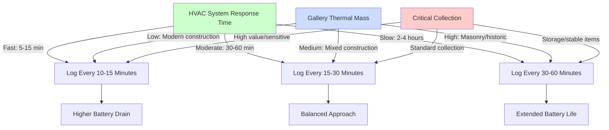
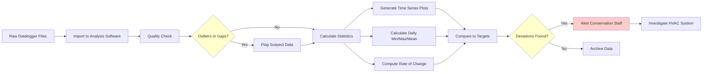

Environmental dataloggers serve as the foundation of museum climate control verification, providing continuous measurement of temperature and relative humidity conditions that directly affect collection stability. These instruments bridge the gap between HVAC system performance and actual environmental conditions at artifact locations.

## Physical Principles of Environmental Measurement

### Temperature Sensing Mechanisms

Modern museum dataloggers employ thermistors or resistance temperature detectors (RTDs) to measure air temperature. Thermistors exploit the temperature coefficient of electrical resistance in semiconductor materials, where resistance $R$ varies with absolute temperature $T$ according to the Steinhart-Hart equation:

$$\frac{1}{T} = A + B\ln(R) + C(\ln(R))^3$$

where $A$, $B$, and $C$ are calibration coefficients specific to the thermistor material. This nonlinear relationship provides high sensitivity (typically 3-5% resistance change per °C) but requires accurate characterization.

RTDs use pure metals (platinum preferred) with linear resistance-temperature relationships. The resistance at temperature $T$ follows:

$$R_T = R_0[1 + \alpha(T - T_0)]$$

where $R_0$ is resistance at reference temperature $T_0$ (typically 0°C or 25°C) and $\alpha$ is the temperature coefficient (0.00385 Ω/Ω/°C for platinum). RTDs offer superior long-term stability at higher cost.

### Relative Humidity Measurement

Capacitive RH sensors dominate museum applications. These devices use hygroscopic polymer dielectrics between electrodes, where absorbed water molecules alter dielectric constant $\epsilon_r$ and therefore capacitance $C$:

$$C = \epsilon_0 \epsilon_r \frac{A}{d}$$

where $\epsilon_0$ is permittivity of free space, $A$ is electrode area, and $d$ is dielectric thickness. Water absorption increases $\epsilon_r$ from approximately 2.5 (dry polymer) to values approaching 80 (water), yielding measurable capacitance change proportional to ambient RH.

The equilibrium moisture content in the hygroscopic layer follows sorption isotherm behavior, introducing hysteresis effects of 1-3% RH depending on whether RH is increasing or decreasing.

## Accuracy Requirements for Collection Monitoring

| Parameter | Conservation Target | Datalogger Accuracy | Rationale |
|-----------|---------------------|---------------------|-----------|
| Temperature | ±2°F (1.1°C) | ±0.3°C or better | Detect HVAC deviations before artifact damage |
| Relative Humidity | ±5% RH | ±2% RH or better | Track moisture cycling that causes dimensional change |
| Combined Uncertainty | - | ±3% RH at 25°C | Account for temperature-RH cross-sensitivity |
| Long-term Drift | - | <0.5% RH/year | Maintain validity between annual calibrations |

The ±2% RH accuracy requirement stems from material response characteristics. Organic hygroscopic materials (paper, wood, textiles) exhibit moisture content $M$ related to RH by sorption isotherms approximated as:

$$M = \frac{a \cdot RH}{1 + b \cdot RH}$$

where $a$ and $b$ are material-specific coefficients. A 5% RH change typically produces 0.5-1.0% moisture content change, sufficient to cause measurable dimensional strain in restrained materials.

## Sampling Interval Selection

The appropriate logging interval depends on the thermal time constant of the monitored space and HVAC system response characteristics. For a gallery space with thermal capacitance $C_{th}$ (J/K) and thermal conductance $U$ (W/K) to surrounding spaces, temperature disturbances decay with time constant:

$$\tau = \frac{C_{th}}{U}$$

Typical museum galleries exhibit time constants of 2-6 hours due to high thermal mass (masonry construction, massive display cases). The Nyquist sampling theorem requires sampling at intervals $\Delta t < \tau/2$ to capture temperature transients. This establishes 15-30 minute intervals as appropriate for most applications.

RH responds more slowly due to moisture buffering by hygroscopic materials (textiles, paper, wood furnishings). Effective moisture capacitance extends RH time constants to 8-24 hours in furnished galleries, permitting hourly logging intervals.

## Wired vs. Wireless System Architectures

### Wired Datalogger Systems

Wired systems connect sensors to centralized data acquisition hardware via low-voltage cabling (typically RS-485 or 4-20 mA current loops). Advantages include continuous power supply, real-time data access, and immunity to radio interference. Cable runs limited to 4000 ft (1200 m) for RS-485, shorter for analog systems due to voltage drop and noise pickup.

Power consumption per sensor: 0.1-0.5 W continuous. No battery replacement required.

### Wireless Datalogger Systems

Wireless systems employ radio frequency communication (typically 433 MHz, 868 MHz, or 915 MHz ISM bands, or 2.4 GHz for WiFi/Bluetooth). Battery-powered operation eliminates installation disruption in historic buildings.

Battery life $t_b$ depends on logging interval $\Delta t$, transmission power $P_{tx}$, transmission duration $t_{tx}$, sleep current $I_{sleep}$, and battery capacity $Q$:

$$t_b = \frac{Q \cdot V}{I_{sleep} + \frac{P_{tx} \cdot t_{tx}}{V \cdot \Delta t}}$$

For typical parameters (3.6V lithium battery, $Q$ = 2400 mAh, $I_{sleep}$ = 10 μA, $P_{tx}$ = 50 mW, $t_{tx}$ = 100 ms, $\Delta t$ = 15 min), battery life approaches 3-5 years. Frequent transmission (every 5 minutes) reduces life to 1-2 years.

| System Type | Initial Cost | Installation Cost | Flexibility | Real-time Access | Power Source | Typical Application |
|-------------|--------------|-------------------|-------------|------------------|--------------|---------------------|
| Wired Sensors | Medium | High (cable runs) | Low | Yes | Building power | New construction, renovations |
| Wireless Stand-alone | Low | Very low | High | No (manual download) | Battery (1-3 yr) | Small museums, temporary exhibits |
| Wireless Networked | High | Low | Very high | Yes | Battery (3-5 yr) | Distributed collections, historic buildings |

## Datalogger Placement Strategy

Sensor placement must represent artifact microenvironments while avoiding spurious readings from radiant heat, air currents, and thermal mass effects.

**Placement guidelines:**

- Position sensors at artifact height (not ceiling-mounted unless monitoring upper gallery zones)
- Maintain 3 ft (1 m) minimum distance from walls, windows, and supply diffusers to avoid boundary layer effects
- Place sensors inside display cases for enclosed artifact monitoring
- Avoid direct solar radiation, which produces radiant temperature errors of 5-15°C
- Shield sensors from direct airflow (>100 fpm) that causes aspiration cooling errors

For naturally aspirated sensors, convective heat transfer coefficient $h_c$ varies with air velocity $v$ approximately as:

$$h_c \approx 10.5 \sqrt{v}$$

where $h_c$ is in W/m²K and $v$ is in m/s. At typical gallery velocities (0.1-0.3 m/s), $h_c$ = 3-6 W/m²K. With radiant exposure of 50 W/m² (indirect daylight), sensor temperature error reaches:

$$\Delta T = \frac{q_{rad}}{h_c} = \frac{50}{5} = 10°C$$

Radiation shields reduce this error to <0.5°C.

## Data Analysis and Trending

### Statistical Characterization

Analyze logged data using descriptive statistics that reveal HVAC system performance:

- **Mean values:** Indicate setpoint tracking accuracy and systematic bias
- **Standard deviation:** Quantifies short-term variability (minutes to hours) from control cycling
- **Daily range:** Captures diurnal swings from solar gains and occupancy patterns
- **Rate of change:** Identifies rapid transients (°C/hr or %RH/hr) during HVAC failures

Conservation standards specify:

- Maximum rate of RH change: 10% RH per 24 hours (ISO 11799 for libraries/archives)
- Maximum rate of temperature change: 2°C per hour (prevents shock to artifacts)
- Annual temperature range: ±2°C for Class AA environments (ASHRAE Chapter 24)

### Trending Protocols

## Calibration Verification Schedule

Sensor drift results from aging of hygroscopic polymers (RH sensors) and mechanical stress in temperature sensors. Verification frequency:

- **Temperature sensors:** Annual verification (±0.3°C tolerance)
- **RH sensors:** Semi-annual verification (±2% RH tolerance)
- **Critical applications:** Quarterly verification for Class AA environments

Verification methods:

1. **Salt solution method (RH):** Saturated salt solutions produce defined RH at controlled temperature. LiCl (11% RH), MgCl₂ (33% RH), NaCl (75% RH) at 25°C provide three-point calibration.

2. **Ice bath method (temperature):** Ice-water slurry produces 0.0°C reference (±0.05°C uncertainty). Requires pure water and complete ice coverage.

3. **Transfer standard comparison:** Compare field datalogger against recently calibrated reference instrument under identical conditions for 24-48 hours.

Sensors exceeding tolerance require recalibration or replacement. Document all verification results to establish drift patterns and optimize replacement schedules.

## Battery Replacement Protocols

Battery depletion follows exponential decay modified by temperature effects. Battery capacity decreases approximately 0.7% per °C below 20°C for lithium cells. In unheated storage areas (10°C), effective capacity drops 7-10%, reducing replacement intervals proportionally.

**Replacement indicators:**

- Dataloggers report battery voltage <2.8V (lithium cells nominal 3.6V)
- Missing data points indicate intermittent power failures
- Scheduled replacement at 80% of rated lifetime prevents data loss

Implement staggered replacement schedules (monthly rotation through zones) to distribute labor and prevent simultaneous failures across the monitoring network.

## Multiple Location Monitoring Networks

Large museums require 50-200+ dataloggers distributed across galleries, storage, and mechanical spaces. Network design considerations:

- **Spatial resolution:** One datalogger per 2000-5000 ft² (200-500 m²) in conditioned galleries
- **Vertical stratification:** Monitor multiple heights in spaces with >20 ft (6 m) ceiling height
- **Microenvironment monitoring:** Individual dataloggers inside sealed display cases and storage cabinets
- **HVAC verification:** Sensors at supply ducts, return air, and outdoor conditions

Centralized data management systems aggregate measurements, automate alerting, and generate compliance reports for conservation audits. Networked wireless systems transmit data every 15-60 minutes, enabling real-time dashboards while maintaining multi-year battery life.
