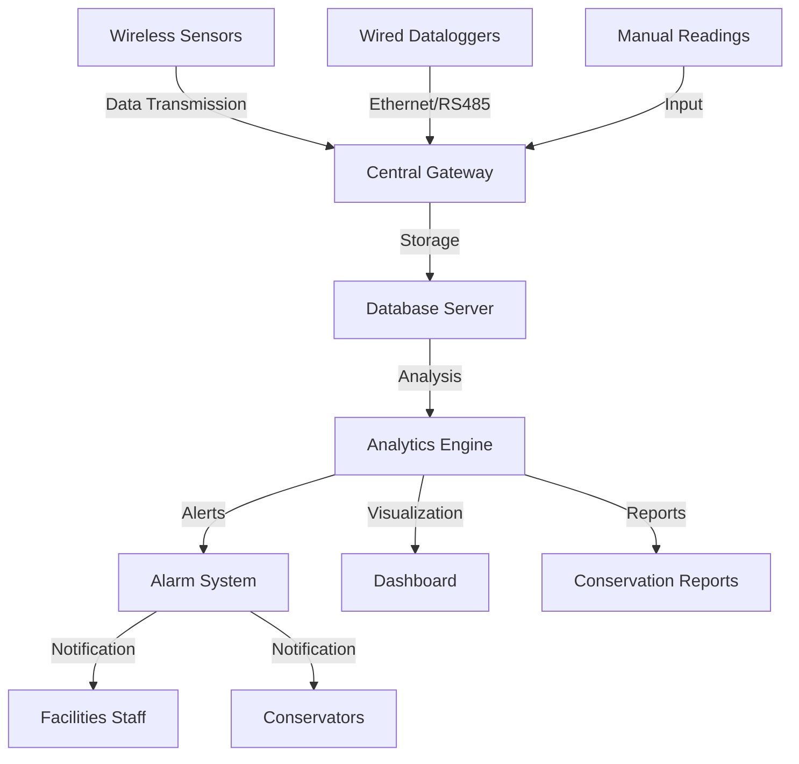

Environmental monitoring forms the foundation of preventive conservation by quantifying the physical and chemical stressors that accelerate material degradation in museum collections. Proper monitoring systems measure temperature, relative humidity, illuminance, pollutant concentrations, and vibration levels to ensure compliance with conservation standards and detect anomalies before damage occurs.

## Temperature and Relative Humidity Monitoring

### Physical Basis of Measurement

Temperature sensors in conservation applications typically use resistance temperature detectors (RTDs) or thermistors. RTDs exploit the linear relationship between electrical resistance and temperature:

$$R_T = R_0[1 + \alpha(T - T_0)]$$

where $R_T$ is resistance at temperature $T$, $R_0$ is resistance at reference temperature $T_0$, and $\alpha$ is the temperature coefficient of resistance (0.00385 °C⁻¹ for platinum).

Relative humidity sensors measure the moisture content of air relative to saturation. Capacitive RH sensors change dielectric constant with water vapor absorption:

$$C = \epsilon_0 \epsilon_r \frac{A}{d}$$

where $\epsilon_r$ varies with absorbed moisture, $A$ is electrode area, and $d$ is dielectric thickness.

### Critical Performance Specifications

Conservation-grade monitoring requires sensors meeting specific accuracy thresholds:

| Parameter | Required Accuracy | Response Time | Stability |
|-----------|------------------|---------------|-----------|
| Temperature | ±0.2°C | <5 minutes | <0.1°C/year |
| Relative Humidity | ±2% RH | <10 minutes | <1% RH/year |
| Dewpoint | ±0.3°C | <10 minutes | <0.2°C/year |

The dewpoint temperature $T_d$ provides a humidity metric independent of temperature:

$$T_d = \frac{b\gamma(T,RH)}{a - \gamma(T,RH)}$$

where $\gamma(T,RH) = \frac{a T}{b+T} + \ln(RH/100)$, with constants $a = 17.27$ and $b = 237.7°C$ (Magnus-Tetens approximation).

### Sensor Placement Strategy

Position sensors based on airflow patterns and collection vulnerabilities. Recommended density:

- General galleries: 1 sensor per 200-500 m²
- Sensitive collections: 1 sensor per 50-100 m²
- Microclimate monitoring: Multiple sensors per display case

Place sensors away from HVAC diffusers (minimum 2 m), exterior walls (minimum 0.5 m), and direct sunlight.

## Light Level Measurement

### Radiometric and Photometric Fundamentals

Illuminance $E_v$ (lux) measures visible light intensity weighted by the photopic response:

$$E_v = K_m \int_{\lambda} E_\lambda(\lambda) V(\lambda) d\lambda$$

where $K_m = 683$ lm/W, $E_\lambda$ is spectral irradiance, and $V(\lambda)$ is the photopic luminosity function.

For conservation, total light exposure integrates illuminance over time:

$$H = \int_0^t E_v \, dt$$

measured in lux-hours or megalux-hours (Mlxh). Photochemical damage follows reciprocity: 100 lux for 10 hours equals 1000 lux for 1 hour in degradation potential.

### UV and IR Monitoring

Ultraviolet radiation (300-400 nm) accelerates photodegradation. The UV content ratio:

$$\text{UV Ratio} = \frac{E_{UV}}{E_v}$$

should not exceed 75 μW/lm for sensitive materials. Silicon photodiodes with optical filters measure UV and visible bands separately.

Infrared radiation (>780 nm) contributes thermal stress without visual benefit. The total radiant exposure includes IR heating effects not captured by illuminance measurements alone.

### Conservation Light Limits

| Material Category | Maximum Illuminance | Annual Exposure |
|-------------------|---------------------|-----------------|
| Highly Sensitive (textiles, watercolors) | 50 lux | 150,000 lxh |
| Moderately Sensitive (oils, wood) | 150 lux | 450,000 lxh |
| Insensitive (stone, metal, ceramics) | 300 lux | No limit |

## Pollutant Detection

### Gaseous Pollutant Monitoring

Key atmospheric pollutants affecting collections:

**Sulfur dioxide** ($SO_2$) forms sulfuric acid on hygroscopic surfaces:

$$SO_2 + H_2O \rightarrow H_2SO_3 \rightarrow H_2SO_4$$

Electrochemical sensors detect $SO_2$ via oxidation reactions at sensing electrodes. Conservation threshold: <10 μg/m³.

**Nitrogen dioxide** ($NO_2$) degrades organic materials through nitration and oxidation. Colorimetric passive samplers or chemiluminescent analyzers measure concentrations. Threshold: <10 μg/m³.

**Ozone** ($O_3$) attacks unsaturated bonds in rubber, dyes, and organic materials. Target level: <2 μg/m³.

**Acetic acid** off-gasses from wood products and attacks lead, copper, and calcium carbonate. Passive diffusion samplers with ion chromatography analysis detect organic acids.

### Particulate Matter

Airborne particles deposit on surfaces and catalyze chemical degradation. Optical particle counters measure concentrations:

- PM₁₀: particles <10 μm (target: <50 μg/m³)
- PM₂.₅: particles <2.5 μm (target: <25 μg/m³)

## Vibration Monitoring

Vibration from nearby traffic, construction, or mechanical systems can damage fragile objects. Accelerometers measure displacement:

$$a = \frac{d^2x}{dt^2}$$

Peak particle velocity (PPV) quantifies vibration intensity:

$$\text{PPV} = 2\pi f A$$

where $f$ is frequency and $A$ is displacement amplitude.

Conservation vibration thresholds (ISO 2041):

- Fragile objects: <0.2 mm/s PPV
- Paintings on walls: <2.0 mm/s PPV
- Building structure: <5.0 mm/s PPV

## Data Management Systems

### System Architecture

**Sensor Networks**: Wireless mesh networks (Zigbee, LoRaWAN) enable distributed monitoring with:

- Low power consumption (2-10 year battery life)
- Redundant communication paths
- 15-minute to 1-hour logging intervals

**Data Storage**: Relational databases store time-series data with:

- Timestamp precision to 1 second
- Sensor metadata (location, calibration dates)
- Alarm thresholds and event logs

**Quality Assurance**: Implement automated data validation:

- Range checks (reject physically impossible values)
- Rate-of-change limits (flag sensor failures)
- Duplicate timestamp detection
- Missing data identification

### Calibration and Verification

Sensors drift over time. Establish calibration protocols:

1. **Field verification** every 3-6 months using certified reference instruments
2. **Laboratory calibration** annually at accredited facilities
3. **Salt slurry tests** for RH sensors (specific salts create known RH levels)

Common salt calibration points:

| Salt | RH at 20°C | RH at 25°C |
|------|-----------|-----------|
| LiCl | 11.3% | 11.3% |
| MgCl₂ | 33.1% | 32.8% |
| NaCl | 75.5% | 75.3% |
| KCl | 85.1% | 84.3% |

## Reporting for Conservators

### Statistical Analysis

Quantify environmental stability using statistical metrics:

**Mean and standard deviation** characterize central tendency and variability:

$$\sigma = \sqrt{\frac{1}{N}\sum_{i=1}^N (x_i - \mu)^2}$$

**Proofed fluctuation (PF)** quantifies short-term variability:

$$\text{PF} = \max(x_{\text{24h}}) - \min(x_{\text{24h}})$$

Values should not exceed ±2°C or ±5% RH daily.

**Time-weighted preservation index (TWPI)** integrates degradation over varying conditions based on Arrhenius kinetics.

### Essential Report Elements

Conservation reports should include:

1. **Compliance summary**: Percentage of time within target ranges
2. **Excursion analysis**: Duration, magnitude, and frequency of out-of-range events
3. **Seasonal patterns**: Monthly averages and extremes
4. **Spatial variation**: Comparison across monitoring zones
5. **Equipment performance**: Sensor status, calibration dates, system uptime
6. **Trend analysis**: Long-term drift or cyclical patterns

### Alarm Configuration

Set alarms based on collection vulnerability:

**Warning alarms** (5-10% deviation from setpoint):
- Notify facilities staff
- Log for trend analysis
- No immediate action required

**Critical alarms** (>10% deviation or rapid change):
- Notify conservators and management
- Immediate investigation required
- Potential collection relocation

Implement alarm delays (15-30 minutes) to avoid nuisance notifications from brief transients.

## Integration with HVAC Control

Environmental monitoring provides feedback for HVAC optimization. Direct digital control (DDC) systems can:

- Adjust setpoints seasonally based on collection requirements
- Modulate equipment to minimize fluctuations
- Trigger economizer lockouts during high pollution events
- Optimize filtration based on particle count trends

The monitoring system serves as the critical validation that HVAC systems maintain conservation environments, bridging facilities management and collection care.

## References

- ASHRAE Handbook—HVAC Applications, Chapter 24: Museums, Galleries, Archives, and Libraries
- ISO 11799: Information and documentation—Document storage requirements for archive and library materials
- ASHRAE 2015: Thermal Guidelines for Data Processing Environments
- Michalski, S. (2014). "The Ideal Climate, Risk Management, the ASHRAE Chapter, Proofed Fluctuations, and Toward a Full Risk Analysis Model"
