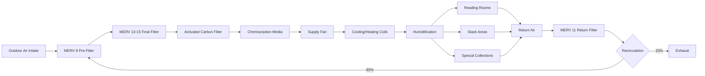

## Particulate Filtration Requirements

Rare book libraries demand exceptional particulate filtration to protect valuable collections from dust, fibers, and airborne contaminants that accelerate deterioration. The accumulation of particulate matter on book surfaces acts as a substrate for moisture retention and chemical reactions that damage paper, bindings, and inks.

MERV 13 filtration represents the minimum acceptable standard for general rare book collections, capturing 90% of particles in the 1.0-3.0 micron range and 85% in the 0.3-1.0 micron range. Premium collections housing incunabula, illuminated manuscripts, or irreplaceable documents require MERV 15 or higher filtration, achieving 95% efficiency at 1.0-3.0 microns and 90% at 0.3-1.0 microns.

HEPA filtration (99.97% at 0.3 microns) applies to special collections rooms where manuscripts undergo conservation work or display preparation. The filtration efficiency relationship follows:

$$\eta = 1 - e^{-\frac{KL}{U}}$$

where $\eta$ is filtration efficiency, $K$ is the filter coefficient (m⁻¹), $L$ is filter depth (m), and $U$ is face velocity (m/s).

## Gaseous Pollutant Removal

Gaseous pollutants pose equal or greater threats to rare books than particulate contamination. Sulfur dioxide, nitrogen oxides, ozone, and organic acids catalyze paper degradation through oxidation and acid hydrolysis reactions that break cellulose chains and embrittle paper fibers.

Activated carbon filtration removes gaseous pollutants through physical adsorption and chemical reaction. Virgin activated carbon with high surface area (1000-1200 m²/g) provides 6-12 month service life depending on outdoor pollutant concentrations and system airflow rates.

Potassium permanganate-impregnated alumina media specifically targets sulfur dioxide, hydrogen sulfide, and formaldehyde. This chemically reactive media oxidizes pollutants, converting them to less harmful compounds trapped within the media structure.

The adsorption capacity follows the Freundlich isotherm:

$$q_e = K_f C_e^{1/n}$$

where $q_e$ is adsorbed amount per unit mass (mg/g), $C_e$ is equilibrium concentration (mg/m³), $K_f$ is the Freundlich constant, and $n$ is the heterogeneity factor.

## Acid Vapor Protection

Acid vapors from sulfur dioxide and nitrogen oxide reactions with moisture create sulfuric and nitric acids that irreversibly damage paper through acid hydrolysis. External sources include vehicle exhaust, industrial emissions, and coal combustion. Internal sources involve off-gassing from wood furnishings, carpeting adhesives, and even the paper collections themselves.

Chemisorption media specifically formulated for acid gas removal includes:

- Potassium permanganate on alumina substrate (SO₂, H₂S removal)
- Activated carbon impregnated with potassium iodide (oxidants, ozone)
- Mixed-bed media combining activated carbon and permanganate
- Zeolite molecular sieves (formaldehyde, organic acids)

Media depth requirements range from 50-100 mm depending on face velocity and removal efficiency targets. Lower face velocities (0.3-0.5 m/s) maximize contact time and adsorption efficiency.

## Filtration System Configuration

Multi-stage filtration systems for rare book libraries employ sequential filtration stages optimized for specific contaminant removal.

Pre-filters extend final filter life by capturing larger particles, reducing loading on expensive MERV 13-15 and gaseous filtration media. Filter replacement intervals typically follow:

- MERV 8 pre-filters: 3-4 months
- MERV 13-15 final filters: 9-12 months
- Activated carbon: 6-12 months
- Chemisorption media: 12-18 months

## Pressure Drop Considerations

Pressure drop across filtration systems directly impacts fan energy consumption and system capacity. Multi-stage filtration creates substantial resistance requiring careful analysis during design.

Total system pressure drop equals the sum of individual component drops:

$$\Delta P_{total} = \Delta P_{pre} + \Delta P_{final} + \Delta P_{carbon} + \Delta P_{chem}$$

Initial and final pressure drops differ significantly as filters load with captured contaminants. Design calculations use average pressure drop:

$$\Delta P_{avg} = \frac{\Delta P_{initial} + \Delta P_{final}}{2}$$

Typical pressure drop values:

| Filter Type | Initial ΔP (Pa) | Final ΔP (Pa) | Face Velocity (m/s) |
|-------------|----------------|---------------|---------------------|
| MERV 8 Pre-filter | 50-75 | 200-250 | 2.5 |
| MERV 13 Final | 100-150 | 300-400 | 2.5 |
| MERV 15 Final | 150-200 | 400-500 | 2.5 |
| Activated Carbon | 75-125 | 200-300 | 0.5 |
| Chemisorption Media | 100-150 | 250-350 | 0.4 |
| HEPA Filter | 250-300 | 500-600 | 1.3 |

Fan motor sizing requires capacity at final pressure drop conditions plus 20% safety factor. Variable frequency drives maintain constant airflow as filters load by increasing fan speed to compensate for rising pressure drop.

## Monitoring Air Quality

Continuous air quality monitoring validates filtration system performance and protects collections from pollutant exposure. Real-time monitoring provides early warning of filter breakthrough or system malfunctions.

**Particulate Monitoring**

Optical particle counters measure particle concentrations across six size ranges (0.3, 0.5, 1.0, 2.5, 5.0, 10.0 microns). Target concentrations for rare book areas:

- 0.3-0.5 μm: <500,000 particles/m³
- 0.5-1.0 μm: <50,000 particles/m³
- 1.0-2.5 μm: <10,000 particles/m³
- >2.5 μm: <1,000 particles/m³

**Gaseous Pollutant Monitoring**

Electrochemical sensors track key pollutants affecting paper collections:

| Pollutant | Target Level | Alarm Threshold | Measurement Method |
|-----------|--------------|-----------------|-------------------|
| SO₂ | <2 μg/m³ | >5 μg/m³ | Electrochemical cell |
| NO₂ | <5 μg/m³ | >10 μg/m³ | Electrochemical cell |
| O₃ | <2 μg/m³ | >5 μg/m³ | UV absorption |
| Formaldehyde | <10 μg/m³ | >20 μg/m³ | Photometric |
| Acetic Acid | <50 μg/m³ | >100 μg/m³ | GC/MS sampling |
| Formic Acid | <25 μg/m³ | >50 μg/m³ | GC/MS sampling |

**Differential Pressure Monitoring**

Magnehelic gauges or electronic pressure transducers monitor pressure drop across each filter stage. Rising pressure indicates filter loading; declining pressure suggests filter failure or bypass. Alarm setpoints trigger at 90% of final design pressure drop, scheduling filter replacement before performance degradation.

**Data Logging and Analysis**

Building automation systems log air quality data at 15-minute intervals, generating trend reports identifying seasonal patterns, filter performance degradation, and outdoor pollution episodes. Annual analysis correlates pollutant exposure with collection condition assessments, validating filtration system effectiveness.

Passive monitoring using metal coupons or pH indicator strips supplements electronic monitoring, providing long-term average exposure data independent of electronic system operation. These dosimeters remain in collection areas for 3-6 month periods, then laboratory analysis quantifies cumulative pollutant exposure.
